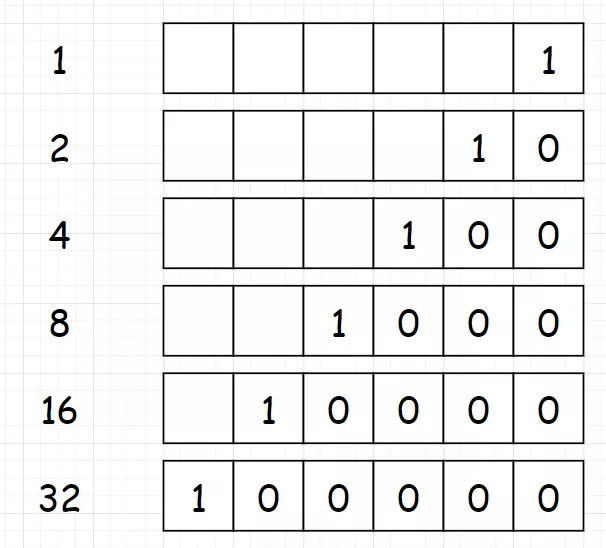
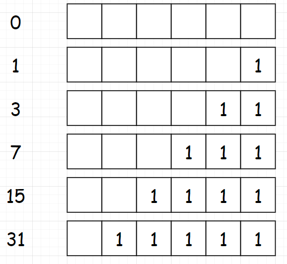

 
##	2的幂(231)
date:	2020-06-21
 

> 今天给大家分享一道比较简单但是很经典的题目。话不多说，直接看题。

## 01、题目示例

> 这道题，大家先想一想是用什么思路进行求解？

<br/>

| 第231题：2的幂                                        |
| ----------------------------------------------------- |
| 给定一个整数，编写一个函数来判断它是否是 2 的幂次方。 |

**示例 1:**

```
输入: 1
输出: true
解释: 20 = 1
```

**示例 2:**

```
输入: 16
输出: true
解释: 24 = 16
```

**示例 3:**

```
输入: 218
输出: false
```

<br/>

**PS：建议大家停留个两分钟先想一想...直接拉下去看题解就没什么意思了。**

## 02、题目分析

> 这道题是**通过位运算来进行求解的非常典型的题目。**当然，其他的题解也有很多：比如暴力求解，又或者是不停除以2通过递归的方式求解，等等。但是并不是今天我想说的。

<br/>

先观察一些是2的幂的二进制数：



**可以发现这些数，都是最高位为1，其他位为0**。所以我们把问题转化为“判断一个数的二进制，除了最高位为1，是否还有别的1存在”。然后我们再观察下面这样的一组数，对应着上面的数减去1：



我们对两组数求“&”运算：


可以看到，对于N为2的幂的数，**都有 N&(N-1)=0 ，** 所以这就是我们的判断条件。（这个技巧可以记忆下来，在一些别的位运算的题目中也是会用到的）

<br/>

根据分析，完成代码：

```go
//go
func isPowerOfTwo(n int) bool {
    return n > 0 && n&(n-1) == 0
}
```

执行结果：


## 03、证明过程

> “下里巴人”和“阳春白雪”是古代楚国的歌曲名，屈原的大弟子宋玉曾著有《对楚王问》：“客有歌于郢中者，其始曰下里巴人，国中属而和者数千人……其为阳春白雪，国中属而和者不过数十人。”“下里巴人”和“阳春白雪”一词后来被用来泛指通俗和高雅的文艺作品。 古琴十大名曲之一。

<br/>

“阳春白雪，下里巴人”这个比喻虽然有点牵强，但是却难掩位运算的重要性。位运算在整个算法体系里，不少人可能会觉得有点食之无味、弃之可惜的意思。但其实，完全不是这样！有这种想法的，大多是初学者。对于这点，应该C系的玩家，会深有感触。万丈高楼平地起，暂且不说位运算在底层运算中占据了多大比重，单是整个leetcode列表里，打着位运算标签的题目就超过80余道，我想已经说明了问题。**至少，在面试这块，你必须对位运算了如指掌！** 所以，今天的题目算是一个引子，后面我会出一个位运算的专题，希望尽我所能，帮助大家攻克这一类型的问题。


<br/>

所以，今天的问题你学会了吗？评论区留下你的想法！