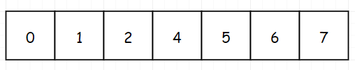
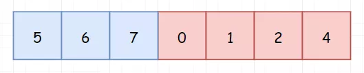
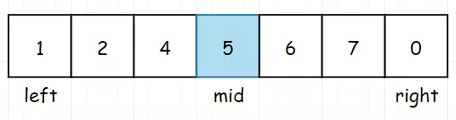
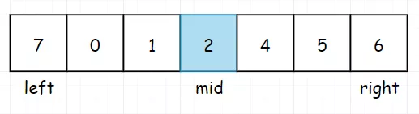

 
##	旋转排序数组中的最小值Ⅰ（153）
date:	2020-07-03
 

> 今天继续为大家讲解二分查找，分享一道知乎面试题。话不多说，直接看题。

## 01、题目示例

> 这道题目有两个版本，一道简单，一道困难。我们从简单的开始讲起。

 <br/>

| 第153题：旋转排序数组最小值Ⅰ                                 |
| ------------------------------------------------------------ |
| 假设按照升序排序的数组在预先未知的某个点上进行了旋转。( 例如，数组 [0,1,2,4,5,6,7] 可能变为 [4,5,6,7,0,1,2] )。请找出其中最小的元素。你可以假设数组中不存在重复元素。 |

**示例 1:**

```
输入: [3,4,5,1,2]
输出: 1
```

**示例 2:**

```
输入: [4,5,6,7,0,1,2]
输出: 0
```

## 02、题解分析

> 这道题目的关键点取决于是否可以想到二分，难点：无。但是如果把题中的条件，换成数组中元素可重复，本题的难度就会大幅上升。

 <br/>

当然，本题可以直接暴力搜索，但是这就就会被面试官撵出去。为了不被他撵出去，我们还是使用二分更为稳妥！**在二分搜索中，我们找到区间的中间点并根据某些条件决定去区间左半部分还是右半部分搜索**。但是麻烦的是，我们的数组被旋转了，因此肯定不能直接使用二分。那我们需要先观察一下，假若我们的原始数组如下：



无论怎么旋转，我们都可以得到一个结论，首元素 > 尾元素，像是下面这样。虽然不知道这个结论有什么用，但是我们先记下来。


继续进行观察，上面其实是两种极端情况，那如果普通的情况旋转，大概是下面这样：



问题似乎变得简单了，旋转将原数组一分为二，并且我们已知了首元素值总是大于尾元素，那我们只要找到将其一分为二的那个点（该点左侧的元素都大于首元素，该点右侧的元素都小于首元素），是不是就可以对应找到数组中的最小值。


然后我们通过二分来进行查找，先找到中间节点mid，如果中间元素大于首元素，我们就把mid向右移动。



如果中间元素小于首元素，我们就把mid向左移动。



根据分析，完成题解：

java版本

```java
//java
class Solution {
    public int findMin(int[] nums) {
        int left = 0;
        int right = nums.length - 1; 
        while (left < right) {
            int mid = left + (right - left) / 2 + 1;   
            if (nums[left] < nums[mid]) {
                left = mid;                           
            } else if (nums[left] > nums[mid]) {
                right = mid - 1;                       
            }
        }
        return nums[(right + 1) % nums.length];  
    }
};
```

python版本

```python
//python 
class Solution:
    def findMin(self, nums: List[int]) -> int: 
        left = 0
        right = len(nums) - 1
        while left < right:
            mid = (left + right) >> 1
            if nums[mid] > nums[right]:         
                left = mid + 1
                else:                               
                    right = mid
                    return nums[left]
```

c版本

```c
//c 
int findMin(int* nums, int numsSize){ 
    int left=0; 
    int right=numsSize-1; 
    while(right>left) 
    { 
        int mid=left+(right-left)/2;
        if(nums[mid]>nums[right])
            left=mid+1;
        else
            right=mid;
    }
    return nums[left];
}
```

执行结果：


## 03、课后思考

> 本题有多种变形，是一道练习二分法的绝佳题目。比如“把元素中不可重复的条件去掉”，又或者是“编写一个函数来判断目标值是否在数组中”等等，不同的改动，都会对题目解题方式有略微的影响，但是万变不离其宗，统统都是二分法。

 <br/>

其他的就不啰嗦了，明天将为大家答疑分析，解决“元素可重复”的版本。所以，今天的问题你学会了吗，评论区留下你的想法！