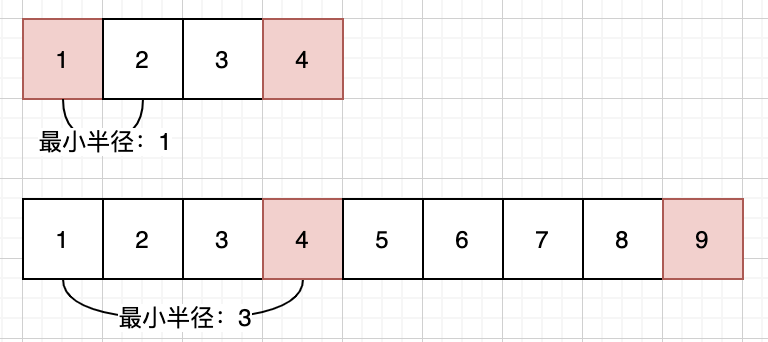

 
##	供暖器（475）
date:	2020-07-06
 

> 当然不能让你真的去修供暖器，但是如果你真的很有兴趣，可以参考下面步骤：


今天为大家分享一道腾讯校招面试题，话不多说，一起来看题吧。

## 01、题目示例

> 这道题的重点在于对**题意的理解**，建议先自行思考，再看题解。

| 第475题：供暖器                                              |
| ------------------------------------------------------------ |
| 冬季已经来临。你的任务是设计一个有固定加热半径的供暖器向所有房屋供暖。现在，给出位于一条水平线上的房屋和供暖器的位置，找到可以覆盖所有房屋的最小加热半径。所以，你的输入将会是房屋和供暖器的位置。你将输出供暖器的最小加热半径。 |

**说明:**

- 给出的房屋和供暖器的数目是非负数且不会超过 25000。

- 给出的房屋和供暖器的位置均是非负数且不会超过10^9。

- 只要房屋位于供暖器的半径内(包括在边缘上)，它就可以得到供暖。

- 所有供暖器都遵循你的半径标准，加热的半径也一样。

   <br/>

**示例 1:**

```
输入: [1,2,3],[2]
输出: 1
解释: 仅在位置2上有一个供暖器。如果我们将加热半径设为1，那么所有房屋就都能得到供暖。
```

**示例 2:**

```
输入: [1,2,3,4],[1,4]
输出: 1
解释: 在位置1, 4上有两个供暖器。我们需要将加热半径设为1，这样所有房屋就都能得到供暖。
```

## 02、题目分析

> 这道题目容易进入两个极端，要么就是没有读懂题意完全不知所云，要么就是觉得非常简单没什么可说的。

 <br/>

这个题目还是比较有趣的，解题的关键在于读懂题意：我们要对任意一个房屋供暖，要么用前面的暖气，要么用后面的暖气，两者之间取最近的，这就是距离。同时，如果要覆盖到所有的房屋，我们要选择上述距离中最大的一段，这就是最小的加热半径。



当然，我们可以采用暴力题解，通过双层遍历，第一层：遍历所有的房子，第二层：遍历加热器，找出距离该房子的最小距离。但是我们其实可以通过二分搜索来优化这个过程。

 <br/>

根据分析，得出代码：（再不写CPP，有读者就要给我寄刀片了）

```c++
//c++
class Solution {
public:
    int findRadius(vector<int>& houses, vector<int>& heaters) {
        //找到每个房屋位置所需要的最小半径的最大值
        int res = 0;
        int n = heaters.size();
        sort(heaters.begin(), heaters.end());
        for (auto house : houses)
        {
            //二分法找不小于house的第一个值
            int left = 0, right = n;
            while (left < right)
            {
                int mid = left + (right - left)/2;
                if (house > heaters[mid]) left = mid + 1;
                else right = mid;
            }
            int dist1 = (right == 0) ? INT_MAX : abs(house - heaters[right - 1]);
            int dist2 = (right == n) ? INT_MAX : abs(house - heaters[right]);
            res = max(res, min(dist1, dist2));
        }
        return res;
    }
};
```

这个代码逻辑还是比较简单的，不需要额外补充。另外，其实本题还可以使用滑动窗口来进行求解，但是考虑到输入规模，**房屋数量有可能远远大于供暖器数量**，所以还是建议使用二分。

 <br/>

最后还有一点要强调的就是：代码在刚开始的时候进行了一次排序。这个也是容易进入的误区，题目给的样例给人一种错觉 “提供的就是有序数组”，其实题中并没有说明，我第一次就犯了这样的错误。如果去掉排序的代码，就会报错：


## 03、其他

> 大家可以尝试用滑动窗口的方式来解答本题，也是很容易的。提供一个思路：首先还是保证数组**有序**，同时维护一个双指针，记录每一个房子左边的暖气，并且让其成为下一个房子左边的起始值，最后滑动窗口即可。

 <br/>

今天看到很多IT行业的自媒体，都发表了  “前端大佬司徒正美去世” 的相关推文，这个行为我不做评论，说不上好或坏，因为是我的话，我不太愿意炒作去世的人。但是，换个角度，也许这样的炒作又可以为其家人带来一些体恤。“逝者已矣,生者如斯”，想说的是：这个行业还是蛮不容易的，钱一辈子挣不完，健康才是第一位，希望大家都能照顾好自己的身体，珍惜眼前人，幸福安康。

 <br/>

所以，今天的问题你学会了吗，评论区留下你的想法！