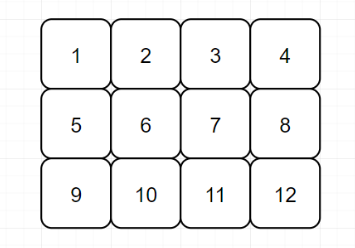
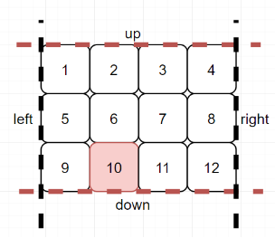
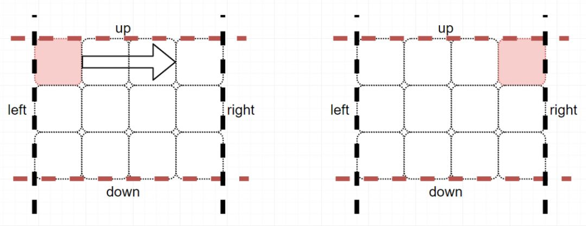

 
##	螺旋矩阵Ⅰ（54）
date:	2020-06-15
 

> 今天为大家分享一道关于**螺旋矩阵**的问题。话不多说，直接看题目吧。

## 01、题目分析

| 第54题：螺旋矩阵                                             |
| ------------------------------------------------------------ |
| 定一个包含 m x n 个元素的矩阵（m 行, n 列），请按照顺时针螺旋顺序，返回矩阵中的所有元素。 |

**示例 1:**

```
输入:
[
 [ 1, 2, 3 ],
 [ 4, 5, 6 ],
 [ 7, 8, 9 ]
]
输出: [1,2,3,6,9,8,7,4,5]
```

**示例 2:**

```
输入:
[
  [1, 2, 3, 4],
  [5, 6, 7, 8],
  [9,10,11,12]
]
输出: [1,2,3,4,8,12,11,10,9,5,6,7]


```

## 02、题目分析

本题的思路，在于**模拟螺旋的移动轨迹**。

问题的难点，在于**想明白模拟过程中会遇到什么问题**。

那模拟的过程中会遇到什么样的问题？**边界处理**。

<br/>

因为只有我们能找到边界（边界包括：1、数组的边界 2、已经访问过的元素），才可以通过“**右，下，左，上**”的方向来进行移动。同时，每一次**碰壁**，就可以调整到下一个方向。

<br/>

思路明确了，我们看一下整个过程。假如我们的数组为：

[

  [1, 2, 3, 4],

  [5, 6, 7, 8],

  [9,10,11,12]

]

数组如下图所示：



我们首先对其设置好四个边界:

```
up := 0
down := len(matrix) - 1
left := 0
right := len(matrix[0]) - 1
```

如下图所示：


同时，我们定义x和y，来代表行和列。

如x=2，y=1，则 arr[2][1]=10（第3行第2列）



然后我们从第一个元素开始行军（y=left），完成第一行的遍历，直到碰壁。（y<=right）



下面关键的一步来了，**因为第一行已经走过了，我们将上界下调** **（up++）**，同时转弯向下走。


直到碰到底部时（x<=down），我们将**右界左调（right--）**，转弯向左走。


后面向左和向上，分别完成**下界上调（down--）**和**左界右调（left++）**。


最后，对剩下的矩阵重复整个过程，直到上下、左右的壁与壁碰在一起 **（up <= down && left <= right，这是避免碰壁的条件）**。

## 03、Go语言示例

所以这道题很简单，只要会碰壁，就可以顺利得到代码（很漂亮，不是吗？），代码如下：

```go
func spiralOrder(matrix [][]int) []int {
	var result []int
	if len(matrix) == 0 {
		return result
	}
	left, right, up, down := 0, len(matrix[0])-1, 0, len(matrix)-1

	var x, y int
	for left <= right && up <= down {
		for y = left; y <= right && avoid(left, right, up, down); y++ {
			result = append(result, matrix[x][y])
		}
		y--
		up++
		for x = up; x <= down && avoid(left, right, up, down); x++ {
			result = append(result, matrix[x][y])
		}
		x--
		right--
		for y = right; y >= left && avoid(left, right, up, down); y-- {
			result = append(result, matrix[x][y])
		}
		y++
		down--
		for x = down; x >= up && avoid(left, right, up, down); x-- {
			result = append(result, matrix[x][y])
		}
		x++
		left++
	}
	return result
}

func avoid(left, right, up, down int) bool {
	return up <= down && left <= right
}
```

执行结果：

