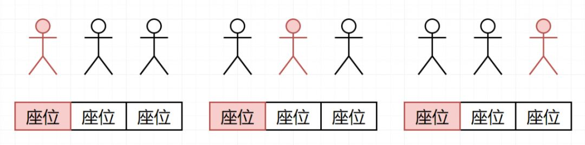

 
##	飞机座位分配概率（1227）
date:	2020-06-15
 

> 坐汽车、火车、飞机的时候，大家不知道有没有想过这样一个问题？如果自己的票弄丢了，那么自己屁股随机这么一蹲，坐到自己位置的概率有多大？今天就为大家分析一下这个问题。

## 01、题目分析

| 第1227题：飞机座位分配概率                                   |
| ------------------------------------------------------------ |
| 有 n 位乘客即将登机，飞机正好有 n 个座位。第一位乘客的票丢了，他随便选了一个座位坐下。 |

剩下的乘客将会：

- 如果他们自己的座位还空着，就坐到自己的座位上，
- 当他们自己的座位被占用时，随机选择其他座位

第 n 位乘客坐在自己的座位上的概率是多少？

<br/>

**示例 1：**

```
输入：n = 1
输出：1.00000
解释：第一个人只会坐在自己的位置上。
```

**示例 2：**

```
输入: n = 2
输出: 0.50000
解释：在第一个人选好座位坐下后，第二个人坐在自己的座位上的概率是 0.5。
```

## 02、题目图解

对于这道题，不卖关子，直接分析：

一个位置一个人，一屁股蹲下，概率100%，这没啥可说的。


两个位置两个人，第一个人已经坐下，要么坐对了，要么坐错了。所以第二个人坐在自己位置上的概率是50%。


重点来了，三个位置三个人，第一个一屁股坐下，有三种坐法。

如果恰好**第一个人坐到了自己的座位**上（1/3），那这种情况下，第二个人也就可以直接坐在自己的座位上，第三个人一样。所以此时第三人坐在自己座位上的可能性是 100%。


如果**第一个人占掉了第二个人的位置（1/3）。** 此时第二人上来之后，要么坐在第一人的位置上，要么坐在第三人的位置上。（1/2）所以，在这种情况下，第三人的座位被占的可能性是 1/3*1/2=1/6。


那假如第一人直接一屁股坐在第三人的座位上，此时第三人的座位被占的可能性就是第一人选择第三人座位的可能性。（1/3）


所以，如果三个座位三个人，第三个人坐到自己位置上的概率就是：1-1/6-1/3=1/2。当然，也可以通过 1/3+1/6=1/2 来正向计算。

<br/>

而对于 n>3 的情况，我们参照 3 个座位时进行分析：

- 如果第 1个乘客选择第 1 个座位，那么第n个人选择到第 n 个座位的可能性就是 100%。(1/n)
- 如果第1个乘客选择了第n个座位，那么第 n 个人选择第 n 个座位的可能性就是0。(0)
- **而对于第 1 个乘客选择除了第一个和第 n 个座位之外的座位k (1<k<n) ，就会导致有可能出现，前 n-1 位乘客占第 n 位乘客的概率出现**。

<br/>

第一二种情况都好说，对于第三种情况。因为此时第k个座位被占用，于第 k 个乘客而言，他又会面临和第一个乘客一样的选择。**相当于乘客1将问题转移到了第k个乘客身上，等同于****本次选择无效！**且这个过程会一直持续到没有该选项**。**于是乎，对于第 n 个人，他最后将只有两个选项：1、自己的 2、第一个人。**所以对于n>=3 的情况，等同于 n=2，全部的概率都为 1/2**。

<br/>

如果还是不能理解的小伙伴，可以这样想。**登机时座位被占的乘客 ，其实相当于和上一位坐错的乘客交换了身份**。直到完成终止条件（坐对位置 或者 坐到最后一个位置），否则该交换将一直进行下去。所以第n位乘客，坐到第n个位置，自然还是 1/2。

## 03、Go语言示例

根据分析，完成代码：

```go
func nthPersonGetsNthSeat(n int) float64 {
	if n == 1 {
		return 1
	}
	return 0.5
}
```

<br/>

> 小伙伴都看懂了吗？
>
> 这里留下一个疑问，假如共有200个座位，平均有多少人没有坐到自己的位置呢？
>
> 评论区留下你的想法吧！

