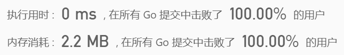

 
##	猜数字游戏（299）
date:	2020-06-17
 

>今天为大家分享一道非常经典的题目，**猜数字**。话不多说，直接看题。

## 01、题目分析

| 第299题：猜数字（Bulls and Cows）游戏                        |
| ------------------------------------------------------------ |
| 你写下一个数字让你的朋友猜。每次他猜测后，你给他一个提示，告诉他有多少位数字和确切位置都猜对了（称为“Bulls”, 公牛），有多少位数字猜对了但是位置不对（称为“Cows”, 奶牛）。你的朋友将会根据提示继续猜，直到猜出秘密数字。 |

请写出一个根据秘密数字和朋友的猜测数返回提示的函数，用 A 表示公牛，用 B 表示奶牛。

<br/>

请注意秘密数字和朋友的猜测数都可能含有重复数字。

<br/>

**示例 1:**

```
输入: secret = "1807", guess = "7810"
输出: "1A3B"
解释: 1 公牛和 3 奶牛。公牛是 8，奶牛是 0, 1 和 7。
```

**示例 2:**

```
输入: secret = "1123", guess = "0111"
输出: "1A1B"
解释: 朋友猜测数中的第一个 1 是公牛，第二个或第三个 1 可被视为奶牛。
```

<br/>

**说明:** 你可以假设秘密数字和朋友的猜测数都只包含数字，并且它们的长度永远相等。

## 02、题目图解

这道题，虽然被评定为“简单”，但是其实非常有趣。基本拿到题目，我们就能想到可以使用hashmap进行求解，一起来分析一下。

- 因为secret数字和guess数字长度相等，所以我们遍历secret数字。

- 如果当前索引两个数字相同，就将公牛数加1。

  

- **如果不相同，我们将secret和guess当前索引位置处的数字通过map记录下来，统计他们出现的次数。**当然，之前我们讲过。有限的map，比如数字 0-10，字母 a-z，都可以通过**数组**来进行替换，用以压缩空间。

  

- 最后，如果记录的两个map中，**数字出现重叠**（可以通过最小值来判断），则意味着该数字在两边都出现过，就将母牛数加一（我就想说是母牛，不服来辩）

## 03、GO语言示例

根据分析，完成代码（这次翻Go的牌子）：

```go
func getHint(secret string, guess string) string {
	a, b := 0, 0
	mapS, mapG := make([]int, 10), make([]int, 10)
	for i := range secret {
        //注意：这里是获取对应数字的ASCII码
		tmp, charGuess := secret[i], guess[i]
		if tmp == guess[i] {
			a++
		} else {
			mapS[tmp-'0']++
			mapG[charGuess-'0']++
		}
	}
	for i := 0; i < 10; i++ {
        //找到重叠的
		b += min(mapS[i], mapG[i])
	}
    //strconv.Itoa : 整数转字符串
	return strconv.Itoa(a) + "A" + strconv.Itoa(b) + "B"
}

func min(a, b int) int {
	if a > b {
		return b
	}
	return a
}
```

执行结果：



## 04、奇怪的知识

**奶牛包不包括公牛？**为了研究这个问题，我google了好一会儿。首先，国际定义，**奶牛包括公牛**。那公奶牛能不能产奶呢？答案是**不能**。那现在就有意思了，为什么公牛不产奶，还可以被称为奶牛？这是因为公奶牛是用来交配的，他们要保证所有的母奶牛都在哺乳期，所以他们需要不停的交配。一般一个养殖场，公母的比例大约是8：100。母牛当然舒服了，挤挤奶就成。但是这些公牛，却是相当辛苦。正所谓，“吃水不忘挖井人”，如此含辛茹苦的公牛，凭什么就不能被称为奶牛呢？

<br/>

所以，今天的问题你听明白了吗？评论区留下你的想法吧！