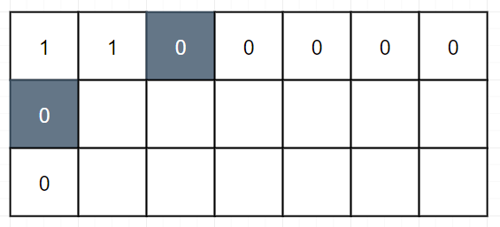
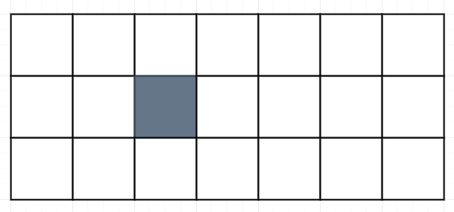

 
##	不同路径 - 障碍物
date:	2020-06-18
 

上一篇为大家分享了不同路径的DP解法之后，有很多小伙伴后台给我留言，说直接用公式法一步就可以得到答案。给你们点个赞！确实是这样，我没有用公式法的原因，是因为我的目的是想层层推进难度为大家分析不同路径这一类题型。后面我会单独拉出一系列，专门为大家讲解公式法一类的题目。

<br/>

如果还没有学习上一篇内容，建议先进行学习：

[不同路径](1.99/13.md) 

## 01、题目示例

> 多了一点障碍物之后，题目会有何不同？（这可是困难题目哦~

| 不同路径 - 障碍物                                            |
| ------------------------------------------------------------ |
| 一个机器人位于一个 m x n 网格的左上角，起始点在下图中标记为“Start”。机器人每次只能向下或者向右移动一步。机器人试图达到网格的右下角，在下图中标记为“Finish”。现在考虑网格中有障碍物。那么从左上角到右下角将会有多少条不同的路径？      问总共有多少条不同的路径？ |


网格中的障碍物和空位置分别用 1 和 0 来表示。

<br/>

**说明：** m 和 n 的值均不超过 100。

<br/>

**示例 1:**

```
输入:
[
  [0,0,0],
  [0,1,0],
  [0,0,0]
]
输出: 2

解释:
3x3 网格的正中间有一个障碍物。
从左上角到右下角一共有 2 条不同的路径：
\1. 向右 -> 向右 -> 向下 -> 向下
\2. 向下 -> 向下 -> 向右 -> 向右
```

## 02、题目分析

> 因为只是多了一点障碍物，题目的本质并没什么不同，所以直接进行分析即可。

首先我们还是定义状态，**用DP[i][j]表示到达i行j列的最多路径**。同时，因为第0行和第0列都只有一条路径，所以需要初始化为1。但有一点不一样的就是：**如果在0行0列中遇到障碍物，后面的就都是0，意为此路不通**。



完成了初始化，下面就是状态转移方程。和没有障碍物的相比没什么特别的，仍然是dp[i][j] = dp[i-1][j]   dp[i][j-1]。唯一需要处理的是：**如果恰好[i][j]位置上有障碍物，则dp[i][j]为0**。比如下图，有dp[1][2]为0。



根据分析，得出代码：（今天翻java牌子）

```java
//JAVA 
class Solution { 
    public int uniquePathsWithObstacles(int[][] obstacleGrid) {
        int m = obstacleGrid.length; 
        int n = obstacleGrid[0].length; 
        int[][] dp = new int[m][n]; 
        if (obstacleGrid[0][0] != 1) { 
            dp[0][0] = 1; 
        }
        for (int j = 1; j < n; j  ) {
            dp[0][j] = obstacleGrid[0][j] == 1 ? 0 : dp[0][j - 1];
        }
        for (int i = 1; i < m; i  ) {
            dp[i][0] = obstacleGrid[i][0] == 1 ? 0 : dp[i - 1][0];
        }
        for (int i = 1; i < m; i  ) {
            for (int j = 1; j < n; j  ) {
                dp[i][j] = obstacleGrid[i][j] == 1 ? 0 : dp[i - 1][j]   dp[i][j - 1];
            }
        }
        return dp[m - 1][n - 1];
    }
}
```

执行结果：


## 03、代码优化

> 不啰嗦，我们当然要继续**压缩内存**。

为了大家更好的理解代码，我们还是绘图说明。假若我们的网格如下，其中黑色表示障碍物。


因为计算每一个格子能到达的最多路径，只需要左边和上边的元素，所以我们定义状态**dp[j]表示到达当前行第j位置的最多路径**。这里有一个需要额外说的，就是我们把dp[0]初始化为1，因为在到达第一行的第一个元素时，路径只有一个。下面的图，左边的表示当前网格，右边的是指网格中对应dp数组的值。


根据分析，得出代码：

```java
//JAVA 
class Solution {     
    public int uniquePathsWithObstacles(int[][] obstacleGrid) {
        int m = obstacleGrid.length; 
        int n = obstacleGrid[0].length; 
        int[] dp = new int[n]; 
        dp[0] = 1; 
        for (int[] ints : obstacleGrid) { 
            for (int j = 0; j < n; j  ) {
                if (ints[j] == 1) {
                    dp[j] = 0;
                } else if (j > 0) {
                    dp[j]  = dp[j - 1];
                }
            }
        }
        return dp[n - 1];
    }
}
```

<br/>

**思考：** 上面的代码其实还可以优化内存，大家想想怎么做