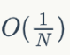

 
##	伪蒙特卡洛
date:	2020-06-28
 

> 分享一道由群员“Melbourne”，外号 “Paper Machine”，有数学小王子之称的小伙伴分享的题目！

<br/>

**特别说明：本文非原创，经投稿者同意后发表。**

## 01、算法介绍

> 期望：在概率论和统计学中，数学期望(mean)（或均值，亦简称期望）是试验中每次可能结果的概率乘以其结果的总和，是最基本的数学特征之一。它反映随机变量平均取值的大小。

<br/>

| 题目：在1*1的正方形中随机撒三个点，两两点都可构成长方形的一组对顶点，这样一共有三个长方形，需要求面积第二大的长方形的面积的期望。 |
| ------------------------------------------------------------ |
| 算法：每次随机三个点，计算第二大面积，最后统计期望。         |

## 02、蒙特卡洛

> 蒙特卡罗法也称统计模拟法、统计试验法。是把概率现象作为研究对象的数值模拟方法。是按抽样调查法求取统计值来推定未知特性量的计算方法。蒙特卡罗是摩纳哥的著名赌城，该法为表明其随机抽样的本质而命名。故适用于对离散系统进行计算仿真试验。在计算仿真中，通过构造一个和系统性能相近似的概率模型，并在数字计算机上进行随机试验，可以模拟系统的随机特性。

<br/>

蒙特卡洛方法(Monte Carlo Method) 指的是一类使用随机变量解决概率问题的方法。比较常见的是计算积分、计算概率、计算期望等问题。

<br/>

常见的蒙特卡洛方法依赖于随机变量的“随机性”，即未发生的事件无法根据已有信息进行预测，比如抛硬币、掷骰子等。在计算机中，常见的随机数是由一系列确定性算法进行生成的，通常称之为伪随机数(pseudo random number)。由于计算精度有限，且这些随机数在统计意义上“不够随机”，会出现可预测的重复序列，这些数在统计意义上收敛精度有限。

<br/>

与常见的蒙特卡洛方法不同的是，伪蒙特卡洛使用了低差异序列(low discrepancy sequence，常见的有halton序列、sobol序列等)，不使用常见的（伪）随机数，其收敛速率更快（记 N 为样本数量，伪蒙特卡洛收敛速率可达，而普通蒙特卡洛方法收敛速率仅为 。另一个最重要的性质是伪蒙特卡洛使用的低差异序列是可复现的(replicable)，即不会随环境改变而改变，没有随机种子；而普通蒙特卡洛使用的伪随机数会因随机种子不同而导致结果不同，收敛效果也不尽相同。

## 03、题目分析

> 本算法利用伪蒙特卡洛完成。

<br/>

CPP代码如下:

```c
#include <cmath> 
#include <cstdio> 
#include <vector> 
#include <cassert> 
#include <omp.h> 
const int UP=100; 
bool sieve[UP 100]; 
int primes[UP],top=0; 
void init()
{
    for (int i=2;i<=UP;  i)
        if (!sieve[i])
        {
            primes[top  ]=i;
            for (int j=i;j<=UP/i;  j)
                sieve[i*j]=true;
        }
}
std::vector<double> halton(long long i,const int &dim)
{
    assert(dim<=top);
    std::vector<double> prime_inv(dim,0),r(dim,0);
    std::vector<long long> t(dim,i);
    for (int j=0;j<dim;  j)
        prime_inv[j]=1.0/primes[j];
    auto f=[](const std::vector<long long> &t)->long long {
        long long ret=0;
        for (const auto &e:t)
            ret =e;
        return ret;
    };
    for (;f(t)>0;)
        for (int j=0;j<dim;  j)
        {
            long long d=t[j]%primes[j];
            r[j] =d*prime_inv[j];
            prime_inv[j]/=primes[j];
            t[j]/=primes[j];
        }
    return r;
}
double experiment(long long idx){
    std::vector<double> li=halton(idx,6);
    double area1=fabs((li.at(0)-li.at(2))*(li.at(1)-li.at(3)));
    double area2=fabs((li.at(0)-li.at(4))*(li.at(1)-li.at(5)));
    double area3=fabs((li.at(2)-li.at(4))*(li.at(3)-li.at(5)));
    double w=area1 area2 area3-std::max(std::max(area1,area2),area3)-std::min(std::min(area1,area2),area3);
    return w;
}
const int BATCH=100000;
const int THREADS=40;
int main()
{
    init();
    double total=0;
    for (long long trial=0;;)
    {
        std::vector<double> li(THREADS,0);
        omp_set_dynamic(0);
        omp_set_num_threads(THREADS);
        #pragma omp parallel for
        for (long long thread=0;thread<THREADS;  thread)
        {
            for (long long i=0;i<BATCH;  i)
                li.at(thread) =experiment(trial thread*BATCH i);
        }
        for (const auto &d:li)
            total =d;
        trial =THREADS*BATCH;
        printf("%lld: %.10f\n",trial,total/trial),fflush(stdout);
    }
    return 0;
}
```

<br/>

分析：使用了并行计算，批量跑随机实验，速度大大提升。其中halton函数会生成halton低差异序列，其值域为[0，1]，参数i表示第i个抽样，dim表示生成数据的维度（本例中每次实验需要6个点，使用6维数据点即可），不同样本之间**互不影响**，故可使用并行计算提速。

<br/>

\#表示随机试验次数×10^7，Avg表示第二大面积的平均值，Err表示与真实值的绝对误差×10^（-10）。

<br/>

|  #   |     Avg      | Err  |  #   |     Avg      | Err  |
| :--: | :----------: | :--: | :--: | :----------: | :--: |
|  1   | 0.1017786804 |  55  |  2   | 0.1017786707 | 152  |
|  3   | 0.1017786905 |  46  |  4   | 0.1017786889 |  30  |
|  5   | 0.1017786809 |  50  |  6   | 0.1017786836 |  23  |
|  7   | 0.1017786849 |  10  |  8   | 0.1017786868 |  9   |
|  9   | 0.1017786799 |  60  |  10  | 0.1017786837 |  22  |
|  11  | 0.1017786845 |  14  |  12  | 0.1017786839 |  20  |
|  13  | 0.1017786874 |  15  |  14  | 0.1017786839 |  20  |
|  15  | 0.1017786848 |  11  |  16  | 0.1017786868 |  9   |
|  17  | 0.1017786851 |  8   |  18  | 0.1017786863 |  4   |
|  19  | 0.1017786854 |  5   |  20  | 0.1017786887 |  28  |
|  21  | 0.1017786858 |  1   |  22  | 0.1017786844 |  15  |
|  23  | 0.1017786841 |  18  |  24  | 0.1017786852 |  7   |
|  25  | 0.1017786849 |  10  |  26  | 0.101778684  |  19  |
|  27  | 0.1017786838 |  21  |  28  | 0.1017786852 |  7   |
|  29  | 0.1017786838 |  21  |  30  | 0.1017786846 |  13  |
|  31  | 0.1017786859 |  0   |  32  | 0.1017786862 |  3   |
|  33  | 0.1017786859 |  0   |  34  | 0.1017786853 |  6   |
|  35  | 0.1017786854 |  5   |  36  | 0.1017786859 |  0   |
|  37  | 0.101778685  |  9   |  38  | 0.1017786854 |  5   |
|  39  | 0.1017786853 |  6   |  40  | 0.1017786858 |  1   |
|  41  | 0.1017786848 |  11  |  42  | 0.1017786851 |  8   |
|  43  | 0.1017786847 |  12  |  44  | 0.1017786841 |  18  |
|  45  | 0.101778685  |  9   |  46  | 0.1017786842 |  17  |
|  47  | 0.1017786852 |  7   |  48  | 0.1017786848 |  11  |
|  49  | 0.1017786854 |  5   |  50  | 0.1017786851 |  8   |
|  51  | 0.1017786842 |  17  |  52  | 0.1017786844 |  15  |

可以看到，在实验次之后，收敛精度可达**9**位小数，非常精确。由于使用的随机数“不够随机”，普通的蒙特卡洛在同样的实验次数下仅能收敛至五位小数的精度。

<br/>

上述方法可扩展至其他随机问题中，非常实用且高效，欢迎大家讨论！

<br/>

所以，今天的问题你学会了吗？评论区留下你的想法！