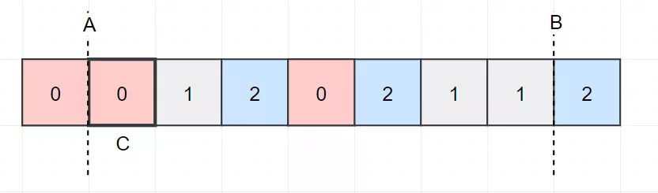

 
##	荷兰国旗问题
date:	2020-07-10
 

> 今天为大家分享经典的荷兰国旗问题。最近折腾了挺多事情，状态有点乱糟糟的。这两天刚刚调整好，全副武装，横戈马上行！

## 01、题目示例

> "荷兰国旗问题" 是计算机科学中的一个经典题目，它是由Edsger Dijkstra提出的。荷兰国旗由红、白、蓝三色组成。

| 荷兰国旗问题：现在有若干个红、白、蓝三种颜色的球随机排列成一条直线。现在我们的任务是把这些球按照红、白、蓝排序。 |
| ------------------------------------------------------------ |
| 这个问题之所以叫荷兰国旗，是因为我们可以将红白蓝三色小球想象成条状物，有序排列后正好组成荷兰国旗。 |

大概就是这么个意思：


## 02、题解分析

> 这道题很经典，很高频。

<br/>

便于分析，我们把上面的图稍微改一下：


改成这样：


好了，这道题结束了。O(∩_∩)O

<br/>

Emmmm....不开玩笑，现在我们讲解如何完成这个过程。

<br/>

首先，用脚趾头都可以想到的是，最终排序完成后的数组是分成三份的：

<br/>

<center>红-白-蓝</center>

红-白-蓝

<br/>

那总共就三个颜色，我们要区分开来，是不是最少需要两条分隔线？A线的左侧为0，右侧为1。B线的左侧为1，右侧为2。


但是刚开始的时候，红-白-蓝 三色是乱序的，所以此时的两条线我们是不是可以看成在最两侧？


那我们剩下的是不是只需要把 A线 和 B线 间的数据维护成满足 AB 线的规则就可以了？那要维护 AB 线间的数据，是不是至少你得遍历下 AB 线间的数据？


我们从 C 位置处开始，**我们发现此时 C 等于0。是不是意味着，我们应把这个元素放到 A 的左侧，所以我们移动 A线。当然，我们也需要移动一下 C 的位置。（CASE-1）**


然后我们发现**新的 C 位置处等于2，那是不是说明这个元素应该位于 B 的右侧。所以我们要把该位置的元素 和 B位置处的元素进行交换，同时移动B。(CASE-2)**



但是这里要注意，**C 交换完毕后，C 不能向前移**。因为C指向的元素可能是属于前部的，若此时 C 前进则会导致该位置不能被交换到前部。继续向下遍历。


有意思了，**我们发现 C 指向位置处等于1。有没有发现这种本身就满足规则了？所以我们忽略就可以了。（CASE-3）** 继续移动 C。


主要就这三种 CASE，我们把剩下的图都绘制出来：


**总结一下：**

<br/>

- 1）若遍历到的位置为0，则说明它一定位于A的左侧。于是就和A处的元素交换，同时向右移动A和C。

- 2）若遍历到的位置为1，则说明它一定位于AB之间，满足规则，不需要动弹。只需向右移动C。
- 3）若遍历到的位置为2，则说明它一定位于B的右侧。于是就和B处的元素交换，交换后只把B向左移动，C仍然指向原位置。（因为交换后的C可能是属于A之前的，所以C仍然指向原位置）

<br/>

大概就是这么一个分析过程，代码其实就很简单了（注意体会一下下面两种代码 C 的处理逻辑）：

<br/>

python版本：

```python
//py3 
class Solution: 
    def sortColors(self, nums: List[int]) -> None: 
        a = c = 0 
        b = len(nums) - 1 
        while c <= b:
            if nums[c] == 0: 
                nums[a], nums[c] = nums[c], nums[a]
                a += 1
                c += 1
            elif nums[c] == 2:
                nums[c], nums[b] = nums[b], nums[c]
                b -= 1
            else:
                c += 1
```

go版本：

```go
//go 
func sortColors(nums []int) { 
    a := 0 
    b := len(nums) - 1 
    for c := 0; c <= b; c++ { 
        if nums[c] == 0 { 
            nums[c], nums[a] = nums[a], nums[c] 
            a++
        }
        if nums[c] == 2 {
            nums[c], nums[b] = nums[b], nums[c]
            c--
            b--
        }
    }
}
```

执行结果：


## 03、总结

> 这道题目限制了最大数为 3999，时间复杂度也就被限制成了O(1)。（这句话忽略！上次的文章忘记删除了。。）

<br/>

好吧，基本就是这样了。这道题目在 leetcode 上对应的是：


我觉得我讲的还是可以的。大家要是认为ok的话，给我来个转发吧~感谢！

<br/>

今天的题目到这里就结束了，你学会了吗？快来评论区留下你的想法吧！