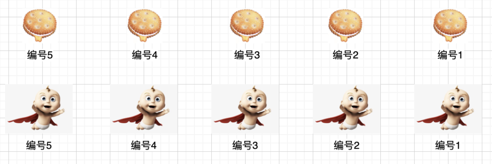

 
##	分发饼干
date:	2020-07-11
 

> 今天给大家分享一道很魔性的题目（很多槽点），也是一道入门级别的贪心算法题目。

## 01、分发饼干

> 贪心算法（又称贪婪算法）是指，在对问题求解时，总是做出在当前看来是最好的选择。也就是说，不从整体最优上加以考虑，算法得到的是在某种意义上的局部最优解。

| 问题：分发饼干                                               |
| ------------------------------------------------------------ |
| 假设你是一位很棒（多棒？？？）的家长，想要给你的孩子们一些小饼干（不能给大饼干吗？？？）但是，每个孩子最多只能给一块饼干（有毒吧。。。） |

<br/>

对每个孩子 i ，都有一个胃口值 gi ，这是能让孩子们满足胃口的饼干的最小尺寸；并且每块饼干 j ，都有一个尺寸 sj 。如果 sj >= gi ，我们可以将这个饼干 j 分配给孩子 i ，这个孩子会得到满足。你的目标是尽可能满足越多数量的孩子，并输出这个最大数值。

<br/>

注意：你可以假设胃口值为正（特么不正难道往外吐吗？？？）。一个小朋友最多只能拥有一块饼干。

<br/>

**示例 :**

```
输入: [1,2,3], [1,1] 
输出: 1 

解释: 
你有三个孩子和两块小饼干，3个孩子的胃口值分别是：1,2,3。
虽然你有两块小饼干，由于他们的尺寸都是1，你只能让胃口值是1的孩子满足。
所以你应该输出1。 
```


<center>（难道剩下一个饼干喂狗吗？？？？？）</center>

## 02、题解分析

> 好吧。假如我们按照题目所说的策略来分析，尽可能的让孩纸满足，满足不了就一个饼干都不给他，忘掉那些懵逼的孩子。

<br/>

其实策略就很简单了：**我们只需要在满足孩子胃口的前提下，尽可能分配小的饼干给到他**。典型的资本主义。


具体怎么做呢，我们把饼干和小朋友都按照**从大到小**排列。



- 如果最大的饼干可以满足肚子最大的孩子，那就给他吃，同时比较下一个。

- 如果最大的饼干不能满足肚子最大的孩子，**那就让他饿着**，然后看看能不能满足第二个孩子。（有点黑暗系，**放弃小朋友**）

<br/>

但是这里有个问题。凭什么就要先满足肚子最大的孩子。按道理讲，肚子越大应该越扛饿才对吧。所以我们换种思路，从**肚子最小的孩子**开始。


- 如果最小的饼干可以满足肚子最小的孩子，那就给他吃，同时比较下一个。

- 如果最小的饼干不能满足肚子最小的孩子，**那就扔掉饼干**，看看下一个饼干能不能给他吃。（**放弃的是饼干**）

<br/>

那这两种其实都算是贪心：

- 一种是胃口太大轮到下一个孩子
- 一种是饼干太小轮到下一个饼干

<br/>

因为要同时控制饼干和小孩，所以我们采用双指针。这里给出先满足小肚子孩子的代码：

```java
class Solution { 
    public int findContentChildren(int[] grid, int[] size) {
        if (grid == null || size == null) return 0; 
        Arrays.sort(grid); 
        Arrays.sort(size); 
        int gi = 0, si = 0; 
        while (gi < grid.length && si < size.length) {
            if (grid[gi] <= size[si]) {
                gi++;
            }
            si++;
        }
        return gi;
    }
}
```

如果想先满足大肚子，代码也大同小异。直接从尾部向前遍历即可。执行结果：


## 03、一点分享

> 前阵子状态很差，这两天逐步调整过来啦，多谢大家的关心。后面的内容我会换一个策略，提前拟定好目录以及学习纲领，更系统的来分享题解，希望大家继续支持！

<br/>

我们遇到什么困难也不要怕，微笑着面对它！消除恐惧的最好办法就是面对恐惧！坚持，才是胜利。加油！奥利给!

<br/>

今天的题目到这里就结束了，你学会了吗？快来评论区留下你的想法吧！