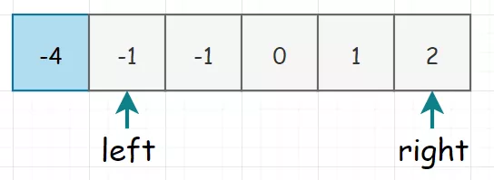

 
##	三数之和（15）
date:	2020-07-06
 

> “时代中的一粒灰，落在个人那里，可能就是一座山。而我们偏偏处在一个尘土飞扬的时代之中。” 为表达全国各族人民对抗击新冠肺炎疫情斗争牺牲烈士和逝世同胞的深切哀悼，国务院于4月3日发布公告，决定 2020年4月4日 举行全国性哀悼活动。而我，在这里也致谢那些扛起大山的人！

 <br/>

今天给大家讲解一道经典鹅厂面试题，有一定难度。大家认真看哦。

 <br/>

建议先回顾一下前面关于该题简化版，二数之和。

 [两数之和(1)](1.0.数组系列/007.md) 

## 01、题目示例

> 该题为 二数之和 的进阶版本，当然还有一个进阶版本为 四数之和。我们将会一一进行分析！

| 第15题：三数之和                                             |
| ------------------------------------------------------------ |
| 给你一个包含 n 个整数的数组 nums，判断 nums 中是否存在三个元素 a，b，c ，使得 a + b + c = 0 ？请你找出所有满足条件且不重复的三元组。注意：答案中不可以包含重复的三元组。 |

**示例：**

```
给定数组 nums = [-1, 0, 1, 2, -1, -4]，
满足要求的三元组集合为：
[
  [-1, 0, 1],
  [-1, -1, 2]
]
```

## 02、题目分析

> 本题的暴力题解可以仿照二数之和，直接三层遍历，取和为0的三元组，并记录下来，最后再去重。但是作为一个有智慧的人，我们不能这么去做。

 <br/>

因为我们的目标是找数，当然使用指针的方式最简单。假若我们的数组为：

```
[-1, 0, 1, 2, -1, -4]
```

求解过程如下：首先我们先把数组排个序（原因一会儿说），排完序长这样：


因为我们要同时找三个数，所以**采取固定一个数，同时用双指针来查找另外两个数的方式**。所以初始化时，我们选择固定第一个元素（当然，这一轮走完了，这个蓝框框我们就要也往前移动），同时将下一个元素和末尾元素分别设上 left 和 right 指针。画出图来就是下面这个样子：



现在已经找到了三个数，当然是计算其三值是否满足三元组。但是这里因为我们已经排好了序，如果**固定下来的数（上面蓝色框框）本身就大于 0，那三数之和必然无法等于 0**。比如下面这种：


然后自然用脚指头也能想到，我们需要移动指针。现在我们的排序就发挥出用处了，**如果和大于0，那就说明 right 的值太大，需要左移。如果和小于0，那就说明 left 的值太小**，需要右移。(上面这个思考过程是本题的核心)  整个过程如下图所示：


其中：在第6行时，因为三数之和大于0，所以right进行了左移。最后一行，跳过了重复的-1。

 <br/>

然后啰嗦一句，因为我们需要处理重复值的情况。除了固定下来的i值（蓝框框），left 和 right 当然也是需要处理重复的情况，所以对于 left 和 left+1，以及 right 和 right-1，我们都单独做一下重复值的处理。（其实没啥处理，就是简单的跳过）

## 03、代码展示

> 四数之和其实与本题解法差不太多，把固定一个数变成两个，同样还是使用双指针进行求解就可以了。

 <br/>

根据上面的分析，顺利得出代码（给一个Java版本的）：

```java
//java
class Solution {
    public List<List<Integer>> threeSum(int[] nums) {
        Arrays.sort(nums);
        List<List<Integer>> res = new ArrayList();
        for (int i = 0; i < nums.length; i++) {
            int target = 0 - nums[i];
            int l = i + 1;
            int r = nums.length - 1;
            if (nums[i] > 0)
                break;
            if (i == 0 || nums[i] != nums[i - 1]) {
                while (l < r) {
                    if (nums[l] + nums[r] == target) {
                        res.add(Arrays.asList(nums[i], nums[l], nums[r]));
                        while (l < r && nums[l] == nums[l + 1]) l++;
                        while (l < r && nums[r] == nums[r - 1]) r--;
                        l++;
                        r--;
                    } else if (nums[l] + nums[r] < target)
                        l++;
                    else
                        r--;
                }
            }
        }
        return res;
    }
}
```

执行结果：


给一个python版本的（这个我就直接拿别人的代码了，思想都一样）

```python
//python
class Solution:
    def threeSum(self, nums: List[int]) -> List[List[int]]:
        
        n=len(nums)
        res=[]
        if(not nums or n<3):
            return []
        nums.sort()
        res=[]
        for i in range(n):
            if(nums[i]>0):
                return res
            if(i>0 and nums[i]==nums[i-1]):
                continue
            L=i+1
            R=n-1
            while(L<R):
                if(nums[i]+nums[L]+nums[R]==0):
                    res.append([nums[i],nums[L],nums[R]])
                    while(L<R and nums[L]==nums[L+1]):
                        L=L+1
                    while(L<R and nums[R]==nums[R-1]):
                        R=R-1
                    L=L+1
                    R=R-1
                elif(nums[i]+nums[L]+nums[R]>0):
                    R=R-1
                else:
                    L=L+1
        return res
```

 <br/>

所以，今天的问题你学会了吗，评论区留下你的想法！

