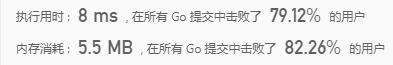

 
##	Z字形变换（6）
date:	2020-07-08
 

> 今天为大家分享一道让很多人头疼过的题目 - Z字形变化。

## 01、题目示例

> 额。。。不知道是不是我瞎，明明是N么（杠精勿扰，只是说说）

<br/>

| 第6题：Z 字形变换                                            |
| ------------------------------------------------------------ |
| 将一个给定字符串根据给定的行数，以从上往下、从左到右进行 Z 字形排列。比如输入字符串为 **"LEETCODEISHIRING"** 行数为 3 时，排列如下： |

```
L   C   I   R
E T O E S I I G
E   D   H   N
```

<br/>

之后，你的输出需要从左往右逐行读取，产生出一个新的字符串，比如：**"LCIRETOESIIGEDHN"**。

<br/>

请你实现这个将字符串进行指定行数变换的函数：

```
string convert(string s, int numRows);
```

**示例 1:**

```
输入: s = "LEETCODEISHIRING", numRows = 3
输出: "LCIRETOESIIGEDHN"
```

**示例 2:**

```
输入: s = "LEETCODEISHIRING", numRows = 4
输出: "LDREOEIIECIHNTSG"

解释:
L     D     R
E   O E   I I
E C   I H   N
T     S     G
```


## 02、题目分析

> 这是我比较推崇的一道“小学题目”，因为其没有任何复杂的思维逻辑，只需要按部就班，就可以顺利解答。难的是，按部就班的过程里，却极其容易出错。

<br/>

因为最终目的是变换字符串的顺序，并且题中也没有限制说不可用额外空间，所以我们秉承不重复造轮子的原则，想办法利用某种结构对原字符串做文章。

<br/>

假若我们采用示例2的数据来进行分析，输入字符串 s 为  "LEETCODEISHIRING"， numRows 为 4 ，画成图大概长这样：


重点来了，**我们的目标是按行打印，那总得有个东西来存储每行的数据吧**？因为只需要存储**每行**的数据，那是不是用个数组就可以了。（当然，你硬说搞个map来存也没啥毛病，就是有点闲得蛋疼）

<br/>

问题来了，那数组设置多大呢？自然是有多少行我们就设置多大呗，换句话说，numRows多大，我们的数组就设置多大。画成图大概就是下面这个样子：


存储的容器有了，原字符串也列出来是啥样了，现在嘎哈？自然就是把原字符串放到容器里咯。怎么放？**根据 numRows 的大小来回进行放置即可**（即从0到n-1，再从n-1到0）。具体的请看下图：


上面的图长得不得了，但是观察我们能看出来，**每 2n-2 即为一个周期**。到了这里，应该没有人会质疑这是一道小学题目了吧。。。把所有的字符串放完之后，大概就是下面这个样子：


最后一步，咱们让这个数组排排坐，就可以开始吃果果：


如果看不清楚，不如这样：


根据分析，得出代码（好久没翻go的牌子了）：

```go
//go
func convert(s string, numRows int) string {
    if numRows == 1{
		return s
	}
	var b = []rune(s)
	var res = make([]string, numRows)
	var length = len(b)
	var period = numRows * 2 - 2
	for i := 0 ;i < length; i ++ {
		var mod = i % period
		if mod < numRows {
			res[mod] += string(b[i])
		} else {
			res[period - mod] += string(b[i])
		}
	}
	return strings.Join(res, "")
}
```

执行结果：



上面的代码要强调两点：

<br/>

第一：用了一个rune，这个其实是go里的用法，用来处理unicode或utf-8字符而已，并没有什么特别的。

第二：12-15行的意思是，在周期内，正着走 numRows-1 下，剩余的反着走。（也就是上面那个长长的图）

<br/>

为了照顾Java的小伙伴，再给出一个Java版本的：

```java
//java
class Solution {
    public static String convert(String s, int numRows) {
        if (numRows == 1) return s;
        String[] arr = new String[numRows];
        Arrays.fill(arr, "");
        char[] chars = s.toCharArray();
        int len = chars.length;
        int period = numRows * 2 - 2;
        for (int i = 0; i < len; i++) {
            int mod = i % period;
            if (mod < numRows) {
                arr[mod] += chars[i];
            } else {
                arr[period - mod] += String.valueOf(chars[i]);
            }
        }
        StringBuilder res = new StringBuilder();
        for (String ch : arr) {
            res.append(ch);
        }
        return res.toString();
    }
}
```

和Go语言的示例一样，代码的关键仍然是计算轨迹的过程（10-17），这里再提供另外一种计算轨迹的方式：

```java
//java
class Solution {
    public String convert(String s, int numRows) {
        if (numRows == 1) return s;
        String[] arr = new String[numRows];
        Arrays.fill(arr, "");
        int i = 0, flag = -1;
        for (char c : s.toCharArray()) {
            arr[i] += c;
            if (i == 0 || i == numRows - 1) flag = -flag;
            i += flag;
        }
        StringBuilder res = new StringBuilder();
        for (String ch : arr) {
            res.append(ch);
        }
        return res.toString();
    }
}
```

通过使用一个标志位，来使轨迹回移。（本质其实是一样的）

<br/>

## 03、总结

> 这道题目的意义在于考察coding的能力，本身的思维过程并不复杂。有的同学一看这种题目，**就想通过二维数组来进行计算，殊不知已经落入了题目的陷阱（不信你试试，二维数组出错率一定远胜一维数组）**。当然，本题也是可以不借助额外空间来进行实现的，核心的逻辑完全相同，建议大家下去自己动手练习一下。

 <br/>

所以，今天的问题你学会了吗，评论区留下你的想法！

