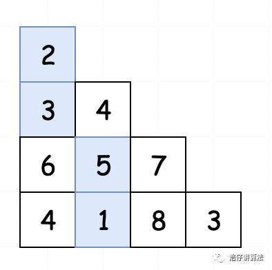
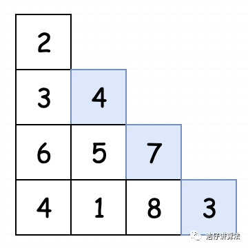

 
##  三角形最小路径和(120)
 

> 在上一篇中，我们通过题目**“最长上升子序列” 以及 "最大子序和"，**学习了DP（动态规划）在**线性关系**中的分析方法。这种分析方法，也在运筹学中被称为“线性动态规划”，具体指的是 “目标函数为特定变量的线性函数，约束是这些变量的线性不等式或等式，目的是求目标函数的最大值或最小值”。这点大家作为了解即可，不需要死记，更不要生搬硬套！
>
> 在本节中，我们将继续分析一道略微区别于之前的题型，希望可以由此题与之前的题目进行对比论证，进而顺利求解！
## 01、题目分析

| 第120题：三角形最小路径和                                    |
| ------------------------------------------------------------ |
| 给定一个三角形，找出自顶向下的最小路径和。每一步只能移动到下一行中相邻的结点上。 |

**例如，给定三角形：**

```
[
     [2],
    [3,4],
   [6,5,7],
  [4,1,8,3]
]
```

则自顶向下的最小路径和为 11（即，2 + 3 + 5 + 1 = 11）。

> **这道题有一定难度哦！如果没有思路请回顾上一篇的学习内容！**
>
> **不建议直接看题解！**

## 02、题目图解

首先我们分析题目，要找的是**三角形最小路径和，** 这是个啥意思呢？假设我们有一个三角形：[[2], [3,4], [6,5,7]，

[4,1,8,3]]


那从上到下的最小路径和就是2-3-5-1，等于11。

由于我们是使用数组来定义一个三角形，所以便于我们分析，我们将三角形稍微进行改动：



这样相当于我们将整个三角形进行了拉伸。这时候，我们根据题目中给出的条件：每一步只能移动到下一行中相邻

的结点上。其实也就等同于，**每一步我们只能往下移动一格或者右下移动一格**。将其转化成代码，假如2所在的元

素位置为[0,0]，那我们往下移动就只能移动到[1,0]或者[1,1]的位置上。假如5所在的位置为[2,1]，同样也只能移动

到[3,1]和[3,2]的位置上。如下图所示：


题目明确了之后，现在我们开始进行分析。题目很明显是**一个找最优解的问题，并且可以从子问题的最优解进**

**行构建**。所以我们通过动态规划进行求解。首先，我们定义状态：

> <center><b>  dp[i][j] : 表示包含第i行j列元素的最小路径和 </b></center>

我们很容易想到可以自顶向下进行分析。并且，无论最后的路径是哪一条，它一定要经过最顶上的元素，即 [0,0]。所以我们需要对 dp[0][0] 进行初始化。

> <center><b> dp[0][0] = [0][0]位置所在的元素值 </b></center>

继续分析，如果我们要求dp[i][j]，那么其一定会从自己头顶上的两个元素移动而来。


如5这个位置的最小路径和，要么是从2-3-5而来，要么是从2-4-5而来。然后取两条路径和中较小的一个即可。进

而我们得到状态转移方程：

> <center><b> dp[i][j] = min(dp[i-1][j-1],dp[i-1][j]) + triangle[i][j] </b></center>

但是，我们这里会遇到一个问题！除了最顶上的元素之外，


**最左边的元素只能从自己头顶而来**。（2-3-6-4）



**最右边的元素只能从自己左上角而来**。（2-4-7-3）

然后，我们观察发现，**位于第2行的元素，都是特殊元素**（**因为都只能从[0,0]的元素走过来**）


我们可以直接将其特殊处理，得到：

> <center><b> dp[1][0] = triangle[1][0] + triangle[0][0] </b></center>
> <center><b> dp[1][1] = triangle[1][1] + triangle[0][0] </b></center>

<br/>

最后，我们只要找到**最后一行元素中，路径和最小的一个**，就是我们的答案。即：

> <center><b> l：dp数组长度 </b></center>
> <center><b> result = min(dp[l-1,0]，dp[l-1,1]，dp[l-1,2]....) </b></center> 

综上我们就分析完了，我们总共进行了4步：

1. 定义状态
2. 总结状态转移方程
3. 分析状态转移方程不能满足的特殊情况。
4. 得到最终解

## 03、Go语言示例

根据以上分析，可以得到代码如下：

```go
func minimumTotal(triangle [][]int) int {
    if len(triangle) < 1 {
        return 0
    }
    if len(triangle) == 1 {
        return triangle[0][0]
    }
	dp := make([][]int, len(triangle))
	for i, arr := range triangle {
		dp[i] = make([]int, len(arr))
	}
    result := 1<<31 - 1
	dp[0][0] = triangle[0][0]
	dp[1][1] = triangle[1][1] + triangle[0][0]
	dp[1][0] = triangle[1][0] + triangle[0][0]

	for i := 2; i < len(triangle); i++ {
		for j := 0; j < len(triangle[i]); j++ {
			if j == 0 {
				dp[i][j] = dp[i-1][j] + triangle[i][j]
			} else if j == (len(triangle[i]) - 1) {
				dp[i][j] = dp[i-1][j-1] + triangle[i][j]
			} else {
				dp[i][j] = min(dp[i-1][j-1], dp[i-1][j]) + triangle[i][j]
			}
		}  
	}
    for _,k := range dp[len(dp)-1] {
        result = min(result, k)
    }
	return result
}

func min(a, b int) int {
	if a > b {
		return b
	}
	return a
}
```

运行结果：


运行上面的代码，我们发现使用的内存过大。我们有没有什么办法可以压缩内存呢？通过观察我们发现，**在我们**

**自顶向下的过程中，其实我们只需要使用到上一层中已经累积计算完毕的数据，并且不会再次访问之前的元素数**

**据**。绘制成图如下：


优化后的代码如下：

```go
func minimumTotal(triangle [][]int) int {
    l := len(triangle)
    if l < 1 {
        return 0
    }
    if l == 1 {
        return triangle[0][0]
    }
    result := 1<<31 - 1
	triangle[0][0] = triangle[0][0]
	triangle[1][1] = triangle[1][1] + triangle[0][0]
	triangle[1][0] = triangle[1][0] + triangle[0][0]
	for i := 2; i < l; i++ {
		for j := 0; j < len(triangle[i]); j++ {
			if j == 0 {
				triangle[i][j] = triangle[i-1][j] + triangle[i][j]
			} else if j == (len(triangle[i]) - 1) {
				triangle[i][j] = triangle[i-1][j-1] + triangle[i][j]
			} else {
				triangle[i][j] = min(triangle[i-1][j-1], triangle[i-1][j]) + triangle[i][j]
			}
		}  
	}
    for _,k := range triangle[l-1] {
        result = min(result, k)
    }
	return result
}

func min(a, b int) int {
	if a > b {
		return b
	}
	return a
}
```

运行结果：


