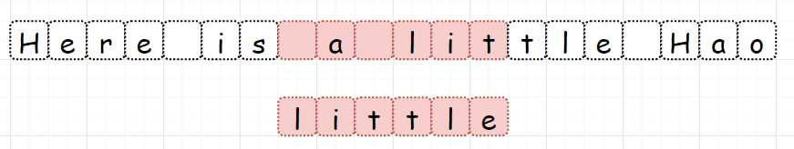

 
##	实现 Sunday 匹配
date:	2020-07-08
 

> 前几天的内容大家可能会觉得比较散。这是因为我目前正在筹划**背包系列**和**贪心系列**两个主题的内容，所以时间比较紧张，就拿出了之前写的一些题解凑凑数。不过呢，今天我将为大家开启一个新的篇章 - **字符串匹配系列篇**，文章写得很用心，相信大家定有所获。

## 01、实现 strStr()

> 字符串匹配类型的题目，是字符串类型中占比很大的一个支类。

<br/>

| 题目：实现 strStr()                                          |
| ------------------------------------------------------------ |
| 实现 strStr() 函数。给定一个 haystack 字符串和一个 needle 字符串，在 haystack 字符串中找出 needle 字符串出现的第一个位置 (从0开始)。如果不存在，则返回  -1。 |

**示例 1:**

```
输入: haystack = "hello", needle = "ll"
输出: 2
```

**示例 2:**

```
输入: haystack = "aaaaa", needle = "bba"
输出: -1
```

**说明:**

<br/>

当 needle 是空字符串时，我们应当返回什么值呢？这是一个在面试中很好的问题。

<br/>

对于本题而言，当 needle 是空字符串时我们应当返回 0 。这与C语言的 strstr() 以及 Java的 indexOf() 定义相符。

## 02、Sunday 匹配

> Sunday 算法是 Daniel M.Sunday 于1990年提出的字符串模式匹配。其核心思想是：在匹配过程中，模式串发现不匹配时，算法**能跳过尽可能多的字符**以进行下一步的匹配，从而提高了匹配效率。

<br/>

因为该问是字符串匹配篇第一讲，所以先普及几个概念：

- 串：串是字符串的简称
- 空串：长度为零的串称为空串
- 主串：包含子串的串相应地称为主串
- 子串：串中任意个连续字符组成的子序列称为该串的子串
- 模式串：子串的定位运算又称为串的模式匹配，是一种求子串第一个字符在主串中序号的运算。被匹配的主串称为目标串，子串称为模式串。

<br/>

了解这些基本概念，回到这个算法。Sunday匹配不是说这人在周末发现了这个算法，而是这人名字叫星期天（可能父母总加班，所以起了这么个名）。听起来牛叉的不得了，其实是个啥意思：

<br/>

假若我们的目标串为：Here is a little Hao

模式串为：little

<br/>

一般来讲，字符串匹配算法第一步，**都是把目标串和模式串对齐**。不管是KMP，BM，SUNDAY都是这样。


而对于SUNDAY算法，我们**从头部开始比较，一旦发现不匹配，直接找到主串中位于模式串后面的第一个字符**，即下面绿色的 “s”。（这里说明一下，为什么是找模式串后面的第一个字符。在把模式串和目标串对齐后，如果发现不匹配，那肯定需要移动模式串。问题是需要移动多少步。各字符串匹配算法之间的差别也来自于这个地方，对于KMP，是建立部分匹配表来计算。BM，是反向比较计算移动量。对于SUNDAY，就是找到模式串后的第一个字符。因为，无论模式串移动多少步，模式串后的第一个字符都要参与下一次比较，也就是这里的 “s”）


找到了模式串后的第一个字符 “s”，接下来该怎么做？我们需要**查看模式串中是否包含这个元素，如果不包含那就可以跳过一大片，从该字符的下一个字符开始比较。**



因为仍然不匹配（空格和l），我们继续重复上面的过程。找到模式串的下一个元素：t


现在有意思了，我们发现 t 被包含于模式串中，并且 t 出现在模式串倒数第3个。所以我们把模式串向前移动3个单位：


有内味了，我们发现竟然匹配成功了，是不是很神奇？证明的过程今天暂且不谈（后面我会出一个算法证明篇，来证明之前讲过的一些算法。**我需要你做的是，掌握上面这些！**）

<br/>

捞干货，这个过程里我们做了一些什么：

<br/>

- 对齐目标串和模式串，从前向后匹配
- **关注主串中位于模式串后面的第一个元素（核心）**
- 如果关注的字符没有在子串中出现则直接跳过
- 否则开始移动模式串，移动位数 = 子串长度 - 该字符最右出现的位置(以0开始)

## 03、算法应用

> 自然是把这个算法应用到我们的题目中咯...

<br/>

根据分析，得出代码：（给一个保证你能看的懂的JAVA版本的）

```java
//JAVA 
class Solution {
    public int strStr(String origin, String aim) {
        if (origin == null || aim == null) {
            return 0; 
        } 
        if (origin.length() < aim.length()) {
            return -1; 
        }
        //目标串匹配索
        int originIndex = 0;
        //模式串匹配索引
        int aimIndex = 0;
        // 成功匹配完终止条件：所有aim均成功匹配
        while (aimIndex < aim.length()) {
            // 针对origin匹配完，但aim未匹配完情况处理 如 mississippi sippia
            if (originIndex > origin.length() - 1) {
                return -1;
            }
            if (origin.charAt(originIndex) == aim.charAt(aimIndex)) {
                // 匹配则index均加1
                originIndex++;
                aimIndex++;
            } else {
                //在我们上面的样例中，第一次计算值为6，第二次值为13
                int nextCharIndex = originIndex - aimIndex + aim.length();
                //判断下一个目标字符（上面图里的那个绿框框）是否存在。
                if (nextCharIndex < origin.length()) {
                    // 判断目标字符在模式串中匹配到，返回最后一个匹配的index
                    int step = aim.lastIndexOf(origin.charAt(nextCharIndex));
                    if (step == -1) {
                        // 不存在的话，设置到目标字符的下一个元素
                        originIndex = nextCharIndex + 1;
                    } else {
                        // 存在的话，移动对应的数字（参考上文中的存在公式）
                        originIndex = nextCharIndex - step;
                    }
                    //模式串总是从第一个开始匹配
                    aimIndex = 0;
                } else {
                    return -1;
                }
            }
        }
        return originIndex - aimIndex;
    }
}
```

## 04、啰嗦吧唧

> **调研一下，这种通过题目来讲解知识的方式，大家是否喜欢？**如果喜欢，请留言区扣1。如果不喜欢，请说明理由~

<br/>

发现网上上来就讲解字符串匹配算法的文章实在是太多了，也不缺我这一个。所以我尝试了这种通过“**图解+题目+知识串讲**”的形式，文中我也尽可能的减少公式化的东西，让大家能看的进去。**希望大家可以给我反馈**，如果大家觉得这种形式ok，那么我后面会更高频的去使用这种形式。

 <br/>

所以，今天的问题你学会了吗，评论区留下你的想法！

