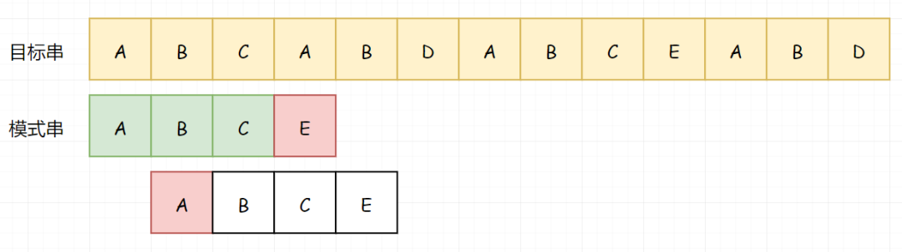
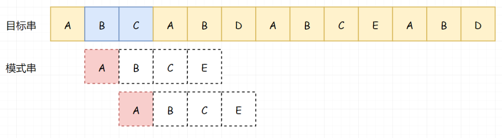
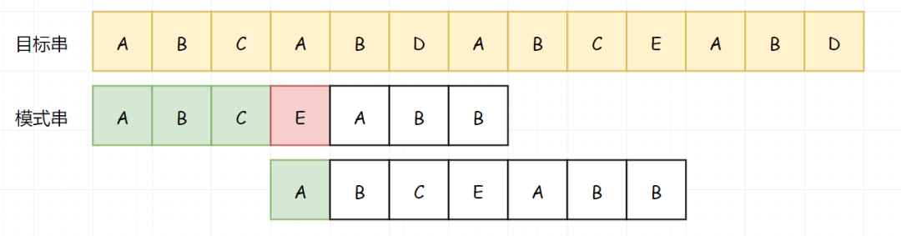
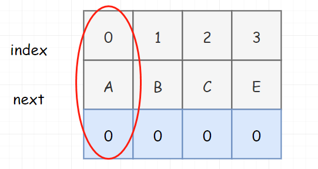
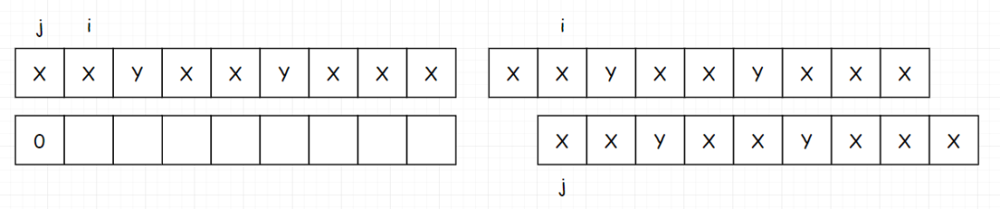

 
##	KMP（上篇）
date:	2020-07-11
 

> 今天打算为大家讲解一下KMP。

<br/>

KMP 其实已经念念叨叨挺长时间了，一直没写的原因是我觉得自己可能写不好。**与其误人子弟，宁可错失良机**。毕竟自己懂是一码事，能讲清楚是另一码事。

<br/>

所以为了写好这篇文章，我又去参考了很多别的资料。嗯。。**我发现网上讲解 KMP 的文章实在是太多了，但大多数看完后还是云里雾里（纵然我已经会了，读对方的文章还是懵逼）**。

<br/>

我希望我的这篇文章能达到的目的是：**让小白也能学会KMP**。如果届时达到了目的，请帮我进行一次转发。否则，你只需要叉掉即可。

<br/>

话不多说，我们直接开始。

## 01、图解分析

> KMP 算法常被称为“看毛片算法”，由一个姓K的，一个姓M的，一个姓P 一起提出。**是一种由暴力匹配改进的字符串匹配算法**。

<br/>

我看了下网上的 KMP 讲解基本都是由 **next匹配表** 开始讲起。但是说实话，如果是我第一次看这玩意，你给我讲 next匹配表，我肯定一脸懵逼。所以我打算换一种讲法。

<br/>

上面说了，**KMP 是由暴力匹配改进的字符串匹配算法**。那什么是暴力匹配？假若我们的目标串和模式串如下图。（之前在 Sunday 匹配中讲过，**所有的字符串匹配算法第一步都是对齐**。不管是 暴力匹配，KMP，Sunday，BM 都是一样）


暴力匹配，就是目标串和模式串一个一个的对比。


当A匹配成功，继续开始比对，直到我们遇见一个不匹配的字符。


然后我们调整模式串，**从目标串的下一个字符开始匹配（注意，这里是核心）**。很遗憾，还是没有匹配成功（A和B）



继续这个步骤：


直到我们完成整个匹配过程：


假若我们目标串长度为m，模式串长度为n。模式串与目标串至少比较m次，又因其自身长度为n，所以理论的时间复杂度为**O(m\*n)。** 但我们可以看到，**因为途中遇到不能匹配的字符时，就可以停止，并不需要完全对比（比如上图第2行）**。所以虽然理论时间复杂度为 **O(m\*n)** ，但其实大部分情况效率高很多。

<br/>

暴力匹配又称为BF算法，暴风算法。代码比较简单：

```go
//GO 
func BFSearch(haystack string, needle string) int { 
    l1 := len(haystack) 
    l2 := len(needle) 
    i, j := 0, 0 
    for i < l1 && j < l2 { 
        if haystack[i] == needle[j] { 
            i++ 
            j++
        } else {
            i -= j - 1
            j = 0
        }
    }
    if j == l2 {
        return i - j
    }
    return -1
}
```

接下来我们开始说KMP。假如还是上面的这个串。最开始其实还是一样，我们依次对比A-A,B-B,C-C，直到遇见第一个无法匹配的字符A-E。


现在开始不一样了，如果按照上面的暴力匹配。此时目标串我们应该回到 B 这个位置，模式串应直接回到头。但是按照 KMP 的思路，**在我们在第一次匹配后，因为 BC 匹配成功了，所以我们知道了 BC 不等于 A（注意这个逻辑关系）**：



那既然已知了 BC 不等于 A，我们就没必要用 A 和 BC 进行匹配了。那我们直接用 A 越过前面不需要匹配的 BC：


继续向下适配，我们发现在 D-C 处，匹配不上了。


那我们因为前面的 B 又匹配成功了，那我们就知道 B 不等于 A，所以我们又可以直接略过前面的 B：


也就是说，我们可以直接从 D 处开始比较：


继续向下比较：


到现在为止，你已经掌握了 KMP 的前百分之五十：**在KMP中，如果模式串和目标串没有匹配成功，目标串不回溯**。现在我们需要换一个新串，来掌握接下来的百分之五十：


我们还是从头开始匹配，直到遇到第一个不匹配的字符：


到这里和上面的例子还是一样，**因为我们的 BC 匹配成功了，所以我们知道 BC 不等于 A，所以我们可以跳过 BC（注意这个逻辑）**：


所以我们从 A 处开始比较：


直到我们再次匹配失败：


我想到现在你已经知道怎么做了，来和我一起说。**因为前面的 B 匹配成功了，所以我们知道 B 不等于 A，所以我们可以跳过 B。** 当然，跳过之后下一次的匹配直接失败了（A-D）。


重点来了！！！然后我们继续匹配下一位。我们发现这一次，我们的匹配基本就要匹配成功了，但是卡在了最后一步的比较（D-B）。


现在怎么办？假若我们把两个串修改一下（把里边的AB修改成XY），那么显而易见，你当然知道从哪里开始：


但是现在的问题是，在模式串中 AB 重复出现了，那我们是不是可以在下次比较的时候直接把 AB 给让出来？


所以我们把这个AB让出来，让出来之后，我们相当于在 模式串 上又跳过了 2个字符。（也就是说模式串下一次匹配从C开始）


其实到这里 KMP 就基本完事了。我们可以稍微总结下：

<br/>

- 如果模式串和目标串匹配成功，长串短串都加一

- 如果模式串和目标串没有匹配成功：

- - 目标串不回溯（**在上面的分割线之前，我都是给你讲这个**）
  - 模式串回溯到匹配未成功的字符前的子串的相同的真前缀和真后缀的最大长度**（在上面的分割线之后，我重点是给你讲这个）**

<br/>

好了，我知道上面匹配成功后的第二种情况有点拗口。所以我又单独拎出来和你说。这句话是啥意思呢？

<br/>

假若我们有个串 abbaab：

- a, ab, abb, abba, abbaa，就是它的真前缀。
- b, ab, aab, baab, bbaab, 就是它的真后缀。
- “真”字，**说白了就是不包含自己**。

<br/>

在我们上面的示例中，未成功的字符前的子串是 ABCEAB，它相同的最长的真前缀和真后缀就是 AB，最大长度就是2。所以我们就把模式串回溯到第2个位置处。


我猜有人要说话了，“不是说模式串是回溯到真前缀和真后缀的最大长度位置处吗？那为什么上面的第一个例子，是回到了起始位置呢？”



其实，不是我们没有回溯模式串，而是此时的最大长度（指的是相同真前缀和真后缀的最大长度，后面都省略）其实就是 0。

<br/>

那我们怎么获取最大长度呢？就可以很自然的引入 next表 了。**不管你是把next表 理解成描述最大长度的东东，还是把 next表 理解成用来回溯模式串的东东，其实都是可以的！！！这也是为什么你在网上看到很多人文章对next表理解不一致的原因。**


我们拿上面标黄色那个解释一下，ABCEAB 不包含自己，那就是 ABCEA，ABCEA的 真前缀 和 真后缀 为：

<br/>

- A,AB,ABC,ABCE
- A,EA,CEA,BCEA

<br/>

所以最大长度就是 1。那这个 1 干啥用呢？我们可以在下次比的时候就直接把这个 A 让过去，直接从 B 开始比。


这里注意，如果我们模式串稍微修改成下面这样，此时 F 的最大长度就是 0，并不是 2。初学者很容易把 AB 误认为是最长相同的真前缀和真后缀。


到这里为止，其实 KMP 的思路已经快说完了。但是大神说话了，大神认为这个匹配表，还得再改改，不然会出问题。



为什么会出问题呢，我们说了，对 KMP 而言，**如果没有匹配成功，** **目标串是不回溯的**。那如果目标串不回溯，如果模式串一直都是 0，是不是意味着这个算法就没办法继续进行下去？所以大神把这个 next匹配表 改了一下，把 0 位置处的 next表 值改为了 -1。


那这个 -1 是干嘛用的呢？**其实只是一个代码技巧**！大家注意一下第 7 行代码，假若没有 j == -1，此时如果 next[j] 等于 0，是不是就进死循环了。而加上这一句，相当于说无论什么情况下，模式串的第一个字符都可以匹配（对 j 而言，此时 -1++，是不是还是0。但是此时模式串却向前走了。不就不会因为死循环而卡死了吗？**请大家自行脑补没有 j==-1 这行代码时，死循环卡死在11行的过程**）

```go
 //GO 
func KmpSearch(haystack string, needle string, next []int) int { 
    l1 := len(haystack) 
    l2 := len(needle) 
    i, j := 0, 0 
    for i < l1 && j < l2 { 
        if j == -1 || haystack[i] == needle[j] { 
            i++
            j++
        } else {
            j = next[j]
        }
    }
    if j == l2 {
        return i - j
    }
    return -1
}
```

到这里为止，其实 KMP 就讲的差不太多了，代码还是比较简单的。但是麻烦的是？一般我们并没有现成的 next表 直接使用。那 next表 又该如何生成呢？

<br/>

其实 next表 的生成，我们也可以看作是字符串匹配的过程：**即原模式串和原模式串自身前缀进行匹配的过程。**

<br/>

我们用下面这个字符串来讲一下：XXYXXYXXX。


对于该字符串：

<br/>

- 真前缀为 X,XX,XXY,XXYX,XXYXX.....
- 真后缀为 X,XX,XXX,YXXX,XYXXX.....

<br/>

为了方便大家理解，我画了两种图（左图是真实的填表过程，右图是脑补过程）：

<br/>

- 首先 index[0] 肯定是填写 0 

  

- 然后填写 index[1]。**如果匹配上，我们把 i 和 j 都加一**。

  

- 然后填写 index[2]，**如果没有匹配上，就把 j 回溯到 j 当前指向的前一个位置的 index 处。在这里，也就是 0 。**

  

- 注意，是回溯完成后才开始填表，此时 index[2] 为 0

  

- 然后我们移动 i，发现下一位匹配成功。同时给 i 和 j 加一，并填表。

  

- 填完表后，我们发现下一位仍然匹配。继续移动 i 和 j。

  

  <center>（填表）</center>

  

  <center>（仍然匹配，继续移动 i 和 j）</center>

- 仍然匹配成功，继续重复上面的操作。

  

  

  

- 注意，**到这里开始匹配失败了**。上面说了，如果没有匹配成功，**把 j 回溯到 j 当前指向的前一个位置的 index 处**。在这里，也就是 2 。

  

  

  <center>（j 的前一个位置的 index）</center>

  

  <center>（回溯完成后，我们发现仍然不匹配）</center>

- 继续这个回溯的过程。。。（这一步是整个 next表 构建的核心）

  

  <center>（这个蓝色的小标是下次的回溯位置）</center>

  

  <center>（回溯后，我们发现匹配成功了）</center>

  

<center>（然后我们可以填表了）</center>

- 注意！这里为什么是填2，其实就是填写上次回溯到的那个匹配成功的位置的index值加1。

<br/>

细心的读者，估计到这里发现一点问题。我们把填完后的表拿出来：


我们发现这个表和我们最上面说的不太一样，我们最上面说的 next表 的首位是 -1，并且要记录哪一个 index 位置的 next 值，是去看该元素前面所有子串的真前缀和真后缀的最大长度。这句话有点拗口，我们还是看到下面这个。


比如 index 为 5 时，此时next的值是看 ABCEA 的最大长度（真后缀A，真前缀A，所以为1）。**但是在我们下面这个表中，我们发现我们是记录的当前索引位置处的最大长度**。其实我这里要说一下，下面这个表，其实我们一般称为**部分匹配表**，或者pmt。


那这个表和我们的 next 表有什么关系吗，我们发现把这个表往后串一位，就得到了我们最终的 next 表。


但是但是但是！！！并不是所有讲解 KMP 的地方都会给你提一提部分匹配表的概念，有的地方干脆就直接把这个 pmt 等同于 next 表使用。**这种属于错误讲解吗？其实不是的！** 因为我上面也说了，next表 在最初始位置补 -1，或者甚至干脆把 pmt 的第一位补一个 -1 当作 next表，这都统统是可以的。**因为最关键的还是说你到时候怎么去使用！毕竟 next表 的定义也是人们给它赋予的！**

<br/>

举个例子，假如你 next表 的首位不补 -1，我们其实就可以在前面 KMP 的算法中，去掉 -1 的逻辑。而单独加一个 if 判断来解决上面说的死循环的问题。

## 02、总结

KMP上篇到这里就结束了! KMP系列打算分上下两篇来讲，第一讲就是讲明白 KMP 是干嘛的，next 表是干嘛的，pmt 又是干嘛的。第二讲会给大家讲讲关于 next表 的计算，以及 next表 的优化。

<br/>

总之，我个人认为本篇内容放在全网讲解KMP的文章里，质量都还是可以的。如果是小白，学习本篇文章其实就够了。

<br/>

今天的题目到这里就结束了，你学会了吗？快来评论区留下你的想法吧！