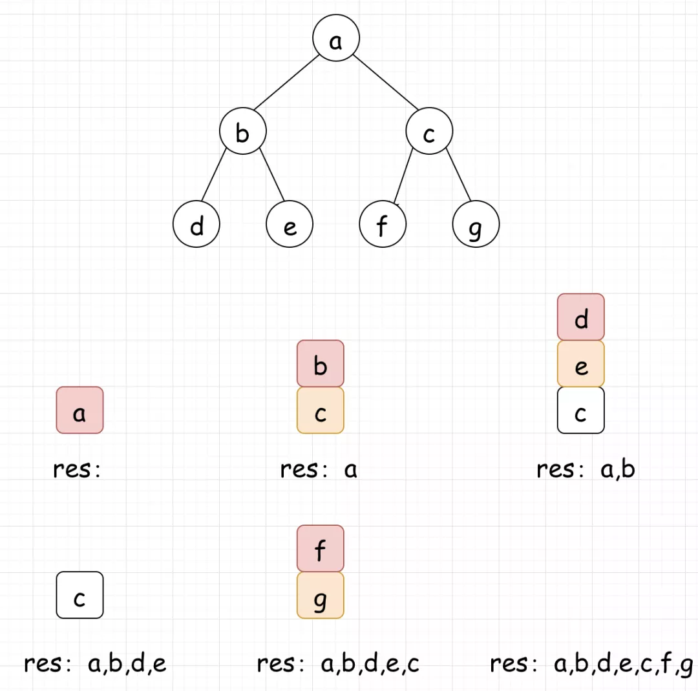

 
##  最大深度与DFS(104)
 

> 在计算机科学中，二叉树是**每个结点最多有两个子树**的树结构。通常子树被称作“左子树”（left subtree）和“右子树”（right subtree）。二叉树常被用于**实现二叉查找树**和**二叉堆**。树比链表稍微复杂，因为链表是线性数据结构，而树不是。树的问题很多都可以由**广度优先搜索**或**深度优先搜索解决**。
>
> 在本系列中，我们将通过一些例题，学习关于二叉树的经典操作！
## 01、题目分析

| 第104题：二叉树的最大深度                                    |
| ------------------------------------------------------------ |
| 给定一个二叉树，找出其最大深度。二叉树的深度为根节点到最远叶子节点的最长路径上的节点数 |

说明: 叶子节点是指没有子节点的节点。

**示例：**

```
给定二叉树 [3,9,20,null,null,15,7]，
    3   
   / \  
  9  20    
    /  \  
   15   7
```

<br/>

<center><b> 本系列内容均为必须掌握！ </b></center>

## 02、递归求解

我们知道，**每个节点的深度与它左右子树的深度有关，且等于其左右子树最大深度值加上  1 。** 即：

><center><b> maxDepth(root) = max(maxDepth(root.left), </b></center>
>
><center><b> maxDepth(root.right)) + 1</b></center>

以  [3,4,20,null,null,15,7]  为例：

<br/>

<1>我们要对根节点的最大深度求解，就要对其左右子树的深度进行求解


<2>我们看出。以4为根节点的子树没有左右节点，其深度为 1 。而以 20 为根节点的子树的深度，同样取决于它的左右子树深度。


<3>对于15和7的子树，我们可以一眼看出其深度为 1 。


<4>由此我们可以得到根节点的最大深度为:

```
maxDepth(root-3)
=max(**maxDepth**(sub-4),**maxDepth**(sub-20))+1
=max(1,max(**maxDepth**(sub-15),**maxDepth**(sub-7))+1)+1
=max(1,max(1,1)+1)+1
=max(1,2)+1
=3
```

<br/>

根据分析，我们通过**递归**进行求解代码如下：

```go
func maxDepth(root *TreeNode) int {
    if root == nil {
        return 0
    }
    return max(maxDepth(root.Left), maxDepth(root.Right)) + 1
}

func max(a int, b int) int {
    if a > b {
        return a
    }
    return b
}
```

<br/>

## 03、DFS

其实我们上面用的递归方式，本质上是使用了DFS的思想。先介绍一下DFS：深度优先搜索算法（Depth First Search），对于二叉树而言，它沿着**树的深度遍历树的节点，尽可能深的搜索树的分支**，**这一过程一直进行到已发现从源节点可达的所有节点为止**。


如上图二叉树，它的访问顺序为：

><center><b> A-B-D-E-C-F-G </b></center>

A-B-D-E-C-F-G

<br/>

到这里，我们思考一个问题？虽然我们用递归的方式根据DFS的思想顺利完成了题目。但是这种方式的缺点却显而易见。因为**在递归中，如果层级过深，我们很可能保存过多的临时变量，导致栈溢出**。这也是为什么我们一般不在后台代码中使用递归的原因。如果不理解，下面我们详细说明：

<br/>

事实上，函数调用的参数是通过栈空间来传递的，在调用过程中会**占用线程的栈资源**。而递归调用，**只有走到最后的结束点后函数才能依次退出**，而未到达最后的结束点之前，占用的栈空间一直没有释放，如果递归调用次数过多，就可能导致占用的栈资源超过线程的最大值，从而导致栈溢出，导致程序的异常退出。

<br/>

所以，我们引出下面的话题：如何将递归的代码转化成非递归的形式。这里请记住，**99%的递归转非递归，都可以通过栈来进行实现**。

<br/>

非递归的DFS，代码如下：

```java
private List<TreeNode> traversal(TreeNode root) {     List<TreeNode> res = new ArrayList<>(); 
    Stack<TreeNode> stack = new Stack<>(); 
    stack.add(root); 
    while (!stack.empty()) { 
        TreeNode node = stack.peek(); 
        res.add(node);         
        stack.pop();                         
        if (node.right != null) {
           stack.push(node.right);
           }
        if (node.left != null) {
           stack.push(node.left);
           }
     }
     return res;
}
```

上面的代码，唯一需要强调的是，为什么需要先右后左压入数据？是因为我们需要将先访问的数据，后压入栈（请思考栈的特点）。

如果不理解代码，请看下图：



1：首先将a压入栈 

2：a弹栈，将c、b压入栈（注意顺序）

3：b弹栈，将e、d压入栈

4：d、e、c弹栈，将g、f压入栈

5：f、g弹栈

<br/>

至此，非递归的DFS就讲解完毕了。那我们如何通过非递归DFS的方式，来进行本题求解呢？相信已经很简单了，留下课后作业，请自行实践！