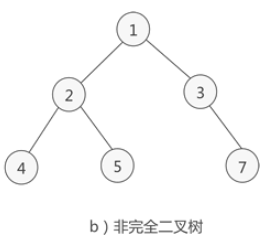

 
## 完全二叉树(222)
date: 2020-06-11
 

> 在上一篇中，我们学习了解了**平衡二叉树**，并且利用DFS进行了验证。在本节中，我们将继续学习**完全二叉树**的相关内容。首先了解一下什么是完全二叉树。

## 01、完全二叉树

完全二叉树由满二叉树引出，先来了解一下什么是满二叉树：

<br/>

如果**二叉树中除了叶子结点，每个结点的度都为 2**，则此二叉树称为**满二叉树**。（**二叉树的度**代表**某个结点的孩子或者说直接后继的个数。** 对于二叉树而言，1度是只有一个孩子或者说单子树,2度是有两个孩子或者说左右子树都有。）

<br/>

比如下面这颗：


那什么又是完全二叉树呢：

<br/>

如果**二叉树中除去最后一层节点为满二叉树，且最后一层的结点依次从左到右分布**，则此二叉树被称为**完全二叉树**。

<br/>

比如下面这颗：


而这颗就不是：



熟悉了概念，我们还是一起来看题目吧。

## 02、题目分析

| 第222题：完全二叉树的节点个数            |
| ---------------------------------------- |
| 给出一个完全二叉树，求出该树的节点个数。 |

**说明：**

完全二叉树的定义如下：在完全二叉树中，除了最底层节点可能没填满外，其余每层节点数都达到最大值，并且最下面一层的节点都集中在该层最左边的若干位置。若最底层为第 h 层，则该层包含 1~ 2h 个节点。

<br/>

**示例:**

```
输入: 
    1
   / \
  2   3
 / \  /
4  5 6

输出: 6
```

## 03、递归求解

首先分析题目，我们很容易可以想到通过递归，来求解节点个数。

```
func countNodes(root *TreeNode) int {
    if root != nil {
        return 1 + countNodes(root.Right) + countNodes(root.Left)
    }
    return 1 + countNodes(root.Right) + countNodes(root.Left)
}
```

执行结果：


但是很明显，出题者肯定不是要这种答案。因为这种答案和完全二叉树一毛钱关系都没有。所以我们继续思考。

## 04、经典解法

由于题中已经告诉我们这是一颗完全二叉树，我们又已知了完全二叉树除了最后一层，其他层都是满的，并且最后一层的节点全部靠向了左边。那我们可以想到，可以将该完全二叉树可以分割成**若干满二叉树和完全二叉树**，**满二叉树直接根据层高h计算出节点为2^h-1，**然后**继续计算子树中完全二叉树节点**。那如何分割成若干满二叉树和完全二叉树呢？**对任意一个子树，遍历其左子树层高left，右子树层高right，相等左子树则是满二叉树，否则右子树是满二叉树**。这里可能不容易理解，我们看图。

<br/>

假如我们有树如下：


我们看到根节点的左右子树高度都为3，那么说明左子树是一颗满二叉树。因为节点已经填充到右子树了，左子树必定已经填满了。所以左子树的节点总数我们可以直接得到，是2^left - 1，加上当前这个root节点，则正好是2^3，即 8。然后只需要再对右子树进行递归统计即可。


那假如我们的树是这样：


我们看到左子树高度为3，右子树高度为2。说明此时最后一层不满，但倒数第二层已经满了，可以直接得到右子树的节点个数。同理，右子树节点+root节点，总数为2^right，即2^2。再对左子树进行递归查找。


根据分析，得出代码：

```java
class Solution {
    public int countNodes(TreeNode root) {
        if (root == null) {
            return 0;
        }
        int left = countLevel(root.left);
        int right = countLevel(root.right);
        if (left == right) {
            return countNodes(root.right) + (1 << left);
        } else {
            return countNodes(root.left) + (1 << right);
        }
    }

    private int countLevel(TreeNode root) {
        int level = 0;
        while (root != null) {
            level++;
            root = root.left;
        }
        return level;
    }
}
```

运行结果：

