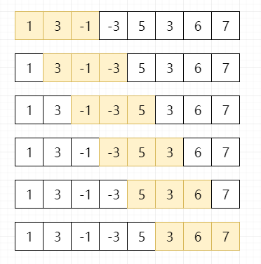

 
## 滑动窗口最大值（239）
date: 2020-06-12
 

date: 2020-06-12

> 有读者小伙伴建议讲一下**滑动窗口**相关题型，因为经常面试会被问到。所以就开了这个系列（所以如果大家有想让分享的题型都可以留言区告诉我，任何事情我觉得都需要有反馈。比如一个错误，你不反馈，我不知道..那就只能这样过去了..）闲话不啰嗦，直接看题！

## 01、题目分析

| 第239题：滑动窗口最大值                                      |
| ------------------------------------------------------------ |
| 给定一个数组 nums，有一个大小为 k 的滑动窗口从数组的最左侧移动到数组的最右侧。你只可以看到在滑动窗口内的 k 个数字。滑动窗口每次只向右移动一位。返回滑动窗口中的最大值。 |

给定一个数组 nums，有一个大小为 k 的滑动窗口从数组的最左侧移动到数组的最右侧。你只可以看到在滑动窗口内的 k 个数字。滑动窗口每次只向右移动一位。

<br/>

返回滑动窗口中的最大值**所构成的数组**。

<br/>

**示例:**

```
输入: nums = [1,3,-1,-3,5,3,6,7], 和 k = 3
输出: [3,3,5,5,6,7] 
解释: 

  滑动窗口的位置                最大值
---------------               -----
[1  3  -1] -3  5  3  6  7       3
 1 [3  -1  -3] 5  3  6  7       3
 1  3 [-1  -3  5] 3  6  7       5
 1  3  -1 [-3  5  3] 6  7       5
 1  3  -1  -3 [5  3  6] 7       6
 1  3  -1  -3  5 [3  6  7]      7
```

> **本题有一定难度！建议认真阅读**
>
> **并课后练习~**

## 02、题目分析

本题对于题目没有太多需要额外说明的，应该都能理解，直接进行分析。我们很容易想到，可以**通过遍历所有的滑动窗口，找到每一个窗口的最大值，来进行暴力求解**。那一共有多少个滑动窗口呢，小学题目，可以得到共有 **L-k+1** 个窗口。

<br/>

假设 nums = [1,3,-1,-3,5,3,6,7]，和 k = 3，窗口数为6



根据分析，直接完成代码：

```java
class Solution {
    public int[] maxSlidingWindow(int[] nums, int k) {
        int len = nums.length;
        if (len * k == 0) return new int[0];
        int [] win = new int[len - k + 1];
        //遍历所有的滑动窗口
        for (int i = 0; i < len - k + 1; i++) {
            int max = Integer.MIN_VALUE;
            //找到每一个滑动窗口的最大值
            for(int j = i; j < i + k; j++) {
                max = Math.max(max, nums[j]);
            }
            win[i] = max;
        }
        return win;
    }
}
```

运行结果：


<br/>

> It's Bullshit！结果令我们很不满意，时间复杂度达到了O(LK)，如果面试问到这道题，基本上只写出这样的代码，一定就挂掉了。那我们怎么样优化时间复杂度呢？有没有可以O(L)的实现呢？=_=

## 03、线性题解

这里不卖关子，其实这道题比较经典，我们可以采用队列，DP，堆等方式进行求解，所有思路的主要源头应该都是**在窗口滑动的过程中，如何更快的完成查找最大值的过程**。但是最典型的解法还是使用**双端队列**。具体怎么来求解，一起看一下。

<br/>

首先，我们了解一下，什么是双端队列：是一种具有**队列和栈的性质的数据结构**。双端队列中的元素可以从两端弹出或者插入。


我们可以利用双端队列来实现一个窗口，目的是让该窗口可以做到**张弛有度**（汉语博大精深，也就是长度动态变化。其实用游标或者其他解法的目的都是一样的，就是去维护一个可变长的窗口）

<br/>

然后我们再做一件事，只要**遍历该数组**，同时**在双端队列的头去维护当前窗口的最大值（在遍历过程中，发现当前元素比队列中的元素大，就将原来队列中的元素祭天），在整个遍历的过程中我们再记录下每一个窗口的最大值到结果数组中。**最终结果数组就是我们想要的，整体图解如下。

<br/>

假设 nums = [1,3,-1,-3,5,3,6,7]，和 k = 3


> （小浩os：我觉得自己画的这个图对于双端队列的解法还是介绍的比较清晰的，大家好好看一下哦，这样我的努力也就没有白费呢。）

<br/>

根据分析，得出代码：

```go
func maxSlidingWindow(nums []int, k int) []int {
	if len(nums) == 0 {
		return []int{}
	}
	//用切片模拟一个双端队列
	queue := []int{}
	result := []int{}
	for i := range nums {
		for i > 0 && (len(queue) > 0) && nums[i] > queue[len(queue)-1] {
            //将比当前元素小的元素祭天
			queue = queue[:len(queue)-1]
		}
        //将当前元素放入queue中
		queue = append(queue, nums[i])
		if i >= k && nums[i-k] == queue[0] {
            //维护队列，保证其头元素为当前窗口最大值
			queue = queue[1:]
		}
		if i >= k-1 {
            //放入结果数组
			result = append(result, queue[0])
		}
	}
	return result
}
```

执行结果：


<br/>

Perfact~题目完成！看着一下子超越百分之99的用户，是不是感觉很爽呢~