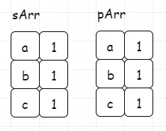

 
## 字母异位词（438）
date: 2020-06-12
 


> 之前的两节讲解了**滑动窗口类**问题的**模式解法**，相信大家对该类题型已不陌生**。**今天将继续完成一道题目，来进行巩固学习。

## 01、题目分析

| 第438. 找到字符串中所有字母异位词                            |
| ------------------------------------------------------------ |
| 给定一个字符串 s 和一个非空字符串 p，找到 s 中所有是 p 的字母异位词的子串，返回这些子串的起始索引。 |

字符串只包含小写英文字母，并且字符串 s 和 p 的长度都不超过 20100。

**说明：**

<br/>

- 字母异位词指字母相同，但排列不同的字符串。
- 不考虑答案输出的顺序。

<br/>

**示例 1:**

```
输入:s: "cbaebabacd" p: "abc"

输出:[0, 6]

解释:
起始索引等于 0 的子串是 "cba", 它是 "abc" 的字母异位词。
起始索引等于 6 的子串是 "bac", 它是 "abc" 的字母异位词。
```

**示例 2:**

```
输入:s: "abab" p: "ab

输出:[0, 1, 2]

解释:
起始索引等于 0 的子串是 "ab", 它是 "ab" 的字母异位词。
起始索引等于 1 的子串是 "ba", 它是 "ab" 的字母异位词。
起始索引等于 2 的子串是 "ab", 它是 "ab" 的字母异位词。
```

> **提示：**
>
> **建议先完成上节内容的学习！**
>
> **否则可能理解会有一定困难！**

## 02、题解分析

直接套用之前的模式，使用双指针来模拟一个滑动窗口进行解题。分析过程如下：

<br/>

假设我们有字符串为“cbaebabacd”，目标串为“abc”

<br/>

我们通过双指针维护一个窗口，由于我们只需要判断字母异位词，我们可以将窗口初始化大小和目标串保持一致。（当然，你也可以初始化窗口为1，逐步扩大）


而**判断字母异位词**，我们需要**保证窗口中的字母出现次数与目标串中的字母出现次数一致**。这里因为字母只有26个，直接使用数组来替代map进行存储（和上一讲中的ASCII使用256数组存储思想一致）。

<br/>

pArr为目标串数组，sArr为窗口数组。我们发现初始化数组，本身就满足，记录下来。（**这里图示用map模拟数组，便于理解**）



然后我们通过移动窗口，来更新窗口数组，进而和目标数组匹配，匹配成功进行记录。每一次窗口移动，**左指针前移**，原来**左指针位置处的数值减1，表示字母移出**；**同时右指针前移**，**右指针位置处的数值加1，表示字母移入**。详细过程如下：


最终，当右指针到达边界，意味着匹配完成。

## 04、代码展示

根据分析，完成代码：(下面pSize相关的忽略，调试忘删了)

```java
class Solution {

    public List<Integer> findAnagrams(String s, String p) {

        if (s == null || p == null || s.length() < p.length()) return new ArrayList<>();
        
        List<Integer> list = new ArrayList<>();

        int[] pArr = new int[26];
        int pSize = p.length();
        int[] sArr = new int[26];
    
        for (int i = 0; i < p.length(); i++) {
            sArr[s.charAt(i) - 'a']++;  
            pArr[p.charAt(i) - 'a']++;
        }

        for (int i = 0; i < p.length(); i++) {
            int index = p.charAt(i) - 'a';
            if (pArr[index] == sArr[index]) 
                pSize--;
        }
        
        int i = 0;
        int j = p.length();
        
        // 窗口大小固定为p的长度
        while (j < s.length()) {
            if (isSame(pArr, sArr))
                list.add(i);            
            //sArr[s.charAt(i) - 'a']-- 左指针位置处字母减1
            sArr[s.charAt(i) - 'a']--;
            i++;
                //sArr[s.charAt(j) - 'a']++ 右指针位置处字母加1
                sArr[s.charAt(j) - 'a']++;
            j++;
        }
        
        if (isSame( pArr, sArr))
            list.add(i);
        
        return list;
    }

    public boolean isSame(int[] arr1, int[] arr2) {
        for (int i = 0; i < arr1.length; ++i)
            if (arr1[i] != arr2[i])
                return false;
        return true;
    }
}
```

执行结果：


PS：本题属于模式解法，非最优解！这里留下思考内容，如何在本解法的基础上进行优化，近一步降低时间复杂度？

