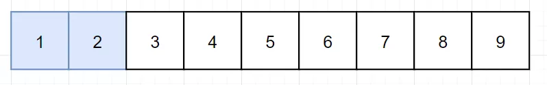

 
##	和为s的连续正数序列
date:	2020-07-08
 

> 昨天写了一篇感悟，没想到那么受欢迎。几百人转发，好几千人阅读，虚荣心得到了极大的满足。今天继续为大家分享一道经典面试题目。

## 01、题目示例

> 咕咕咕...一道很简单的题目~

<br/>

| 题目：和为s的连续正数序列                                    |
| ------------------------------------------------------------ |
| 输入一个正整数 target ，输出所有和为 target 的连续正整数序列（至少含有两个数）。序列内的数字由小到大排列，不同序列按照首个数字从小到大排列。 |

**示例 1：**

```
输入：target = 9
输出：[[2,3,4],[4,5]]
```

**示例 2：**

```
输入：target = 15
输出：[[1,2,3,4,5],[4,5,6],[7,8]]
```

## 02、题目分析

> 特别提醒：这两天有人问我，说浩哥，为什么看了你那么多题解，但是我一旦上机写，便啥都不记得了。这个我想说。。。你真牛掰。普通人应该都做不到看看题解，就能真的掌握一个题目（不信你看书学学KMP，再试试看能不能一次写出来）。题解只是给你提供一个思路，真正的提高，取决于coding的过程。大量的练习，忍受难受的过程，才能真正的进步！

<br/>

这个题目比较简单，典型的一道**滑动窗口**的题目。如果对滑动窗口陌生，可以先看下下面的题解：

 [滑动窗口最大值（239）](1.5.滑动窗口系列/501.md) 

 [无重复字符的最长子串（3）](1.5.滑动窗口系列/502.md) 

 [找到字符串中所有字母异位词（438）](1.5.滑动窗口系列/503.md) 

假若我们输入的 target 为 9，大脑中应该有下面这么个玩意：


然后我们通过左右指针来维护一个滑动窗口，同时计算窗口内的值是否是目标值：



如果窗口的值过小，我们就移动右边界。


如果窗口的值过大，我们就移动左边界。


剩下的就是反复上面的操作就可以了。到这里分析过程看似结束了。但是我们可以观察出一丢丢规律，用来优化我们的算法。**对于任意一个正整数，总是小于它的中值与中值+1的和**。为了让大家直观，用下图举例：


比如这里的100，就一定小于50+51，换成其他数也一样。换句话说，**一旦窗口左边界超过中值，窗口内的和一定会大于 target**。

<br/>

根据分析，得到题解：(好久没给Go语言的示例了，刻意把代码写的比较简单，没有用啥骚操作哈)

```go
//go 
func findContinuousSequence(target int) [][]int { 
    result := make([][]int, 0) 
    i := 1 
    j := 1 
    win := 0 
    arr := make([]int, target) 
    for i := range arr {
        arr[i] = i + 1
    }
    for i <= target/2 {
        if win < target {
            win += j
            j++
        } else if win > target {
            win -= i
            i++
        }  else {
            result = append(result, arr[i-1:j-1])
            win -= i
            i++
        }
    }
    return result
}
```

同时也给一个java版本的：

```java
//java 
class Solution { 
    public int[][] findContinuousSequence(int target) {
        List<int[]> res = new ArrayList<>(); 
        int i = 1;  
        int j = 1;  
        int win = 0;  
        while (i <= target / 2) {
            if (win < target) {
                win += j;
                j++;
            } else if (win > target) {
                win -= i;
                i++;
            } else {
                int[] arr = new int[j-i];
                for (int k = i; k < j; k++) {
                    arr[k-i] = k;
                }
                res.add(arr);
                win -= i;
                i++;
            }
        }
        return res.toArray(new int[res.size()][]);
    }
}
```

## 03、继续优化

> 到这里你以为这个题目就结束了吗？...哈哈哈哈哈...其实真就结束了~囧！o(╯□╰)o

<br/>

本题我使用滑动窗口进行求解，是期望给出一种通用解法。有很多基础差的同学，并不能每道题目都玩出来骚操作。但是本题除了常规的滑动窗口之外，其实还有数学法，递推法等多种解题思路。这里给出数学法的提示：**等差数列求和公式**，希望大家下去自行思考一番，评论区留下你的想法！咱们明天见！

 <br/>

所以，今天的问题你学会了吗，评论区留下你的想法！

