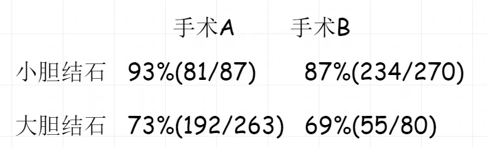

 
##	辛普森悖论
date:	2020-06-14
 

> 本系列主要为大家带来一整套的**博弈论问题（广义）**。因为在面试的过程中，除了常规的算法题目，我们经常也会被问到一些趣味题型来考察思维，而这类问题中，很多都有博弈论的影子存在。这些公司里以FLAG（Facebook, LinkedIn, Amazon, Google）为典型，特别喜欢考察本类题型。同时，本系列将不一定都是算法问题，不是IT行业的小伙伴也可以进行学习，来提高分析问题的能力~

## 01、辛普森悖论

| 辛普森悖论                                                   |
| ------------------------------------------------------------ |
| 羊羊医院里统计了两种胆结石治疗方案的治愈率。在统计过程中，医生将病人分为大胆结石和小胆结石两组。统计结果如下： |

- 对于小胆结石而言，手术A的治愈率（93%）高于 手术B（87%）

- 对于大胆结石而言，手术A的治愈率（73%）高于 手术B（69%）

  
<b>羊羊医院的医生得出结论： </b>

  
  无论是对于大小胆结石，手术A的治愈率都胜过手术B。

 

但是真的是这样吗？当然不是，我们根据样本统计出大小胆结石总计的治愈率，发现**手术B(治愈率83%)其实是要高于手术A(治愈率78%)**。

为什么会出现这样的结果？这就是著名的**辛普森悖论。**

## 02、直觉的缺陷

得到了结论，我们来思考背后的东西。在我们的直觉里有这样一个逻辑：**如果一个事物的各部分都分别大于另一个事物的各部分，那么这个事物大于另一个事物。** 比如：我们的直觉告诉我们如果手术A在两组病人中都更好，那么在所有病人中也应该更好。

 

我们可以将其公式化（**该公式错误**），假设：

>
<b>A=A1+A2+....+An </b>

>
<b>B=B1+B2+....+Bn</b>

>
<b>如果对i=1,2...,n都有Ai>Bi，则A>B</b>
   

乍一看，我们觉得该公式没有问题~所以这个公式也就代表了我们大部分人的思维工作。其实在这个公式中，隐藏掉了一个很重要的条件：**A1、A2、An 以及 B1、B2、Bn 并不能简单的通过“加”来得到 A 或者 B**。这就是**可加性**的前提。在大脑的思维过程中，因为我们很难直接看到这个前提，进而就导致了我们错误的思考！

## 03、辛普森悖论举例

下面我们举一些在生活中常见的辛普森悖论例子：

 

- 打麻将的时候，把把都赢小钱，造成赢钱的假象，其实不如别人赢一把大的。
- 在苹果和安卓的竞争中，你听见身边的人都在逃离苹果，奔向安卓。但是其实苹果的流入率还是要高于安卓。（有数据证明，很经典的案例）
- 你男票，这里比别人差，那里比别人差，但是其实他真的比别的男生差吗？（这个纯属本人胡扯了..）

 

好啦，这篇内容就到这里了，你学会了吗？