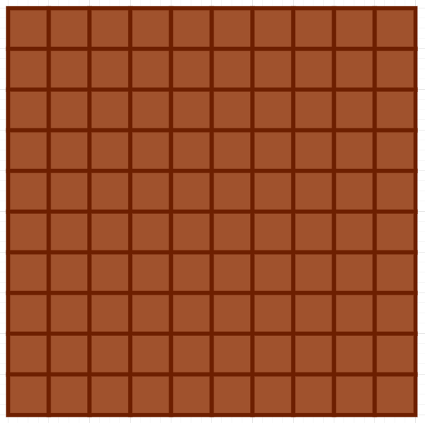
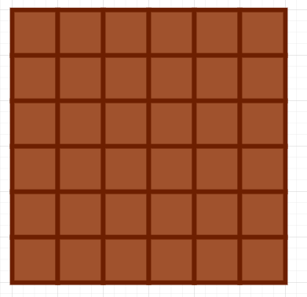

 
##	巧克力问题
date:	2020-07-06
 

> 这次小浩又出去面试，虽然面试官没让他修电暖气，但却给了他一块巧克力。。。（题目由读者在美团面试后提供）

## 01、题目示例

> 巧克力的凹槽是干嘛用的？大量的凹槽设计增加了巧克力的接触面积，可以使巧克力快速的凝固，并且保证凝固均匀。试想一下，如果是把巧克力放入平整的没有凹槽的方形盒子中，是不是凝固后很难取下来呢。

  

| 面试题：小浩出去面试时，面试官掏出一块10×10个小块的巧克力。首先，面试官把巧克力掰成两大块，并且吃掉其中一块，把另一块交给小浩。小浩再把剩下的巧克力掰成两大块，吃掉其中一块，把另一块交回给面试官。两个人就这样无聊且枯燥的掰呀掰。。。 |
| ------------------------------------------------------------ |
| 规定：谁没办法往下继续掰，谁就输了。如果面试官先开始掰的话，面试官和小浩谁有必胜策略？（面试官输了，小浩将赢得面试） |

## 02、题目分析

> 原题由读者 venus 提供，小浩在其基础上改编而成。

  

作为聪明机智的小浩（没见过这么夸自己的），最后当然是小浩获胜。获胜的方法：**只要小浩一直保持巧克力是正方形就可以了**。刚开始，巧克力是10×10的，长这样：

不管面试官咋掰，最后都会掰成一个长宽不相等的正方形。举个栗子，假若面试官把巧克力掰成6×10的：

小浩就再把它掰成6×6的：

不管面试官咋整，小浩都将其变成正方形，直到最后一次将其变成一个1×1的巧克力，此时面试官就输掉了面试。哦不，是小浩赢得了面试。

## 03、超级改编版

> 下面的问题不要陷入固定思维哈~

  

如果巧克力换成边长为10的等边三角形，长这样：

每次只能**沿着线条掰下一个小等边三角形吃掉**，假若还是由面试官开局，请问，谁必胜？评论区留下你的分析过程吧（另外小浩为了感谢广大读者一直以来的支持，后面每周都会送出**百元红包**，得奖率20%，拉到最下面就可以参与了。如果可以的话，要是能帮我再点个**在看**，我将感激涕零~）

  

所以，今天的问题你学会了吗，评论区留下你的想法！

