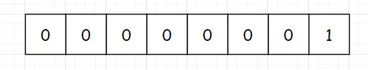
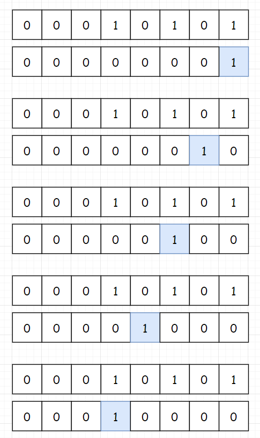

 
##	返回二进制中1的个数(191)
date:	2020-06-21
 

> 今天继续分享一道和位运算有关的题型，同样在难度上属于简单。我们还是从一道题开始吧

## 01、题目示例

> 这道题，大家先想一想是用什么思路进行求解？

<br/>

| 第191题：位1的个数                                           |
| ------------------------------------------------------------ |
| 编写一个函数，输入是一个无符号整数，返回其二进制表达式中数字位数为 ‘1’ 的个数（也被称为汉明重量）。 |

**示例 1：**

```
输入：00000000000000000000000000001011
输出：3
解释：输入的二进制串 00000000000000000000000000001011 中，共有三位为 '1'。
```

**示例 2：**

```
输入：00000000000000000000000010000000
输出：1
解释：输入的二进制串 00000000000000000000000010000000 中，共有一位为 '1'。
```

**示例 3：**

```
输入：11111111111111111111111111111101
输出：31
解释：输入的二进制串 11111111111111111111111111111101 中，共有 31 位为 '1'。
```

**提示：**

- 请注意，在某些语言（如 Java）中，没有无符号整数类型。在这种情况下，输入和输出都将被指定为有符号整数类型，并且不应影响您的实现，因为无论整数是有符号的还是无符号的，其内部的二进制表示形式都是相同的。
- 在 Java 中，编译器使用二进制补码记法来表示有符号整数。因此，在上面的 示例 3 中，输入表示有符号整数 -3。

<br/>

**PS：建议大家停留个两分钟先想一想...直接拉下去看题解就没什么意思了。**

## 02、题目分析

> 这道题仍然是**通过位运算来进行求解的非常典型的题目。**掩码是指使用一串二进制代码对目标字段进行位与运算，屏蔽当前的输入位。

<br/>

首先最容易想到的方法是：**我们直接把目标数转化成二进制数，然后遍历每一位看看是不是1，如果是1就记录下来**。通过这种比较暴力的方式，来进行求解。比如Java中，int类型是32位，我们只要能计算出当前是第几位，就可以顺利进行求解。

<br/>

那如何计算当前是第几位呢，我们可以构造一个掩码来进行，说掩码可能大家听着有点懵逼，其实就是弄个1出来，1的二进制是这样：



我们只需要让这个掩码每次向左移动一位，然后与目标值求“&”，就可以判断目标值的当前位是不是1。比如目标值为21，21的二进制是这样：


然后每次移动掩码，来和当前位进行计算：



根据分析，完成代码：

```java
//java
public class Solution {
    public int hammingWeight(int n) {
        int result = 0;
        //初始化掩码为1
        int mask = 1;
        for (int i = 0; i < 32; i++) {
            if ((n & mask) != 0) {
                result++;
            }
            mask = mask << 1;
        }
        return result;
    }
}
```

执行结果：


注意：这里判断 n&mask 的时候，千万不要错写成 (n&mask) == 1，因为这里你对比的是十进制数。（恰好这个题我之前面试别人的时候问到过，对方就直接这么写了...）

## 03、继续优化

> 位运算小技巧: 对于任意一个数，将 n 和 n-1 进行 & 运算，我们都可以把 n 中最低位的 1 变成 0

<br/>

大家是否还记得昨天学会的技巧，昨天的题目我们通过计算 n & n-1 的值，来判断是否是 2 的幂。今天我们继续使用这个技巧，观察一下，**对于任意一个数，将 n 和 n-1 进行 & 运算，我们都可以把 n 中最低位的 1 变成 0**。比如下面这两对数：


那下面就简单了，只需要不断进行这个操作就可以了。（翻CPP牌子，有没有好评的？）

```c
//c
class Solution {
public:
    int hammingWeight(uint32_t n) {
        int count = 0;
        while(n > 0)
        {
            n &= (n - 1);
            ++count;
        }
        return count;
    }
};
```

肯定有人又是看的一脸懵逼，我们拿 11 举个例子：（注意最后一位1变成0的过程）


<br/>

所以，今天的问题你学会了吗？评论区留下你的想法！