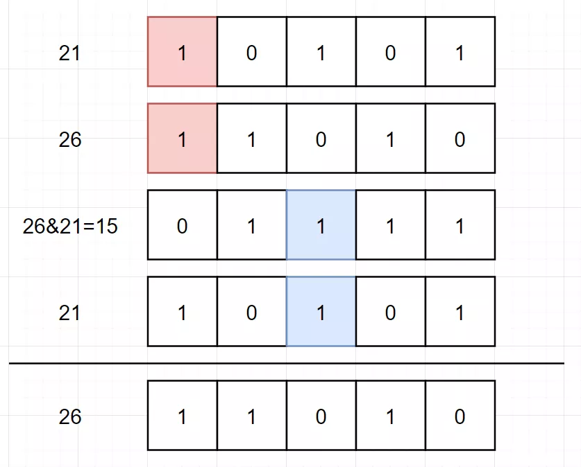
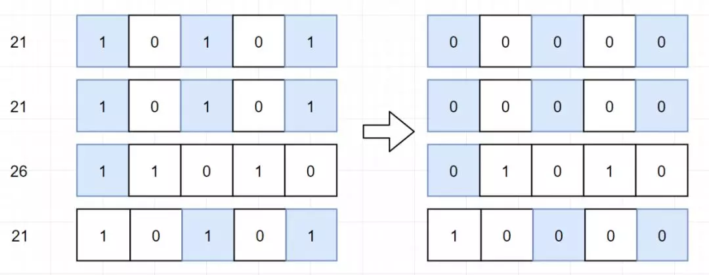

 
##	只出现一次的数字Ⅱ(137)
date:	2020-06-23
 

> 昨天我们在“除了某个元素只出现一次以外，其余每个元素均出现二次”的条件下，通过使用“异或”的操作，找到了只出现一次的元素。那对于其余每个元素均出现三次的case，我们应该如何解决呢？一起来看下吧。

<br/>

看之前强烈建议复习昨天的文章：

<br/>

 [只出现一次的数字(136)](learning/1.8/804.md) 

## 01、题目示例

> 这种通过改变题中条件，进而增加难度的方式，其实是出题者惯用的一种手段！

<br/>

| 第137题：只出现一次的数字Ⅱ                                   |
| ------------------------------------------------------------ |
| 给定一个非空整数数组，除了某个元素只出现一次以外，其余每个元素均出现了三次。找出那个只出现了一次的元素。说明：你的算法应该具有线性时间复杂度。你可以不使用额外空间来实现吗？ |

**说明：**

你的算法应该具有线性时间复杂度。 你可以不使用额外空间来实现吗？

<br/>

**示例 1:**

```
输入: [2,2,3,2]
输出: 3
```

**示例 2:**

```
输入: [0,1,0,1,0,1,99]
输出: 99
```

<br/>

**PS：建议大家停留个两分钟先想一想...直接拉下去看题解就没什么意思了。**

## 02、HashMap求解

> 很简单就能想到，说白了就是**统计每个元素出现的次数，最终再返回次数为1的元素**。但是使用了额外空间。

<br/>

直接上代码：（go版本）

```go
func singleNumber(nums []int) int {
    m := make(map[int]int)
    for _, k := range nums { 
        //如果是其他语言，请注意对应的判空操作！    
        m[k]   
    } 
    for k, v := range m { 
        if v == 1 {
            return k
        }
    }
    return 0
}
```

执行结果：


## 03、数学方式

> 这个题目曾经在Google很火~目前国内应该也有很多厂子会问到。

<br/>

原理：[A,A,A,B,B,B,C,C,C] 和 [A,A,A,B,B,B,C]，差了两个C。即：

3×(*a* *b* *c*)−(*a* *a* *a* *b* *b* *b* *c*)=2*c*

也就是说，如果把**原数组去重、再乘以3得到的值，刚好就是要找的元素的2倍**。举个例子：


利用这个性质，进行求解：（python代码如下，这里要注意的是，使用int可能会因为超出界限报错）

```python
class Solution:
    def singleNumber(self, nums: List[int]) -> int:
        return int((sum(set(nums)) * 3 - sum(nums)) / 2)
```

执行结果：


## 04、位运算

> 对于“每个其余元素，均出现了二次”之所以可以使用“**异或**”进行求解，原因是因为“异或”操作可以让两数相同归 0。那对于其余元素出现三次的，是不是只要可以让其三者相同归 0，就能达到我们的目的呢？

<br/>

这个思想可能比较简单，但是要让大家理解，还是有一定难度。如果大家准备好了，可以开始往下看。我看过leetcode上的题解，很多都是直接扔出来一个公式，其实讲的我认为并不是特别的清楚。所以我打算先把本题退化到“每个其余元素，均出现二次”的case来进行分析一下。

<br/>

假如我们有 [21,21,26] 三个数，是下面这样：


回想一下，之所以能用“**异或**”，其实我们是完成了一个 **同一位上有2个1清零** 的过程。上面的图看起来可能容易，如果是这样 (下图应为26^21)：



那对于“每个其余元素，均出现了三次”也是一样，如果我们可以完成 **一个同一位上的三个1清零的过程，** 也就是 a ？a ？a = 0，问题则迎刃冰解。那因为各语言中都没有这样一个现成的方法可以使用，所以我们需要构造一个。（想象一下，位运算也是造出来的对不对？）



如何构造，这里先说第一种方法（注意，到这里我们的问题已经转化成了定义一种 a ? a ? a = 0 的运算），观察一下“异或”运算：

<center> 1^1=0 </center>
<center> 1^0=1 </center>
<center> 0^1=1 </center>
是不是可以理解为，其实就是二进制的加法，然后砍掉进位呢？


**砍掉进位的过程，是不是又可以理解为对 2 进行取模**，也就是取余。到了这里，问题已经非常非常明确了。那我们要完成一个 a ? a ? a = 0 的运算，是不是其实就是让其二进制的每一位数都相加，最后再对 3 进行一个取模的过程呢？（一样，如果要定义一个 a ? a ? a ? a = 0 的运算，那就最后对 4 进行取模就可以了）

```go
//go 
func singleNumber(nums []int) int {
    number, res := 0, 0 
    for i := 0; i < 64; i++ { 
        //初始化每一位1的个数为0 
        number = 0
        for _, k := range nums { 
            //通过右移i位的方式，计算每一位1的个数
            number + = (k >> i) & 1
        }
        //最终将抵消后剩余的1放到对应的位数上
        res |= (number) % 3 << i
    }
    return res
}
```

如果对上面的代码不能理解，可以看看这个图，假设只有一个数 [21]，我们通过不断右移的方式，获取其每一位上的1。当然，这里因为余数都是1，所以肯定都保留了下来，然后与 1 进行 “与”运算，最终再将其放入到对应的位数上。


执行结果：


在上面的代码中，**我们通过一个number，来记录每一位数出现的次数**。但是缺点是，我们记录了64位（Go语言中，int为32位以上）


那如果我们可以同时对所有位进行计数，是不是就可以简化过程。因为我们的目的是把每一位与3取模进行运算，是不是就可以理解为其实是一个**三进制**。如果大家听不懂三进制的话，可以简单理解为3次一循环，也就是 00 - 01 - 10 - 11。但是又因为对于 11 这种情况，我们需要砍掉（上面已经说过了，相当于 11 - 00 的转化），所以我们就只有3个状态，00 - 01 - 10，所以我们采用 a 和 b 来记录状态。其中的状态转移过程如下：


这里 a‘ 和 b’ 的意思代表着 a 和 b 下一次的状态。next 代表着下一个 bit 位对应的值。然后这是什么，不就是状态机嘛。。。我们通过 a 和 b 的状态变化，来完成次数统计。

<br/>

然后因为此图复杂，将其分别简化成 a 和 b 的卡诺图（卡诺图是逻辑函数的一种图形表示。两逻辑相邻项，合并为一项，保留相同变量，消去不同变量。先 b’ 后 a‘ ）

| next\a，b | 00   | 01   | 11   | 10   |
| --------- | ---- | ---- | ---- | ---- |
| 1         | 1    | 0    | X    | 0    |
| 0         | 0    | 1    | X    | 0    |

| next\a，b | 00   | 01   | 11   | 10   |
| --------- | ---- | ---- | ---- | ---- |
| 1         | 0    | 1    | X    | 0    |
| 0         | 0    | 0    | X    | 1    |

然后我们根据卡诺图（这个卡诺图其实并不难看。。如果学习一下话，还是挺简单的。）写出关系式：

<center> a` = (a &~ next) | (b & next) </center>
<center> b` = (~a & ~b & next) | (b & ~next) </center>
然后就是套公式：（Java代码，注意Go语言中是不天然支持 ~ 这种运算的）

```go
class Solution {
    public int singleNumber(int[] nums) {
        int a = 0, b = 0, tmp = 0;
        for (int next : nums) {
            tmp = (a & ~next) | (b & next);
            b = (~a & ~b & next) | (b & ~next);
            a = tmp; 
        }
        return b;
    }
}
```

当然，其实题解还可以再进一步优化，其实就是化简上一步中的公式：

```go
class Solution {
    public int singleNumber(int[] nums) {
        int a = 0, b = 0;
        for (int next : nums) {
            b = (b ^ next) & ~a;
            a = (a ^ next) & ~b; 7        }
        return b; 
    }
}
```

当然，这个解法就相当牛皮了，反正我第一次做肯定是想不到的。。。我看了一下，第一个给出这个解法的人，应该是一位国外的工程师（某扣上面有很多人其实都是把题解翻译过来的，当然我有时也会哈哈哈哈，我觉得这某种意义上讲也是一个好的现象，挺好）不过毕竟非原创，还是得说明一下！


<br/>

总之，今天的题目，有一定的难度！希望大家动脑动手动脚， 认真想想。

<br/>

所以，今天的问题你学会了吗？评论区留下你的想法！