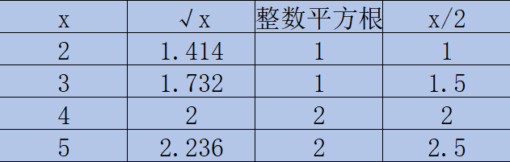

 
##	x的平方根（69）
date:	2020-06-30
 

> 今天继续为大家分享二分法系列篇的内容，看一道比较简单的题目。

## 01、题目分析

> 这道题目是比较简单，但我认为同时也是非常经典，建议大家掌握！

| 第69题：x的平方根                                            |
| ------------------------------------------------------------ |
| 计算并返回 x 的平方根，其中 x 是非负整数。由于返回类型是整数，结果只保留整数的部分，小数部分将被舍去。 |

<br/>

**PS：建议大家停留个两分钟先想一想...直接拉下去看题解就没什么意思了。**

<br/>

## 02、二分查找

> 使用二分法来完成平方根还是比较容易被想到的，在有限的“区间”中，每次通过筛选一半的元素，到最终只剩下一个数（收敛），这个数就是题目要求的取整的平方根整数。

<br/>

根据之前说过的二分法模板，要使用二分法，我们当然要找到Left，Right，Mid，那在这里，Mid 自然被作为最终我们要找的平方根的值（不像上一道题，Mid是作为速度，不太容易被想到），而 Left 和 Right，我们采用 1 和 x/2。

<br/>

Left 设置为 1 比较容易理解，因为我们可以直接处理掉 x 为 0 的情况（当然，也可以把 Left 初始化为 2，然后我们额外处理 0 和 1 的情况，我之前说过，二分法一万个人有一万种写法，只要能解释清楚，那就是你自己的）。但是为什么 Right 是 x/2 呢？

<br/>

我们看一下下面这些数的值：



很容易观察出，当 x>2 时，它的**整数平方根**一定小于等于 x/2 。即有 0 < 整数平方根 <= x/2。所以我们的问题转化为在 [0,x/2] 中找一个**特定值**，满足二分查找的条件。（当然，如果没有想到使用 x/2 作为 Right 而 直接使用 x ，其实也是可以的）

<br/>

剩下的逻辑就很简单了，我们不停缩小mid的范围，如果最终平方大于x就放回它前面一个值，否则就正常返回，直到两边的边界完全收敛。

```java
public class Solution { 
    public int mySqrt(int x) { 
        if (x == 0) return 0; 
        long left = 1; 
        long right = x / 2; 
        while (left < right) { 
            //注意这一行代码 
            long mid = (right + left) / 2 + 1;
            if (mid > x / mid) {
                right = mid - 1;
            } else {
                left = mid;
            }
        }
        return (int) left;
    }
}
```

上面的代码，有三处需要进行讲解：

<br/>

- 第一，就是这里将 left 和 right 都设置为了 long，这是因为担心超出界限。同时，也正是因为设置为了 long，所以后面我可以直接使用 right   left，而不用担心报错。

- 第二，还是这行代码，大家肯定会疑惑，为什么我要在 （right   left）/ 2 后面再加1。这其实是一种技巧，一般人我不告诉他。因为在面试的时候，我们往往需要快速写出freebug 的代码，但是如果遇到二分的题目，你很可能会不停的纠结 mid 到底如何设置，是左边界还是右边界。其实，面试官大多时候，并不需要你写出一个非常非常标准的二分，找到绝对的中值。那这里我们是不是就可以偷懒了？我们通过略微增大搜索空间，来降低自己代码的难度，并且因为代码完美的通过，别人还会觉得你牛逼。

- 第三，这点本来不需要额外说明的，正是在第二的基础上，我们通过不停的缩小搜索空间，最终 left 就变成我们要找的 mid 值，所以直接返回 left 就可以了。（因为昨天的题目有人问我，问为什么最后是返回 left，而不是 mid）其实这也勉强算是一种技巧，一般熟悉二分的人，都不会多余的去写一个mid，而是通过这种返回边界的方式，来找到目标值。这有2个好处，第一是可以让代码更加简洁，第二是不容易出错。

  <br/>

这里，我给出上面代码的三种 mid 衍化形式，大家琢磨琢磨：

```java
public class Solution { 
    public int mySqrt(int x) { 
        if (x == 0) return 0; 
        long left = 1; 
        long right = x / 2; 
        while (left < right) {
            #1 long mid = (right + left) / 2 + 1;
            #2 long mid = left + (right - left + 1) / 2;
            #3 long mid = (left + right + 1) >> 1
                if (mid > x / mid) {
                    right = mid - 1;
                } else {
                    left = mid;
                }
        }
        return (int) left;
    }
}
```

同时，我也再给出一个没想到将 Right 设置为 x/2 的解法，这个解法是非常正派的，特别的适合新手。

```java
//java
public class Solution {

    public int mySqrt(int x) {
		int left = 0;
		int right = x;
		while (left <= right) {
			long mid = (left + right) / 2;
			if (mid * mid == x)
				return (int) mid;
			else if (mid * mid < x)
				left = (int) (mid + 1);
			else
				right = (int) (mid - 1);
		}
		return right;
    }

}
```

读算法文章的目的，是跟着对方的思路走，而不是说这个我会了，就不需要学习了，这样恐怕进步很难。本题自然可以通过 **牛顿法，递归** 等多种方式求解，但并不是我想说的。

<br/>

## 03、一点建议

> 我拉出来讲这道题的原因，绝对不是说你会了，知道怎么样做了就可以了。我是希望通过本题，各位去深度思考二分法中几个元素的建立过程，比如 **Left 和 Right 我们应该如何去设置**，如本题中 Right 既可以设置为 x 也可以设置为 x/2；又比如 **mid 值该如何计算**。大家一定要明确 mid 的真正含义有两层，第一：大部分题目最后的 mid 值就是我们要找的目标值 第二：我们通过 mid 值来收敛搜索空间。

<br/>

那么问题来了，如何可以彻底掌握二分法？初期我并不建议大家直接去套模板，这样意义不是很大，因为套模板很容易边界值出现错误（当然，也可能我的理解还不够深入，网上有很多建议是去直接套模板的）我的建议是：**去思考二分法的本质，了解其通过收敛来找到目标的内涵** **，对每一个二分的题目都进行深度剖析，多分析别人的答案**。你得知道，**每一个答案，背后都是对方的思考过程**。从这些过程中抽茧剥丝，最终留下的，才是二分的精髓。也只有到这一刻，我认为才可以真正的说一句掌握了二分。毕竟模板的目的，也是让大家去思考模板背后的东西，而不是模板本身。

<br/>

所以，今天的问题你学会了吗？评论区留下你的想法！