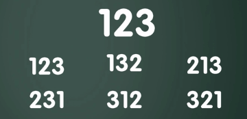
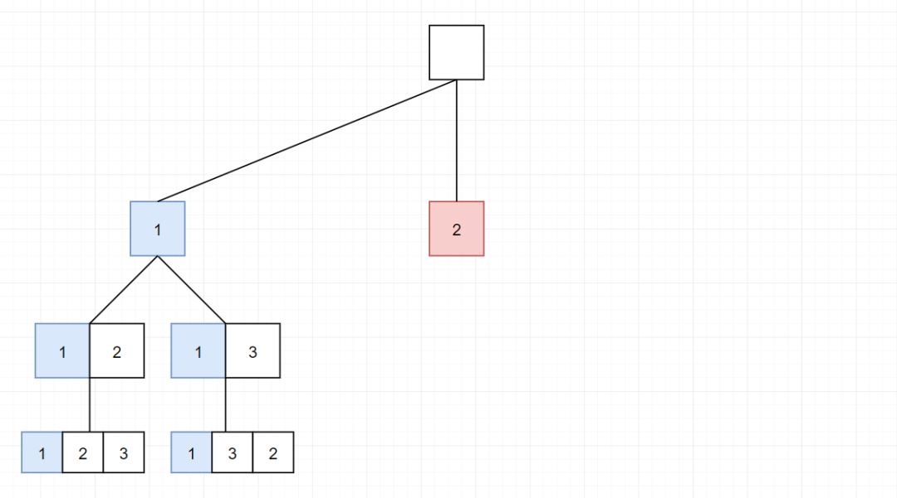

 
##	全排列算法
date:	2020-07-11
 

> 今天为大家分享如何用算法来求全排列！话不多说，直接看题！

## 01、全排列概念

> 什么是全排列？从 n 个不同元素中任取 m（m≤n）个元素，按照一定的顺序排列起来，叫做从 n 个不同元素中取出 m 个元素的一个排列。当 m=n 时所有的排列情况叫全排列。

<br/>

比如 [1,2,3] 全排列共有 6 种：



## 02、全排列题目

> 然后把上面的全排列稍微改改，就变成了一道算法题。。。

| 全排列问题                                                 |
| ---------------------------------------------------------- |
| 给定一个 **没有重复** 数字的序列，返回其所有可能的全排列。 |

**示例:**

```
输入: [1,2,3]

输出:
[
  [1,2,3],
  [1,3,2],
  [2,1,3],
  [2,3,1],
  [3,1,2],
  [3,2,1]
]
```

## 03、题解分析

> 这种由基础数学知识改编而成的题目，在面试时还是很受欢迎的。因为作为面试官，可以用这种题目，来显示自己的博学。（谬论）

<br/>

假如我们不是做算法题，而是做数学题。我们会一个位置一个位置的来考虑，先写出以1开头的排列，再写出以2开头的排列，最后写出以3开头的排列。


这种思路是不是很像深度优先（DFS）的求解过程呢？

<br/>

1、我们先选择 1，然后为 1 的第二位选择 2，此时 1 的 第三位只能选择 3。


2、然后完成了上面的步骤，我们需要回退到 1，因为只有 1 这里还存在别的选择 1-3，然后填写 1-3 后，只有 1-3-2 一种选择。


3、此时我们需要从 1-3-2，回退到 1-3，再回退到 1，再回退到 根节点，然后重新选择 2。



4、后面的流程与前面相似，我就不一步步的描述了。


当然，如果不省略其回溯过程，就是下面这个样子：

[TODO]

上面分析是分析完了，但是仍然不妨碍你继续懵逼。。。“题目中不是给我的是一个数组吗？作为一个合格的算法小白，我特么根本就不知道 DFS 在这里面咋用啊！！”本来想扔完代码就走，想了想还是决定讲一下。

<br/>

我们把代码先丢出来（注意，这个代码不是最优的，这样写只是易于大家理解。比如我们还可以通过置换的方式来进行优化，又或者其他的优化方法。但是都大同小异，核心是回溯的过程）：

```java
//JAVA 
class Solution { 
    List<List<Integer>> ans = new ArrayList<>(); 
       
    public List<List<Integer>> permute(int[] nums) { 
        dfs(nums, new ArrayList<>()); 
        return ans; 
    }
    
    private void dfs(int[] nums, List<Integer> tmp) {
        System.out.println(Arrays.toString(nums) + "," + tmp);
        if (tmp.size() == nums.length) {
            ans.add(new ArrayList<>(tmp));
        } else {
            for (int num : nums) {
                if (!tmp.contains(num)) {
                    tmp.add(num);
                    dfs(nums, tmp);
                    tmp.remove(tmp.size() - 1);
                }
            }
        }
    }
    
}
```

假若 nums 为 [1,2,3]，会有下面的输出：


其实这个代码还是很容易理解的，他干了个啥事？就是当我们按顺序去枚举每一位时，我们要把已经选择过的数字排除掉（第16行代码），比如我们上面选择三个数字：

<br/>

- 在枚举第一位的时候，就有三种情况
- 在枚举第二位的时候，就只有两种情况（前面已经出现的一个数字不可以再出现）
- 在枚举第三位的时候，就只有一种情况（前面已经出现的两个数字不可以再出现）

<br/>

整个代码其实就干了这么一件事！而 第12行 的代码，其实就是说**当枚举到最后一位的时候，这个就是我们要的排列结果，所以我们要放入到全排列结果集中。**

<br/>

那这里还有一个很重要的代码，其实是 第19行，这一步其实是干啥！说白了就是在回到上一位时，我们要就把上一次的选择结果**撤销**掉。不然如果你之前选过了，后面不就不能继续用了么。

## 04、总结

> 回溯法（探索与回溯法）是一种选优搜索法，又称为试探法，按选优条件向前搜索，以达到目标。但当探索到某一步时，发现原先选择并不优或达不到目标，就退回一步重新选择，这种走不通就退回再走的技术为回溯法，而满足回溯条件的某个状态的点称为“回溯点”。

<br/>

这是最简单的一道全排列题目，注意我在上面的题解中，并没有引入什么状态、路径、选择列表、结束条件之类的专业术语，甚至我连回溯的概念都没有提及。


之所以这样讲，我是希望咱可以从最简单的人类思考出发，而不是去套用一些框架之类的东东。。。。当然，至于更多的概念和回溯框架的东西，我会在后面更为复杂的题目中为大家引入。

<br/>

好了，基本就是这样了。周末写文不容易，求个转发，来个评论。感谢~