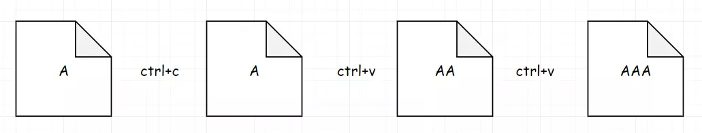

 
##	只有两个键的键盘（650）
date:	2020-06-15
 

>今天为大家分享一道关于 **“复制” + “粘贴”** 的题目。话不多说，直接看题吧。

## 01、题目分析

| 第650题：只有两个键的键盘                                    |
| ------------------------------------------------------------ |
| 最初在一个记事本上只有一个字符  'A' 。你每次可以对这个记事本进行两种操作：Copy All (复制全部) : 你可以复制这个记事本中的所有字符(部分的复制是不允许的)。Paste (粘贴) : 你可以粘贴你上一次复制的字符。 |

给定一个数字 n 。你需要使用**最少的操作次数**，在记事本中打印出恰好 n 个 'A'。输出能够打印出 n 个 'A' 的最少操作次数。

<br/>

**示例 1:**

```
输入: 3
输出: 3
解释:
最初, 我们只有一个字符 'A'。
第 1 步, 我们使用 Copy All 操作。
第 2 步, 我们使用 Paste 操作来获得 'AA'。
第 3 步, 我们使用 Paste 操作来获得 'AAA'。
```

<br/>

**说明:**

n 的取值范围是 [1, 1000] 。

## 02、题目分析

本题的思路，在于**想明白复制和粘贴过程中的规律，找到如何组成N个A的最小操作数。**

<br/>

我们从最简单的开始分析，假如我们给定数字为1，那啥也不用做，因为面板上本来就有一个A。


假如我们给定数字为2，那我们需要做C-P，共计2次操作来得到。


假如我们给定数字为3，那我们需要做C-P-P，共计3次操作来得到。



假如我们给定数字为4，我们发现好像变得不一样了。因为我们有两种方法都可以得到目标。（C-P-C-P）


或者（C-P-P-P）


但是需要的步骤还是一样。

<br/>

好了，到这里为止，STOP！通过上面的分析，我们至少可以观察出：**如果 i 为质数，那么 i 是多少，就需要粘贴多少次**。即：素数次数为本身的结论。如 两个A = 2，三个A = 3，五个A = 5。

<br/>

那对于合数又该如何分析呢？（自然数中除能被1和本身整除外,还能被其他的数整除的数）这里我们直接给出答案：合数的次数为**将其分解质因数的操作次数的和。** 解释一下，这是个啥意思？举个例子：

<br/>

比如30，可以分解为：3*2*5。什么意思呢？我们演示一遍：首先复制1，进行2次粘贴得到3。然后复制3，进行1次粘贴得到6。然后复制6，进行4次粘贴得到30。总共需要（CPPCPCPPPP）


> 注意：这里由于每一次都需要进行一次复制，**所以直接就等于分解质因数的操作次数的和**。并且分解的顺序，不会影响到结果。

<br/>

综合上面的分析，我们得出分析结果：

1、质数次数为其本身。

2、合数次数为将其分解到**所有不能再分解的质数的操作次数的和**。

<br/>

## 03、Go语言示例

分析完毕，代码如下所示：

```go
func minSteps(n int) int {
	res := 0
	for i := 2; i <= n; i++ {
		for n%i == 0 {
			res += i
			n /= i
		}
	}
	return res
}
```

执行结果：

