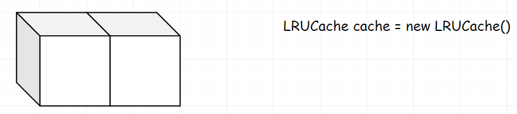
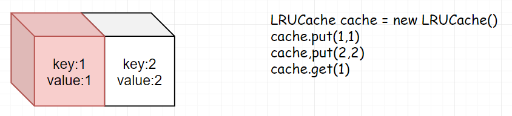
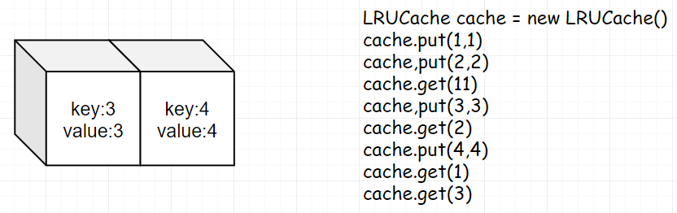
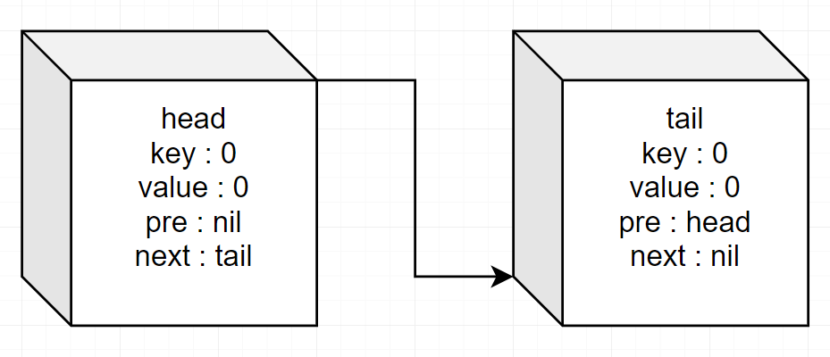

 
##	LRU缓存机制（146）
date:	2020-06-17
 

> 今天为大家分享很出名的 LRU 算法，第一讲共包括 4 节。
>
> - LRU概述
> - LRU使用
> - LRU实现
> - Redis近LRU概述

## 01、LRU 概述

LRU 是 Least Recently Used 的缩写，译为最近最少使用。它的理论基础为“**最近使用的数据会在未来一段时期内仍然被使用，已经很久没有使用的数据大概率在未来很长一段时间仍然不会被使用**”由于该思想非常契合业务场景 ，并且可以解决很多实际开发中的问题，所以我们经常通过 LRU 的思想来作缓存，一般也将其称为**LRU缓存机制**。因为恰好 leetcode 上有这道题，所以我干脆把题目贴这里。但是对于 LRU 而言，希望大家不要局限于本题（大家不用担心学不会，我希望能做一个全网最简单的版本，希望可以坚持看下去！）下面，我们一起学习一下。

| 第146题：LRU缓存机制                                         |
| ------------------------------------------------------------ |
| 运用你所掌握的数据结构，设计和实现一个  LRU (最近最少使用) 缓存机制。它应该支持以下操作：获取数据 get 和 写入数据 put 。 |

获取数据 get(key) - 如果密钥 (key) 存在于缓存中，则获取密钥的值（总是正数），否则返回  -1 。

<br/>

写入数据 put(key, value) - 如果密钥不存在，则写入其数据值。当缓存容量达到上限时，它应该在写入新数据之前删除最近最少使用的数据值，从而为新的数据值留出空间。

<br/>

进阶:你是否可以在 O(1) 时间复杂度内完成这两种操作？

<br/>

**示例:**

```
LRUCache cache = new LRUCache( 2 /* 缓存容量 */ );
cache.put(1, 1);
cache.put(2, 2);
cache.get(1);       // 返回  1
cache.put(3, 3);    // 该操作会使得密钥 2 作废
cache.get(2);       // 返回 -1 (未找到)
cache.put(4, 4);    // 该操作会使得密钥 1 作废
cache.get(1);       // 返回 -1 (未找到)
cache.get(3);       // 返回  3
cache.get(4);       // 返回  4
```

## 02、LRU 使用（解释）

由于我实在担心部分同学完全懵逼零基础，所以我把上面的LRUCache的示例解释一下。

第一步：我们申明一个 LRUCache ，长度为 2。



第二步：我们分别向 cache 里边 put(1,1) 和 put(2,2)，这里因为最近使用的是 2（ put 也算作使用）所以2在前，1 在后。


第三步：我们 get(1)，也就是我们使用了 1，所以需要将 1 移到前面。



第四步：此时我们 put(3,3)，因为 2 是最近最少使用的，所以我们需要将 2 进行作废。此时我们再 get(2)，就会返回 -1 。


第五步：我们继续 put(4,4)，同理我们将 1 作废。此时如果 get(1) ，也是返回 -1 。


第六步：此时我们 get(3) ，实际为调整 3 的位置。



第七步：同理，get(4)，继续调整 4 的位置。


## 03、LRU 实现（层层剖析）

> 上面的图搞了我半小时，基本不是弱智的话，应该都能理解 LRU 的使用了。现在我们聊一下实现。LRU 一般来讲，我们是使用**双向链表**实现。基本上在面试的时候，能写出来双向链表的实现，已经可以打 9 分了。但是这里我要强调的是，其实在项目中，并不绝对是这样。比如 Redis 源码里，LRU 的淘汰策略，就没有使用双向链表，而是使用一种模拟链表的方式。因为 Redis 大多是当内存在用（我知道可以持久化），如果再在内存中去维护一个链表，就平添了一些复杂性，同时也会多耗掉一些内存，后面我会单独拉出来 Redis 的源码给大家分析，这里不细说。

<br/>

回到题目，为什么我们要选择双向链表来实现呢？看看上面的使用步骤图，大家会发现，在整个 LRUCache 的使用中，我们需要**频繁的去调整首尾元素的位置**。而双向链表的结构，刚好满足这一点（再啰嗦一下，前几天我刚好看了 groupcache 的源码，里边就是用双向链表来做的 LRU，当然它里边做了一些改进。groupcache 是memcache 作者实现的 go 版本，如果有 go 的读者，可以去看看源码，还是有一些收获。）

<br/>

下面，我们采用 hashmap+ 双向链表的方式进行实现。

<br/>

首先，我们定义一个 LinkNode ，用以存储元素。因为是双向链表，自然我们要定义 pre 和 next。同时，我们需要存储下元素的 key 和 value 。val 大家应该都能理解，关键是为什么需要存储 key？举个例子，比如当整个cache 的元素满了，此时我们需要删除 map 中的数据，需要通过 LinkNode 中的 key 来进行查询，否则无法获取到 key。

```go
type LinkNode struct {
	key, val  int
	pre, next *LinkNode
}
```

现在有了 LinkNode ，自然需要一个 Cache 来存储所有的 Node。我们定义 cap 为 cache 的长度，m 用来存储元素。head 和 tail 作为 Cache 的首尾。

```go
type LRUCache struct {
	m          map[int]*LinkNode
	cap        int
	head, tail *LinkNode
}
```

接下来我们对整个 Cache 进行初始化。在初始化 head 和 tail 的时候将它们连接在一起。

```go
func Constructor(capacity int) LRUCache {
	head := &LinkNode{0, 0, nil, nil}
	tail := &LinkNode{0, 0, nil, nil}
	head.next = tail
	tail.pre = head
	return LRUCache{make(map[int]*LinkNode), capacity, head, tail}
}
```

大概是这样：



现在我们已经完成了 Cache 的构造，剩下的就是添加它的 API 了。因为 Get 比较简单，我们先完成 Get 方法。这里分两种情况考虑，如果没有找到元素，我们返回 -1。如果元素存在，我们需要把这个元素移动到首位置上去。

```go
func (this *LRUCache) Get(key int) int { 
    head := this.head 
    cache := this.m 
    if v, exist := cache[key]; exist { 
        v.pre.next = v.next 
        v.next.pre = v.pre 7
        v.next = head.next 
        head.next.pre = v         v.pre = head
        head.next = v
        return v.val
     } else {
         return -1
     }
}
```

大概就是下面这个样子（假若 2 是我们 get 的元素）


我们很容易想到这个方法后面还会用到，所以将其抽出。

```go
func (this *LRUCache) AddNode(node *LinkNode) {
	head := this.head
	//从当前位置删除
	node.pre.next = node.next
	node.next.pre = node.pre
	//移动到首位置
	node.next = head.next
	head.next.pre = node
	node.pre = head
	head.next = node
}

func (this *LRUCache) Get(key int) int {
	cache := this.m
	if v, exist := cache[key]; exist {
		this.MoveToHead(v)
		return v.val
	} else {
		return -1
	}
}
```

现在我们开始完成 Put。实现 Put 时，有两种情况需要考虑。假若元素存在，其实相当于做一个 Get 操作，也是移动到最前面（**但是需要注意的是，这里多了一个更新值的步骤**）。

```go
func (this *LRUCache) Put(key int, value int) {
    head := this.head
	tail := this.tail
	cache := this.m
	//假若元素存在
	if v, exist := cache[key]; exist {
		//1.更新值
		v.val = value
		//2.移动到最前
		this.MoveToHead(v)
	} else {
		//TODO
	}
}
```

假若元素不存在，我们将其插入到元素首，并把该元素值放入到 map 中。

```go
func (this *LRUCache) Put(key int, value int) {
    head := this.head
	tail := this.tail
	cache := this.m
	//存在
	if v, exist := cache[key]; exist {
		//1.更新值
		v.val = value
		//2.移动到最前
		this.MoveToHead(v)
	} else {
		v := &LinkNode{key, value, nil, nil}
		v.next = head.next
        v.pre = head
        head.next.pre = v
        head.next = v
        cache[key] = v
	}
}
```

但是我们漏掉了一种情况，**如果恰好此时Cache中元素满了，需要删掉最后的元素。** 处理完毕，附上 Put 函数完整代码。

```go
func (this *LRUCache) Put(key int, value int) {
    head := this.head
	tail := this.tail
	cache := this.m
	//存在
	if v, exist := cache[key]; exist {
		//1.更新值
		v.val = value
		//2.移动到最前
		this.MoveToHead(v)
	} else {
		v := &LinkNode{key, value, nil, nil}
		if len(cache) == this.cap {
            //删除最后元素            
            delete(cache, tail.pre.key)
            tail.pre.pre.next = tail
            tail.pre = tail.pre.pre
        }
        v.next = head.next
        v.pre = head
        head.next.pre = v
        head.next = v
        cache[key] = v
	}
}
```


最后，我们完成所有代码：

```go
type LinkNode struct {
	key, val  int
	pre, next *LinkNode
}

type LRUCache struct {
	m          map[int]*LinkNode
	cap        int
	head, tail *LinkNode
}

func Constructor(capacity int) LRUCache {
	head := &LinkNode{0, 0, nil, nil}
	tail := &LinkNode{0, 0, nil, nil}
	head.next = tail
	tail.pre = head
	return LRUCache{make(map[int]*LinkNode), capacity, head, tail}
}

func (this *LRUCache) Get(key int) int {
	cache := this.m
	if v, exist := cache[key]; exist {
		this.MoveToHead(v)
		return v.val
	} else {
		return -1
	}
}
func (this *LRUCache) AddNode(node *LinkNode) {
	head := this.head
	//从当前位置删除
	node.pre.next = node.next
	node.next.pre = node.pre
	//移动到首位置
	node.next = head.next
	head.next.pre = node
	node.pre = head
	head.next = node
}
func (this *LRUCache) Put(key int, value int) {
    head := this.head
	tail := this.tail
	cache := this.m
	//存在
	if v, exist := cache[key]; exist {
		//1.更新值
		v.val = value
		//2.移动到最前
		this.MoveToHead(v)
	} else {
		v := &LinkNode{key, value, nil, nil}
		if len(cache) == this.cap {
            //删除最后元素            
            delete(cache, tail.pre.key)
            tail.pre.pre.next = tail
            tail.pre = tail.pre.pre
        }
        v.next = head.next
        v.pre = head
        head.next.pre = v
        head.next = v
        cache[key] = v
	}
}
```

优化后：

```g
type LinkNode struct {
	key, val  int
	pre, next *LinkNode
}

type LRUCache struct {
	m          map[int]*LinkNode
	cap        int
	head, tail *LinkNode
}

func Constructor(capacity int) LRUCache {
	head := &LinkNode{0, 0, nil, nil}
	tail := &LinkNode{0, 0, nil, nil}
	head.next = tail
	tail.pre = head
	return LRUCache{make(map[int]*LinkNode), capacity, head, tail}
}

func (this *LRUCache) Get(key int) int {
	cache := this.m
	if v, exist := cache[key]; exist {
		this.MoveToHead(v)
		return v.val
	} else {
		return -1
	}
}

func (this *LRUCache) RemoveNode(node *LinkNode) {
	node.pre.next = node.next
	node.next.pre = node.pre
}

func (this *LRUCache) AddNode(node *LinkNode) {
	head := this.head
	node.next = head.next
	head.next.pre = node
	node.pre = head
	head.next = node
}

func (this *LRUCache) MoveToHead(node *LinkNode) {
	this.RemoveNode(node)
	this.AddNode(node)
}

func (this *LRUCache) Put(key int, value int) {
	tail := this.tail
	cache := this.m
	if v, exist := cache[key]; exist {
		v.val = value
		this.MoveToHead(v)
	} else {
		v := &LinkNode{key, value, nil, nil}
		if len(cache) == this.cap {
			delete(cache, tail.pre.key)
			this.RemoveNode(tail.pre)
		}
		this.AddNode(v)
		cache[key] = v
	}
}
```

执行结果：


因为该算法过于重要，给一个 Java 版本的：

```go
//java版本
import java.util.Hashtable;
public class LRUCache {
  class DLinkedNode {
    int key;
    int value;
    LinkedNode prev;
    LinkedNode next;
  }

  private void addNode(DLinkedNode node) {
    node.prev = head;
    node.next = head.next;
    head.next.prev = node;
    head.next = node;
  }

  private void removeNode(DLinkedNode node){
    LinkedNode prev = node.prev;
    LinkedNode next = node.next;
    prev.next = next;
    next.prev = prev;
  }

  private void moveToHead(DLinkedNode node){
    removeNode(node);
    addNode(node);
  }

  private DLinkedNode popTail() {
    DLinkedNode res = tail.prev;
    removeNode(res);
    return res;
  }

  private Hashtable<Integer, DLinkedNode> cache =
    new Hashtable<Integer, DLinkedNode>();
  private int size;
  private int capacity;
  private DLinkedNode head, tail;

  public LRUCache(int capacity) {
    this.size = 0;
    this.capacity = capacity;
    head = new DLinkedNode();
    tail = new DLinkedNode();
    head.next = tail;
    tail.prev = head;
  }

  public int get(int key) {
    DLinkedNode node = cache.get(key);
    if (node == null) return -1;
    moveToHead(node);
    return node.value;
  }

  public void put(int key, int value) {
    DLinkedNode node = cache.get(key);

    if(node == null) {
      DLinkedNode newNode = new DLinkedNode();
      newNode.key = key;
      newNode.value = value;
      cache.put(key, newNode);
      addNode(newNode);
      ++size;
      if(size > capacity) {
        DLinkedNode tail = popTail();
        cache.remove(tail.key);
        --size;
      }
    } else {
      node.value = value;
      moveToHead(node);
    }
  }
}

```

## 04、Redis 近LRU 介绍

> 上文完成了咱们自己的 LRU 实现，现在现在聊一聊 Redis 中的近似 LRU 。由于**真实LRU需要过多的内存（在数据量比较大时）**，所以 Redis 是使用一种随机抽样的方式，来实现一个近似 LRU 的效果。说白了，LRU 根本只是一个**预测键访问顺序的模型**。

在 Redis 中有一个参数，叫做 “maxmemory-samples”，是干嘛用的呢？

```
# LRU and minimal TTL algorithms are not precise algorithms but approximated  # algorithms (in order to save memory), so you can tune it for speed or  # accuracy. For default Redis will check five keys and pick the one that was  # used less recently, you can change the sample size using the following  # configuration directive.  6#  # The default of 5 produces good enough results. 10 Approximates very closely  # true LRU but costs a bit more CPU. 3 is very fast but not very accurate.  # 10maxmemory-samples 5
```

上面我们说过了，**近似LRU是用随机抽样的方式来实现一个近似的LRU效果**。这个参数其实就是作者提供了一种方式，可以让我们人为干预样本数大小，将其设的越大，就越接近真实 LRU 的效果，当然也就意味着越耗内存。（初始值为 5 是作者默认的最佳）


这个图解释一下，绿色的点是新增加的元素，深灰色的点是没有被删除的元素，浅灰色的是被删除的元素。最下面的这张图，是真实 LRU 的效果，第二张图是默认该参数为 5 的效果，可以看到浅灰色部分和真实的契合还是不错的。第一张图是将该参数设置为 10 的效果，已经基本接近真实 LRU 的效果了。

<br/>

今天基本就说到这里。那 Redis 中的近似 LRU 是如何实现的呢？因为时间的关系，我打算做到下一期的内容。最后，评论区留下你的想法吧！