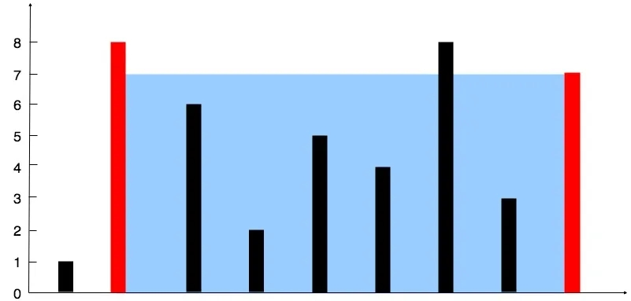
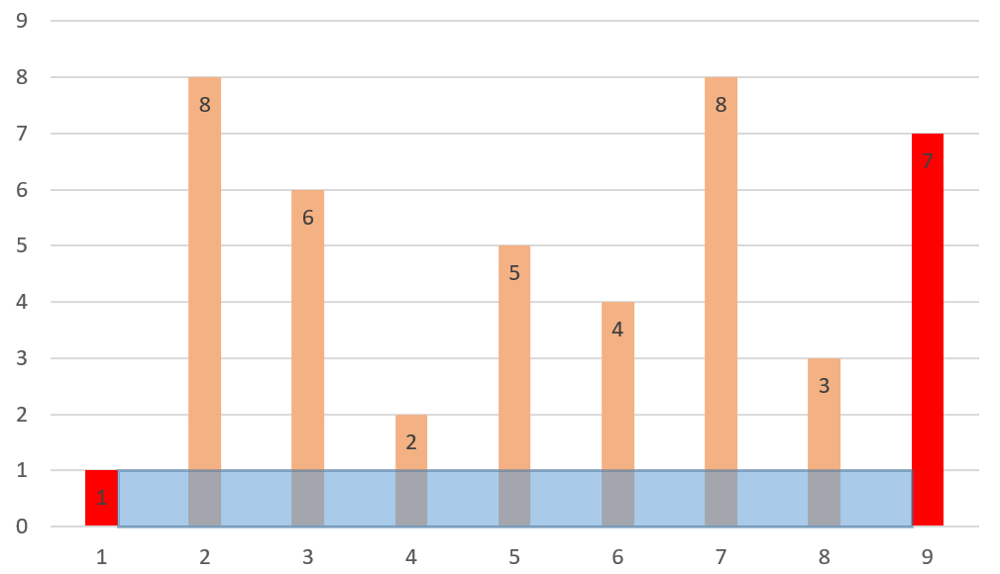
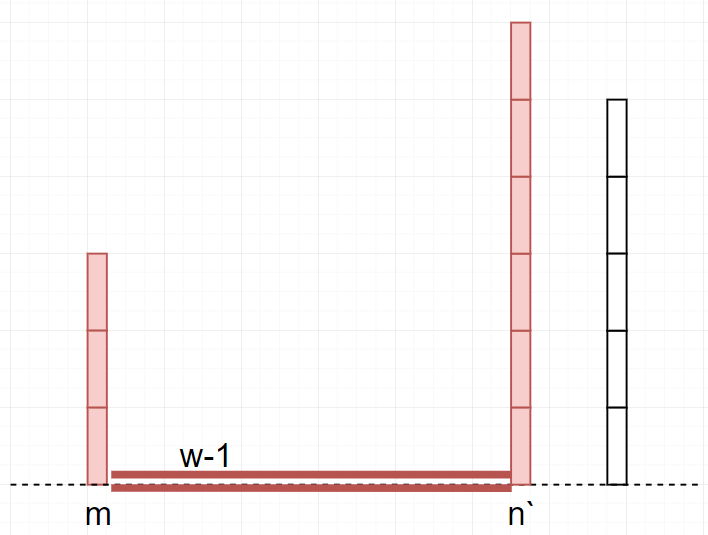

 

##	盛最多水的容器
date:	2020-06-19
 

> 今天为大家分享一道鹅厂的面试题。话不多说，直接看题目。

## 01、题目示例

> 这道题目会了的朋友可能觉得很简单，但是我觉得这题实在很经典，所以还是得拿出来讲讲。还有一个进阶版本“接雨水”，将在后面为大家讲解。

| 盛最多水的容器                                               |
| ------------------------------------------------------------ |
| 给你 n 个非负整数 a1，a2，...，an，每个数代表坐标中的一个点 (i, ai) 。在坐标内画 n 条垂直线，垂直线 i 的两个端点分别为 (i, ai) 和 (i, 0)。找出其中的两条线，使得它们与 x 轴共同构成的容器可以容纳最多的水。 |

说明：你不能倾斜容器，且 n 的值至少为 2。



图中垂直线代表输入数组 [1,8,6,2,5,4,8,3,7]。在此情况下，容器能够容纳水（表示为蓝色部分）的最大值为 49。

<br/>

**示例：**

```
输入：[1,8,6,2,5,4,8,3,7] 
输出：49
```

## 02、题目分析

> 观察可得，垂直的两条线段将会与坐标轴构成一个矩形区域，较短线段的长度将会作为矩形区域的宽度，两线间距将会作为矩形区域的长度，我们求解容纳水的最大值，实为找到该矩形最大化的区域面积。

首先，本题自然可以暴力求解，只要**找到每对可能出现的线段组合，然后找出这些情况下的最大面积**。这种解法直接略过，大家有兴趣可以下去自己尝试。这道题比较经典是是使用双指针进行求解，已经会的朋友不妨复习复习。

<br/>

假若我们的数组为：[1 8 6 2 5 4 8 3 7]，长这样：


首先，我们初始化两个指针，分别指向两边，构成我们的第一个矩形区域。



我们尝试将长的一侧向短的一侧移动，发现对于区域面积增加没有任何意义。比如下图：


所以我们选择将短的一侧向长的一侧移动。根据木桶原理，水的高度取决于短的一侧。


继续重复这个过程，我们总是**选择将短的一侧向长的一侧移动**。并且在每一次的移动中，我们记录下来当前面积大小。（下面这些图，都是我拿PPT一张张做的....）


一直到两个棒子撞在一起。


根据分析，得到代码：(翻Java牌子)

```java
//JAVA 
class Solution { 
    public int maxArea(int[] height) { 
        int i = 0, j = height.length - 1, res = 0; 
        while(i < j){ 
            res = height[i] < height[j] ? 
                Math.max(res, (j - i) * height[i  ]):  
                Math.max(res, (j - i) * height[j--]); 
        }
        return res;
    }
}
```

## 03、反证法证明

> 可能有的朋友想让我证明一下。其实我觉得，这就是个木桶原理。木桶原理：**一只水桶能装多少水取决于它最短的那块木板**。


采用反证法进行证明：


><center>area = h(m) * w</center>

移动n到n，如果n比m短，则有：

area = h(n) * (w-1) 

有 area < area


移动n到n，如果n比m长，则有：

area = h(m) * (w-1)

有 area < area



所以，今天的问题你学会了吗？评论区留下你的想法！