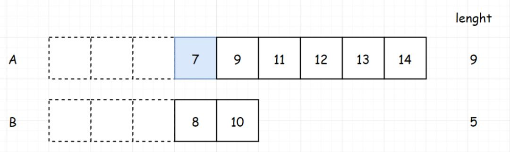

 
##	寻找两个正序数组的中位数（292）
date:	2020-06-20
 

> 今天为大家分享一道FLAG和BAT都出现过的经典面试题。题目有一定难度，建议大家耐着性子看完！不要说没天赋看不懂。在这个浮躁到努力的人都很少的年代，还谈不上说天赋这件事。

## 01、题目示例

> 这道题是非常好的一道题目，也是前面100道里最难的题目之一，相当经典！

<br/>

| 第4题：寻找两个正序数组的中位数                              |
| ------------------------------------------------------------ |
| 给定两个大小为 m 和 n 的有序数组 nums1 和 nums2。请你找出这两个有序数组的中位数，并且要求算法的时间复杂度为 O(log(m   n))。你可以假设 nums1 和 nums2 不会同时为空。 |

**示例 1:**

```
nums1 = [1, 3]
nums2 = [2]
则中位数是 2.0
```

**示例 2:**

```
nums1 = [1, 2]
nums2 = [3, 4]
则中位数是 (2   3)/2 = 2.5
```

## 02、题目分析

> 中位数（Median）又称中值，统计学中的专有名词，是按顺序排列的一组数据中居于中间位置的数，代表一个样本、种群或概率分布中的一个数值，其可将数值集合划分为相等的上下两部分。对于有限的数集，可以通过把所有观察值高低排序后找出正中间的一个作为中位数。如果观察值有偶数个，通常取最中间的两个数值的平均数作为中位数。

<br/>

题意还是比较简单的，没有什么需要额外补充。当然可以直接暴力求解，因为都是有序数组，直接进行合并，再对合并后的数组通过判断是否是偶数个，求出中位数。但是由于这种方法肯定是达不到O(log(n))的，所以我们直接略过。如果是为了练习code能力的小伙伴，下去可以自行试试。

<br/>

那如何保证时间复杂度在O(log(n))呢？这里有一个小技巧，**一般如果题目要求时间复杂度在O(log(n))，大部分都是可以使用二分的思想来进行求解**。当然，本题的二分是有一点反直觉的，可能不是很容易想到，一起看下。

<br/>

首先，我们考虑一个问题，如果只有一个有序数组，我们需要找中位数，那肯定需要判断元素是奇数个还是偶数个，如果是奇数个那最中间的就是中位数，如果是偶数个的话，那就是最中间两个数的和除以2。


那如果是两个数组，也是一样的，我们先求出两个数组长度之和。如果为奇数，就找中间的那个数，也就是 **(长度之和 1)/2** 。如果为偶数，那就找 **长度之和/2**。比如下面的 (9 5)/2 = 7，那我们最终就是**找到排列第7位的值**。此时，问题其实已经转化为“**找到两个数组中第k小的元素**”。找到了第7位之后，第8位我们已经知道了，然后第7位和第8位的和，除以2就是我们要找的中位数（**注意：这里的7和8你其实是不知道的，图中画出来，只是为了帮助理解**）


现在的问题是，我们如何用二分的思想来找到中间排列第7位的数。这里有一种不太好想到的方式，**是用删的方式**，因为**如果我们可以把多余的数排除掉，最终剩下的那个数，是不是就是我们要找的数？** 对于上面的数组，我们可以先删掉 7/2=3 个数。那这里，可以选择删上面的，也可以选择删下面的。那这里因为 i<j，所以我们选择删除上面的3个数。


<center>（删除前）</center>


<center>（删除后）</center>

由于我们已经排除掉了 3 个数字，现在对于两个数组，我们需要找到7-3=4的数字，来进行下一步运算。我们可以继续删掉4/2=2个数。我们比较i和j的值，删除小的一边。


<center>（删除前）</center>


<center>（删除后）</center>

继续上面的步骤，我们删除 2/2=1 个数。**同理，比较7和6的大小，删除小的一边**。删完后是下面这样：


<center>（7和6，删除6）</center>

不要忘记我们的目的，我们是为了找第7小的数。此时，**两个数组的第一个元素，哪个小，就是我们要找的那个数**。因为7<8，所以7就是我们要找的第7小的数。



这里有一点比较特殊的，如果在删除过程中，我们**要删除的K/2个数，大于其中一边的数组长度**，那我们就将小的一侧数组元素都删除。比如下面这个，此时7/2=3，但是下面的数组只有2个元素，我们就将它全部删除。


删完之后，此时因为只删除了2个元素，所以k变成了5。那我们只需要返回其中一边的第5个元素就ok。


整个上面的过程，完成了本题的算法架构！

<br/>

## 03、证明过程

> 今天的题目有一定难度，但是并不是没办法攻克！最重要的还是三点：
>
> - 从整体把握整个问题的算法基础，想明白是如何从找中位数，转化成找“两个有序数组第k大的元素”
> - 能理解折半“删除”元素的过程，将问题转化为二分
> - 独立的思考 一点点的努力

<br/>

根据分析，完成代码：

```java
//JAVA
class Solution {
    public double findMedianSortedArrays(int[] nums1, int[] nums2) {
        int len1 = nums1.length;
        int len2 = nums2.length;
        int total = len1 + len2;
        int left = (total + 1) / 2;
        int right = (total + 2) / 2;
        return (findK(nums1, 0, nums2, 0, left) + findK(nums1, 0, nums2, 0, right)) / 2.0;

    }

    //找到两个数组中第k小的元素
    public int findK(int[] nums1, int i, int[] nums2, int j, int k) {
        if (i >= nums1.length)
            return nums2[j + k - 1];
        if (j >= nums2.length)
            return nums1[i + k - 1];
        if (k == 1) {
            return Math.min(nums1[i], nums2[j]);
        }
        //计算出每次要比较的两个数的值，来决定 "删除"" 哪边的元素
        int mid1 = (i + k / 2 - 1) < nums1.length ? nums1[i + k / 2 - 1] : Integer.MAX_VALUE;
        int mid2 = (j + k / 2 - 1) < nums2.length ? nums2[j + k / 2 - 1] : Integer.MAX_VALUE;
        //通过递归的方式，来模拟删除掉前K/2个元素
        if (mid1 < mid2) {
            return findK(nums1, i + k / 2, nums2, j, k - k / 2);
        }
        return findK(nums1, i, nums2, j + k / 2, k - k / 2);
    }
}
```

执行结果：

