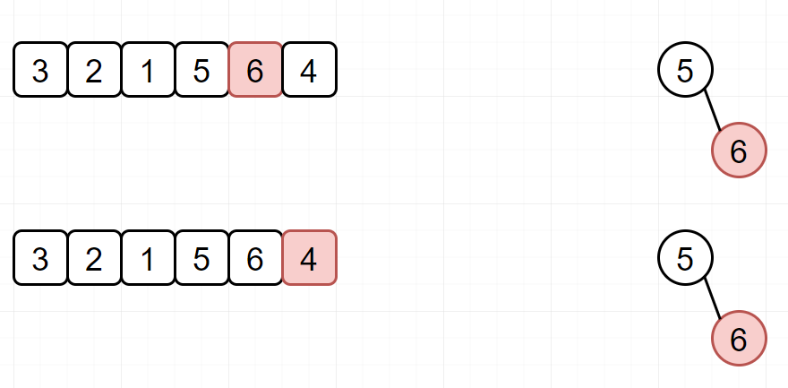

 
##	第k个最大元素（215）
date:	2020-07-01
 

> 今天给大家分享一道美团面试题。话不多说，直接看题。

## 01、题目示例

> 这个题目的变形很多，比如找 "前 K 个高频元素"、 "数据流中的第K大元素" 、"最接近原点的 K 个值" 等等等等。

| 第215题：第K个最大元素                                       |
| ------------------------------------------------------------ |
| 在未排序的数组中找到第 k 个最大的元素。请注意，你需要找的是数组排序后的第 k 个最大的元素，而不是第 k 个不同的元素。 |

**示例 1:**

```
输入: [3,2,1,5,6,4] 和 k = 2
输出: 5
```

**示例 2:**

```
输入: [3,2,3,1,2,4,5,5,6] 和 k = 4
输出: 4
```

**说明:**

你可以假设 k 总是有效的，且 1 ≤ k ≤ 数组的长度。

 <br/>

## 02、大顶堆

> 堆在算法题目中的应用主要包括以下几点：     
>
> - TopK 问题 （尤其是大数据处理）
> - 优先队列
> - 利用堆求中位数

 <br/>

这种题目，从个人来讲，我一般是比较偏好使用堆来做的。毕竟大小顶堆，刚好有着与本类题型契合的特性。如果对堆不太熟悉的话，可以先看下这篇文章：


那本题如何使用堆来做呢？假若我们的数组为[3,2,1,5,6,4]，k=2，我们对其构造一个小顶堆（每个结点的值均不大于其左右孩子结点的值，堆顶元素为整个堆的最小值），整个过程是这样：

 <br/>

- 构造一个小顶堆，依次将元素放入堆中，并保证堆中元素为k。

  

- 如果当前元素小于堆顶元素，那基本就不用看了（因为我们要找的是 排序后的第 k 个最大的元素）

  

- 自然，如果我们遇到比堆顶元素大的元素，就把它放入到堆中。

  

- 重复上面的步骤：

  

然后根据分析，完成代码（今天就不手撕堆了，因为之前已经手撕过了。同时这里给大家一个建议，如果面试的时候，遇到这种TOPK的问题，**假如特别有把握，肯定得手撕数据结构，一定会加分**。但是如果没有把握，那就先用API实现，以 BugFree 为目标吧！）

```java
//java
class Solution {
    public int findKthLargest(int[] nums, int k) {
        PriorityQueue<Integer> minQueue = new PriorityQueue<>(k);
        for (int num : nums) {
            if (minQueue.size() < k || num > minQueue.peek()) {
                minQueue.offer(num);
            }
            if (minQueue.size() > k) {
                minQueue.poll();
            }
        }
        return minQueue.peek();
    }
}

```

我也不知道为啥，Python永远就是这么牛X，朴实无华且枯燥！

```python
//python
class Solution:
    def findKthLargest(self, nums: List[int], k: int) -> int:
        return heapq.nlargest(k, nums)[-1] # [6,5]
```

**注：**python可以使用heapq.nlargest 或 heapq.nsmallest，来找出某个集合中找出最大或最小的N个元素。

```python
//python
>>> import heapq
>>> nums=[1,8,2,23,7,-4,18,23,42,37,2]
>>> print(heapq.nlargest(3,nums))
[42, 37, 23]
>>> print(heapq.nsmallest(3,nums))
[-4, 1, 2]
```

## 03、快排

> 快速排序（Quicksort）是对冒泡排序的一种改进。快速排序由C. A. R. Hoare在1960年提出。它的基本思想是：通过一趟排序将要排序的数据分割成独立的两部分，其中一部分的所有数据都比另外一部分的所有数据都要小，然后再按此方法对这两部分数据分别进行快速排序，整个排序过程可以递归进行，以此达到整个数据变成有序序列。 

 <br/>

那对于本题，我们就是使用快排的思想，选定一个基准值，把比基准值大的放在基准值的右边，把基准值小的放在基准值的左边。若基准值刚好位于倒数第k个数，则基准值为目标值；反之，则递归处理目标值所处的那一部分数组。

```go
func findKthLargest(nums []int, k int) int {
    idx := quickSort(0, len(nums) - 1, len(nums) - k, nums)
    return nums[idx]
}

func quickSort(l, r, pos int, nums []int) int {
    povit_idx := partition(l, r, nums)
    if pos == povit_idx {
        return povit_idx
    } else if pos > povit_idx {
        return quickSort(povit_idx + 1, r, pos, nums)
    } else {
        return quickSort(l, povit_idx - 1, pos, nums)
    }
}

func partition(l, r int, nums []int) int {
    s := l
    povit_value := nums[l]
    for l < r {
        for ;l < r && nums[r] >= povit_value; {
            r--
        }
        for ;l < r && nums[l] <= povit_value; {
            l++
        }
        if l < r {
            nums[l] = nums[r] ^ nums[l]
            nums[r] = nums[l] ^ nums[r]
            nums[l] = nums[r] ^ nums[l]
        }
    }
    nums[s] = nums[l]
    nums[l] = povit_value
    return l
}
```

执行结果：


整个快排的核心，其实就partition。partition 有 单向扫描，双向扫描 等多种写法。上面的代码，大家可以参考参考，看不懂也没关系，我后面是会单独安排一个快排的系列篇来进行讲解的，到时候一堆图解砸进来，保准你看的醍醐灌顶！

<br/>

所以，今天的问题你学会了吗？评论区留下你的想法！