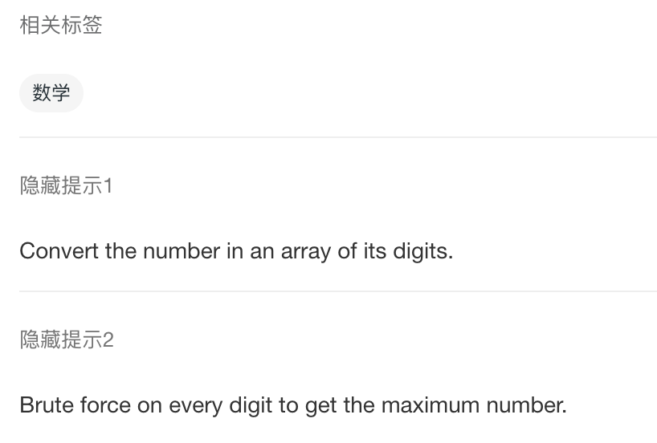

 
##	六九问题
date:	2020-07-10
 

> 69式是一种。。。咳咳，六九问题是一道很有趣的算法题。嗯，不服来辩。

## 01、题目示例

> 注意，num每一位上的数字都是 6 或者 9 。

<br/>

| 题目：1323. 6 和 9 组成的最大数字            |
| -------------------------------------------- |
| 给你一个仅由数字 6 和 9 组成的正整数 `num`。 |

<br/>

大概就是这么个意思：


```
输入：num = 9669
输出：9969

解释：
改变第一位数字可以得到 6669 。
改变第二位数字可以得到 9969 。
改变第三位数字可以得到 9699 。
改变第四位数字可以得到 9666 。
其中最大的数字是 9969 。
```

## 02、题解分析

> 因为题目太简单了，所以。。。。我也不知道为什么拿来讲。反正不是凑字数 😂（我一定不会告诉你我是因为标题污所以选它的）

<br/>

我们只要找到 num 中最高位的 6，将其翻转成 9，就可以找到答案。

```java
//java
class Solution {    
    public int maximum69Number (int num) {        
        String s = num + "";        
        s = s.replaceFirst("6", "9");        
        return Integer.valueOf(s);    
    }
}
```

执行结果：


<br/>

emmmmm，大概就是这样。。。。我感觉要被锤，溜了溜了。


## 03、知识点总结

> 写出上面的答案，大概率是被面试官锤了。那这道题到底是考察我们什么呢？



大家可以看到，这是一道数学题。所以我们需要用数学的方法来进行求解。具体代码如下：

```java
//java
class Solution {    
    public int maximum69Number(int num) {        
        if (num / 1000 == 6) {            
            num += 3000;        
        } else if (num % 1000 / 100 == 6) {            
            num += 300;        
        } else if (num % 100 / 10 == 6) {            
            num += 30;        
        } else if (num % 10 == 6) {            
            num += 3;        
        }        
        return num;    
    }
}
```

其实这种解法，和上面的解法没什么区别。**都是从高位到低位进行判断，遇到 6 就将其变为 9**。只不过，上面是通过 replaceFirst 来进行，下面通过数值相加的方式来进行。那这种方法的效率我们看看：


吊炸天有没有！难怪古人说，学好数理化，走遍天下都不怕。只会 replace 画，面试结束找妈妈。


现在你知道为什么你和别人一起去面试，面试官挂了你，而选择别人了吧。**面试官的思维，往往就是这么朴实无华且枯燥。**

<br/>

今天的题目到这里就结束了，你学会了吗？快来评论区留下你的想法吧！