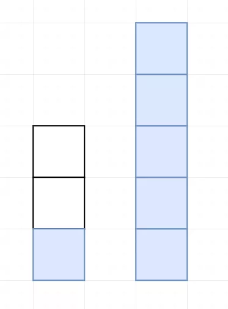
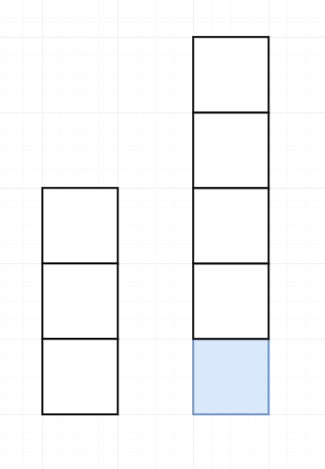
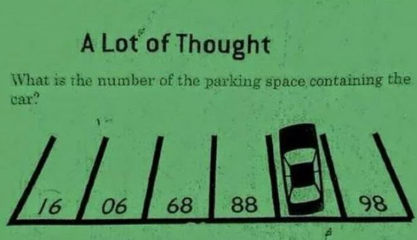

 
##	面试中的智力题
date:	2020-07-12
 

> 今天是小浩算法 “365刷题计划” 第106天。互联网公司面试，经常会出现一些奇奇怪怪的题目。今天就为大家扒几道。（第二道题目由读者提供，是真实的头条面试数据分析岗位对方问到的。防止题目侵权，本文给出的是**相似题型**）

## 01、量出4升水

> 这道题的答案并不难，但作为面试官，却可以通过这道题考察很多内容。

 

| 题目：量出4升水                 |
| ------------------------------- |
| 怎么用3升和5升的桶量出4升的水？ |

 

题目没什么补充的，直接分析，一个3升和5升的水桶：

首先用三升水桶装满水，倒入五升水桶：

再次倒满三升水桶，填满后继续倒入五升水桶，直到五升水桶倒满。

清空五升水桶，将三升水桶的一升水倒入：

再次填满三升水桶，倒入五升水桶中：

## 02、最大的钻石

> 注意，下面是 n，不是 10。网上的题目好多是 1-10 楼。。。。应该都是被简化的，分析起来并不友好。

 

| 题目：最大的钻石                                             |
| ------------------------------------------------------------ |
| 1 楼到 n 楼的每层电梯门口都放着一颗钻石，钻石大小不一。你乘坐电梯从 1 楼到 n 楼，每层楼电梯门都会打开一次，只能拿一次钻石，问怎样才能拿到「最大」的一颗？ |

 

不要认为这种题目不会出现在面试中，恰恰相反，这类题目出现的概率非常高。这不，有读者就碰到了。下面两个是知乎中也遇到该题的读者截图：

那这种问题主要考察面试者的什么能力呢？一个是面试临场随机应变的能力。第二就是分析问题的能力。

 

面试时如果被问到这种题目，其实大多数面试官心中并没有一个标准答案。（不排除有面试官深究的）事实是作为面试者，我们只要流畅的给出答案，大概率都是可以顺利过关。

 

回到题目。其实题中包含一个隐藏条件：**随机放置**。所有的分析都是基于随机放置给出的。**换句话说，如果放置钻石是人为干预大小，那么本题的所以分析则全部不成立**。

 

其实这个问题的原型叫做秘书问题，该类问题全部属于**最佳停止问题**。

这类问题都有着统一的解法：

所以到我们的题目里，我们也是可以直接给出答案：**我们要选择先放弃前 37%（就是1/e）的钻石，此后选择比前 37% 都大的第一颗钻石。**

 

其实该法则还有很多运用，比如一些常见的推文《谈恋爱拒绝掉前面37%的人》，其实就是一样的原因。

 

事实上也有人通过测试证明了这个数据：

当 n=30 时，测试一万次，可以看到有 4000 次我们拿到了最大的钻石。

 

改题目还有一些变种，比如：

 

一个活动，n个女生手里拿着长短不一的玫瑰花，无序的排成一排，一个男生从头走到尾，试图拿更长的玫瑰花，一旦拿了一朵就不能再拿其他的，错过了就不能回头，问最好的策略?

 

现在要聘请 1 名秘书，共有 n 个应聘者，每面试 1 人后，就知道了应聘者的好坏程度，且必须立刻决定是否聘用，不可重复面试。策略是拒绝前 k 个应聘者，而从第 k+1 个应聘者开始，一旦有比前 k 个都好的，就立刻聘用。如何决定 k 的值，使得聘用到最佳应聘者的概率最大？

 

等等。这里再给出一个严谨的推导过程：

## 03、思维定势

> 下面这道题也是一道常见的智力题，但是这道题绝对不会出现在面试中了。拿出来分享给大家的原因，是期望不要被思维定势局限。

这道题中有六个停车位，每个车位上都有一个数字，然而有一个车位上的数字被汽车挡住了，要求学生们在20秒内答出这个被挡住的车位上的数字。这是中国香港小学一道给6岁儿童设计的“停车场智力题”。（**大家可以在评论区留下答案**）

 

**加油，奥利给！**

