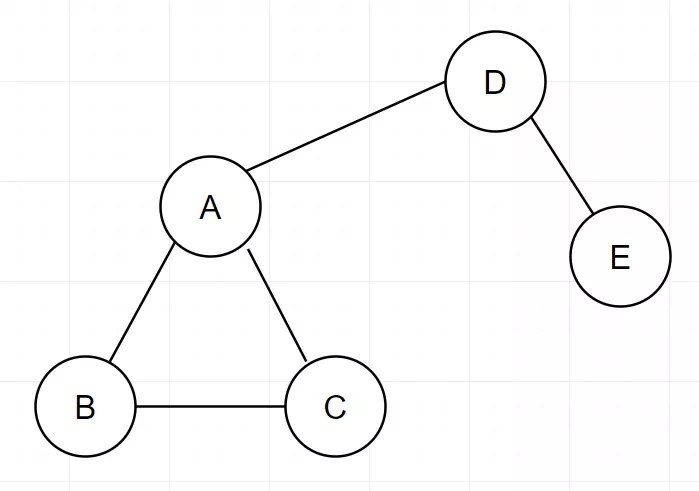
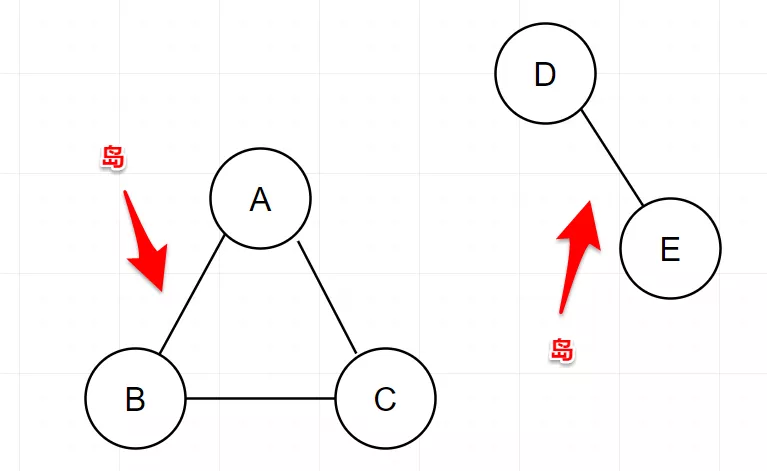

 
##	图的基础知识
date:	2020-07-11
 

> 今天和大家聊聊关于图的一些知识。

## 01、图是什么

> 图（Graph）是表示物件与物件之间的关系的数学对象，是图论的基本研究对象。

 

在数据结构中，图是什么呢？喏，就是这样：

Emmmm.....或者说常见一点的：

图是一个比树形关系复杂一点点，比线性关系复杂两点点的东东。

 

- 线性关系是一对一：一个前驱一个后继。
- 树形结构是一对多：一个父多个子
- 图形结构是多对多：任意两个顶点（图中的节点叫做顶点）都有可能相关，是一种多对多的关系。

 

图我们一般表示为 G = (V，E)

- V：代表点
- E：代表边

 

啥意思嘞，比如就上面那个绿油油的图，就可以表示为:

- V={1,2,3,4,5,6}
- E={(1,2),(1,5),(2,3),(2,5),(3,4),(4,5),(4,6)}

## 02、图的术语

> 然后我们介绍一下图的一些术语。

 

图里最基本的单元是顶点（vertex），相当于树中的节点。顶点之间的关联关系，被称为边（edge）。而边可以分配一个数值（正负都ok），这个数值就叫做权重。

（数据取自真实数据.....）

当然，这里值得一提的是，树也可以被当做简单的图，而链表也可以被当做简单的树。

## 03、无向图和有向图

> 有方向的图就是有向图，无方向的图就是无向图。

 

**边没有方向的图称为无向图。**比如说我微信里同时加了这5个妹子，这5个妹子也都认识我。

突然有一天，除了小花，其他四个妹子同时间都把我拉黑了。我的微信里能看到她们，她们却看不到我。

然后嘞，无向图就变成了有向图：

## 04、完全图

> 所有的顶点互相连接在一起，那就是完全图。

 

在无向图中，若每对顶点之间都有一条边相连，则称该图为完全图。大概就是这样：

而在有向图中，若每对顶点之间都有二条有向边相互连接，也算是完全图。

## 05、循环图 和 DAG

> 所有的这些概念，都是顺利成章产生的。

 

循环图中的循环二字，指的是**起点和终点是同一节点时**产生的路径。所以，**循环图和有向图或无向图并没有什么关系，因为都有可能产生循环**。有向图，那就遵循边的方向。无向图，那只要成环就行。

这三个：

- 第一个就是无向循环图
- 第二个就是有向非循环图
- 第三个就是有向循环图

 

那第二个，更多的是被称为，有向无环图 DAG（Directed Acyclic Graph。那下面这个也是 ：

那上面这个像不像一棵树。。。。。所以计算机结构中的树（大多都是有向的），其实就是一个DAG。

## 06、加权图

> 用数学语言讲，设G为图，对图的每一条边e来说，都对应于一个实数W(e)（可以通俗的理解为边的“长度”，只是在数学定义中图的权可以为负数），我们把W（e）称为e的“权”。把这样的图G称为“加权图”。

 

这个没啥好说的了，就是边有长度的图（**这个长度可以是各种含义**）。大部分我们接触到的图，都是加权图。

但是这里如果细分的话，又分出来了。**顶点加权图和边加权图。** 说白了，就是有人发现如果只给边加上权值（就是长度）并不够用，有时候也需要给顶点加上权值。

## 07、连通图

> 在图论中，连通图基于连通的概念。在一个无向图 G 中，若从顶点i到顶点j有路径相连（当然从j到i也一定有路径），则称i和j是连通的。

 

连通的图，就是连通图：

如果不通了，就是非连通图：（这是一个图）

那没有连通在一起的这两坨（或者说移动的这两坨），我们叫作**岛**。（画外音，也许当年给联通移动起名的，就是程序员。从这里看，联通和移动本身就是对立的）

所以，如果我们的图里包含岛，那就是非连通图。

## 08、稠密图和稀疏图

> 终于出现一个有学问的。你看 连通图-非连通图，加权图-非加权图，循环图-非循环图。。。。。人家稠密，终于知道对应一个稀疏了。

 

如何定义稠密和稀疏？**梵蒂冈也有人觉得他们的圣彼得大教堂拥挤**，所以稠密稀疏本身就是一个主观定义。

 

我们可以简单的认为，稀疏图的边数远远少于完全图，反之，稠密图的边数接近于或等于完全图。

 

本文主要介绍了图的基础知识，下一章会继续讲解图算法。希望大家多多支持！周末写文不容易，求个转发，来个评论。感谢~