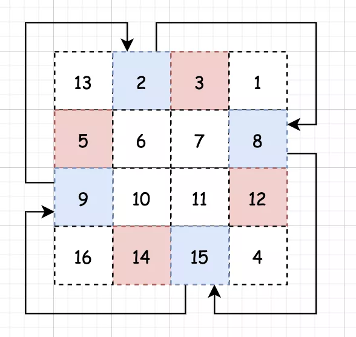

 
##	旋转图像（48）
date:	2020-07-11
 


> 今天是小浩算法 “365刷题计划” 第103天。这是前几天一个同学去滴滴面试的原题。

## 01、题目示例

> 这道题目和昨天讲的生命游戏有一点是很像的，就是同样也要求**原地旋转**。其实在很多矩阵的题目中，都会有这样的要求，大家需要注意一下。

| 第48题：旋转图像                        |
| --------------------------------------- |
| 给定一个 n × n 的二维矩阵表示一个图像。 |

**说明：**

你必须在原地旋转图像，这意味着你需要直接修改输入的二维矩阵。请不要使用另一个矩阵来旋转图像。

<br/>

**示例 1:**

```
给定 matrix = 
[
  [1,2,3],
  [4,5,6],
  [7,8,9]
],

原地旋转输入矩阵，使其变为:
[
  [7,4,1],
  [8,5,2],
  [9,6,3]
]
```

**示例 2:**

```
给定 matrix =
[
  [ 5, 1, 9,11],
  [ 2, 4, 8,10],
  [13, 3, 6, 7],
  [15,14,12,16]
], 

原地旋转输入矩阵，使其变为:
[
  [15,13, 2, 5],
  [14, 3, 4, 1],
  [12, 6, 8, 9],
  [16, 7,10,11]
]
```

题目理解起来还是很容易的：


## 02、题解分析

> 这是一道看起来容易，但其实非常考察细心程度的算法题目，有太多地方会出现失误。

<br/>

我们用代码来旋转矩阵，肯定不能说像拿着一个东西整体直接旋转，类似这样：


一般容易想到的是，一层层的从外到内旋转每一圈（至于为什么不从内到外，如果你觉得方便，也ok），也就是俗称的找框框：


对每个框框，其实都有 4 个顶点：


剩下的就是交换这四个顶点的值：


交换完毕之后，再继续交换移动后的四个顶点：



那代码实现其实就很简单了：

<br/>

- 我们通过 x 和 y 就可以定义这个框框的边界
- 找到框框后，我们再通过框框边界来定义出4个顶点
- 然后完成交换

```java
//java
class Solution {
    public void rotate(int[][] matrix) {
        int temp;
        for (int x = 0, y = matrix[0].length - 1; x < y; x++, y--) {
            for (int s = x, e = y; s < y; s++, e--) {
                temp = matrix[x][s];
                matrix[x][s] = matrix[e][x];
                matrix[e][x] = matrix[y][e];
                matrix[y][e] = matrix[s][y];
                matrix[s][y] = temp;
            };
        };
    }
} 
```

当然，上面是一个 n x n 的矩阵找框框，如果不是 n x n 其实也类似，大家有兴趣可以看下下面这道：

 [螺旋矩阵（54）](1.99.其他补充题目/01.md) 

<br/>

那我们除了找框框之外，还能不能有一些别的解法呢？当然可以，想想小时候我们通过对折来完成的填字游戏。


我们观察这个矩阵：


我们观察这个矩阵，向右旋转90°，是不是可以理解为**先上下翻转，再沿对角线翻转**：


根据分析，完成代码（其实应该用Go写，交换元素会方便许多....）：

```java
//JAVA
class Solution {    
    public void rotate(int[][] matrix) {        
        int n = matrix.length;        
        //上下翻转        
        for (int i = 0; i < n / 2; i ++){            
            int[] tmp = matrix[i];            
            matrix[i] = matrix[n - i - 1];            
            matrix[n - i - 1] = tmp;       
        }        
        //对角线翻转        
        for (int i = 0; i < n; i ++){            
            for (int j= i + 1; j < n; j++){                
                int tmp = matrix[i][j];                
                matrix[i][j] = matrix[j][i];                
                matrix[j][i] = tmp;            
            }       
        }    
    }
}
```

执行结果：


## 03、算法小知识

> 骑士巡逻（英语：Knight's tour）是指在按照国际象棋中骑士的规定走法走遍整个棋盘的每一个方格，而且每个网格只能够经过一次。假若骑士能够从走回到最初位置，则称此巡逻为“封闭巡逻”，否则，称为“开巡逻”。对于8*8棋盘，一共有26,534,728,821,064种封闭巡逻，但是到底有多少种开巡逻仍然未知。


<br/>

今天的题目到这里就结束了，你学会了吗？快来评论区留下你的想法吧！