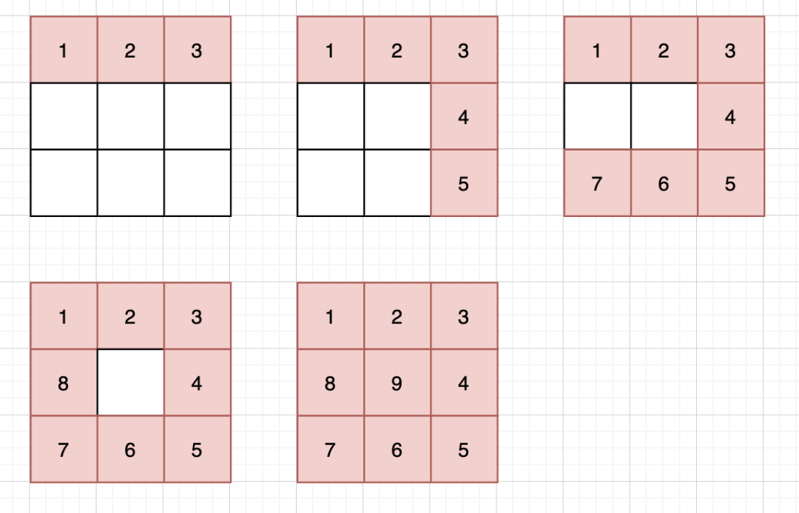
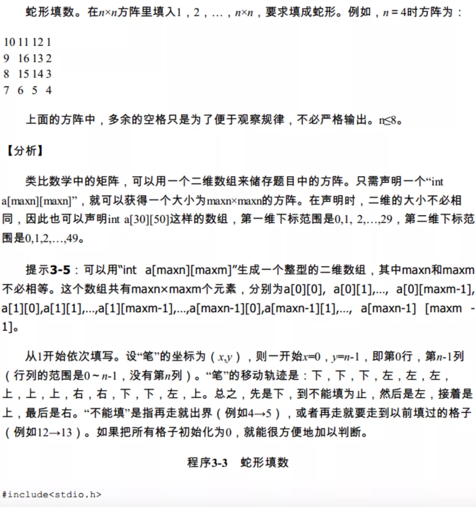

 
##	螺旋矩阵Ⅱ（59）
date:	2020-07-12
 

> 今天是小浩算法 “365刷题计划” 第 108 天。为大家讲解 leetcode 第 59 题，是一道中等难度的题目。

<br/>

大家也可以先看下该题的第一个版本：

 [螺旋矩阵Ⅰ（54）](1.99.其他补充题目/01.md) 

<br/>

本类题目在面试时出现的频率**极高**，尤其是对于工作年限在三年内的同学。因为该题非常考验 coding 能力，**尤其是对边界条件的处理**。

<br/>

很容易筛选面试者。


<br/>


## 01、题目示例

> 做这道题之前，可以通过上面的链接做一下螺旋矩阵Ⅰ

<br/>

| 第59题：螺旋矩阵Ⅱ                                            |
| ------------------------------------------------------------ |
| 给定一个正整数 n，生成一个包含 1 到 n**2 所有元素，且元素按顺时针顺序螺旋排列的正方形矩阵。 |

<br/>

**示例：**

```
输入: 3
输出: [ [ 1, 2, 3 ], [ 8, 9, 4 ], [ 7, 6, 5 ] ]
```

<br/>

题目理解较为容易，给定 n = 3，那就生成一个 3^2 = 9 的矩阵。大家看下面的图可能更加直观一些：


## 02、题解分析

> 螺旋矩阵类的题目，**思路基本都为模拟路径，难点都是考察边界的处理**。虽然也有一些奇淫巧技，但万变不离其宗。

<br/>

既然要模拟路径，先分析下路径是什么：

<br/>

<center>右-下-左-上</center>

<br/>

然后模拟向内环绕的过程，逐层填充：



这种方法其实有一个专业点的名字，叫做：蛇形填数

<br/>



<br/>

这里额外说一下，除了上面这种填充方式外，还有一种填充方式：


两者的区别，只是边界条件设定不同。

<br/>

第一种填充方式的代码：

```java
//java
class Solution {    
    public int[][] generateMatrix(int n) {        
        int[][] res = new int[n][n];        
        for(int s = 0, e = n - 1, m = 1; s<=e ; s++,e--){            
            for (int j = s; j <= e; j++) res[s][j] = m++;            
            for (int i = s+1; i <= e; i++) res[i][e] = m++;            
            for (int j = e-1; j >= s; j--) res[e][j] = m++;           
            for (int i = e-1; i >= s+1; i--) res[i][s] = m++;        
        }        
        return res;    
    }
}
```

第二种填充方式的代码：

```java
//java
class Solution {    
    public int[][] generateMatrix(int n) {        
        int[][] res = new int[n][n];        
        for (int s = 0, e = n - 1, m = 1; s <= e; s++, e--) {            
            if (s == e) res[s][e] = m++;            
            for (int j = s; j <= e - 1; j++) res[s][j] = m++;            
            for (int i = s; i <= e - 1; i++) res[i][e] = m++;            
            for (int j = e; j >= s + 1; j--) res[e][j] = m++;            
            for (int i = e; i >= s + 1; i--) res[i][s] = m++;        
        }        
        return res;    
    }
}
```

看完这两种解法，有没有 get✔ 到这道题目的核心呢？正是大量的边界操作，让这道题目成为了面试官的香饽饽。如果 coding 能力比较差，基本都会栽到这道题目上。

<br/>

所以，非常建议基础较差的同学，认真练习一下上面的两种实现。

<br/>

## 03、相似题目

> 然后这里我准备了几道同一类型的题目，建议大家刷一刷。完成之后可能会有一些不一样的思考。

 [螺旋矩阵Ⅰ（54）](1.99.其他补充题目/01.md) 

 [旋转图像（48）](1.99.其他补充题目/51.md) 

 [生命游戏（289）](1.99.其他补充题目/31.md) 

<br/>

今天的题目到这里就结束了，你学会了吗？快来评论区留下你的想法吧！