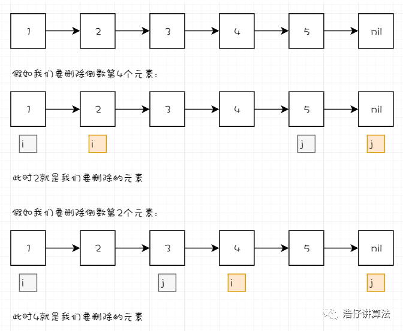

 
##  删除链表倒数第N个节点(19)
 

## 01、哨兵节点

在链表的题目中，十道有九道会用到**哨兵节点**，所以我们先讲一下什么是哨兵节点。

哨兵节点，其实就是一个**附加在原链表最前面用来简化边界条件的附加节点，它的值域不存储任何东西，只是为了操作方便而引入。**

比如原链表为a->b->c，则加了哨兵节点的链表即为x->a->b>c，如下图：


那我们为什么需要引入哨兵节点呢?举个例子，比如我们要删除某链表的第一个元素，**常见的删除链表的操作是找到要删元素的前一个元素**，假如我们记为 pre。我们通过：

> <center><b> pre.Next = pre.Next.Next </b></center>

来进行删除链表的操作。但是此时若是删除第一个元素的话，你就很难进行了，因为按道理来讲，此时第一个元素的前一个元素就是nil（空的），如果使用pre就会报错。那如果此时你设置了哨兵节点的话，此时的pre就是哨兵节点了。这样对于链表中的任何一个元素，你要删除都可以通过pre.Next=pre.Next.Next的方式来进行，这就是哨兵节点的作用。

下面我们看一道题目，看一下哨兵节点的应用

## 02、题目讲解

| 第19题：删除链表倒数第N个节点                                |
| ------------------------------------------------------------ |
| 给定一个链表，删除链表的倒数第 n 个节点，并且返回链表的头结点。 |

**示例：**

```
给定一个链表: 1->2->3->4->5, 和 n = 2.
当删除了倒数第二个节点后，链表变为 1->2->3->5.
```

说明：

- 给定的 n 保证是有效的。

进阶：

- 你能尝试使用一趟扫描实现吗？

<br/>

思路分析：

> 首先我们思考，让我们删除倒数第N个元素，那我们**只要找到倒数第N个元素就可以了**，那怎么找呢？我们**只需要设置两个指针变量，中间间隔N-1元素。当后面的指针遍历完所有元素指向nil时，前面的指针就指向了我们要删除的元素。**如下图所示：



接下来，我们只要同时定位到要删除的元素的前1个元素，通过前面讲过的删除操作，就可以很顺利的完成这道题目啦。

## 03、解题过程

现在我们来完整捋一遍解题过程：

1. 首先我们定义好哨兵节点result，指向哨兵节点的目标元素指针cur，以及目标指针cur的前一个指针pre，此时pre指向nil。
2. 接下来我们开始遍历整个链表。
3. 当head移动到距离目标元素cur的距离为N-1时，同时开始移动cur。
4. 当链表遍历完之后，此时head指向nil，这时的cur就是我们要找的待删除的目标元素。
5. 最后我们通过pre.Next = pre.Next.Next完成删除操作，就完成了整个解题过程。

下面是解题过程图，可以看得更清楚哦。


## 04、题目解答

根据以上分析，我们可以得到下面的题解：

```go
func removeNthFromEnd(head *ListNode, n int) *ListNode {
    result := &ListNode{}
    result.Next = head
    var pre *ListNode
    cur := result
    i := 1
    for head != nil {
        if i >= n {
            pre = cur
            cur = cur.Next
        }
        head = head.Next
        i++
    }
    pre.Next = pre.Next.Next
    return result.Next
}
```
