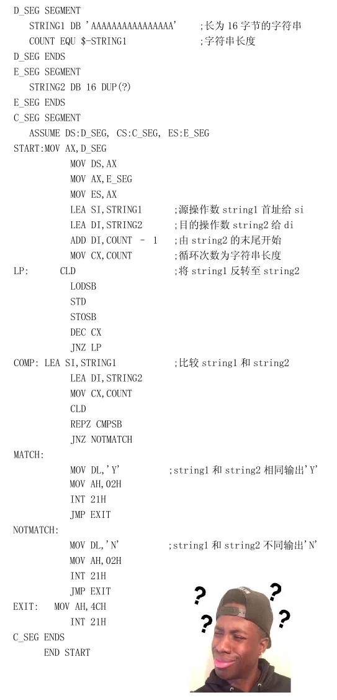

 
##	验证回文串（125）
date:	2020-07-10
 

> **今天是小浩算法 “365刷题计划”- 储备日。**难顶，我本来今天在写最长回文子串这个题目。然后我突然在想，直接讲这个会不会仍然有同学看不懂，为什么不从最简单的讲起呢。于是，今天的文章诞生了。于是，小浩又熬夜到了凌晨。

## 01、题目示例

> 见微知著，发现一组数据很有趣，分享给大家。leetcode 第一题通过次数为 993,335，第二题通过次数为 396,160，第三题通过次数为 69,508。我想说什么，请自己悟。

| 第125题：验证回文串                                          |
| ------------------------------------------------------------ |
| 给定一个字符串，验证它是否是回文串，只考虑字母和数字字符，可以忽略字母的大小写。 |

**说明：** 本题中，我们将空字符串定义为有效的回文串。

<br/>

**示例 1:**

```
输入: "A man, a plan, a canal: Panama"
输出: true
```

**示例 2:**

```
输入: "race a car"
输出: false
```

## 02、图解教程

> 经典题目，你需要像掌握反转字符串一样掌握本题。

<br/>

首先，我想确保你知道什么是回文串。“回文串”是一个正读和反读都一样的字符串，比如“level”或者“noon”等等就是回文串。

<br/>

当然，对于本题而言，因为原字符串还包括了除字母，数字之外的一些幺蛾子，所以我们第一步可以考虑将其替换。因为使用正则实在是方便，所以直接用正则替了。

```java
//JAVA
s = s.toLowerCase().replaceAll("[^0-9a-z]", "");
```

假若原字符串为：

```
A man, a plan, a canal: Panama
```

替换完就是这样：

```
amanaplanacanalpanama
```

剩下的就很简单了，我们同时遍历两边的字符，如果不等直接就返回 false，代码基本就是这样（因为实在简单到无地自容，所以我不知道如何画图....）

```java
//JAVA 
class Solution { 
    public boolean isPalindrome(String s) { 
        s = s.toLowerCase().replaceAll("[^0-9a-z]", "");
        char[] c = s.toCharArray(); 
        int i = 0, j = c.length - 1; 
        while (i < j) { 
            if (c[i] != c[j]) return false; 
            i++;
            j--;
        }
        return true;
    }
}
```

执行结果：


然后上面的代码大家肯定也觉得简单的一批。但是既然我们都知道哪些字符是幺蛾子（**除了字母和数字，都是幺蛾子**），为啥子不直接遍历的时候跳过嘞？这样是不是就不用先做一个替换的预处理了。

```java
//JAVA
class Solution {
    public boolean isPalindrome(String s) {
        s = s.toLowerCase();
        char[] c = s.toCharArray();
        int i = 0;
        int j = s.length() - 1;
        while(i < j) {
            if (!((c[i] >= '0' && c[i] <= '9') || (c[i] >= 'a' && c[i] <= 'z'))) {
                i++;
                continue;
            }
            if (!((c[j] >= '0' && c[j] <= '9') || (c[j] >= 'a' && c[j] <= 'z'))) {
                j--;
                continue;
            }
            if(c[i] != c[j]){
                return false;
            }
            i++;
            j--;
        }
        return true;
    }
}
```

执行结果：


好吧，那既然我们都可以把幺蛾子跳过了，那有木有现成的跳过幺蛾子的API来用嘞？我找了找，java 中没有特别现成的拿来主义，但是我又不想造轮子，那就去别的语言里找找呗。

```cpp
//CPP
class Solution {
public:
    bool isPalindrome(string s) {
        for (int i = 0, j = s.size() - 1; i < j; i++, j--)     
        {
            while (!isalnum(s[i]) && i < j) i++;       
            while (!isalnum(s[j]) && i < j) j--;   
            if (toupper(s[i]) != toupper(s[j])) return false;
        }
        return true;
    }
};
```

提示：isalnum() 方法检测字符串是否由字母和数字组成，是c++标准库函数。当然，c库也有

<br/>

但是这样感觉代码还是好长好难受，有没有更加简洁的写法？祭出大杀器！

```python
//py3
class Solution:
    def isPalindrome(self, s: str) -> bool:
        s = list(filter(str.isalnum, s.lower()))
        return s == s[::-1] 
```

然后，我还想祭出终极大杀器 之 战斗魔鬼！



## 03、总结

> 万丈高楼平地起，盘龙卧虎高山齐。希望大家对于回文串的判断烂熟于心，为后面的题目做好准备~

<br/>

今天的题目到这里就结束了。你学会了吗？快来评论区留下你的想法吧！