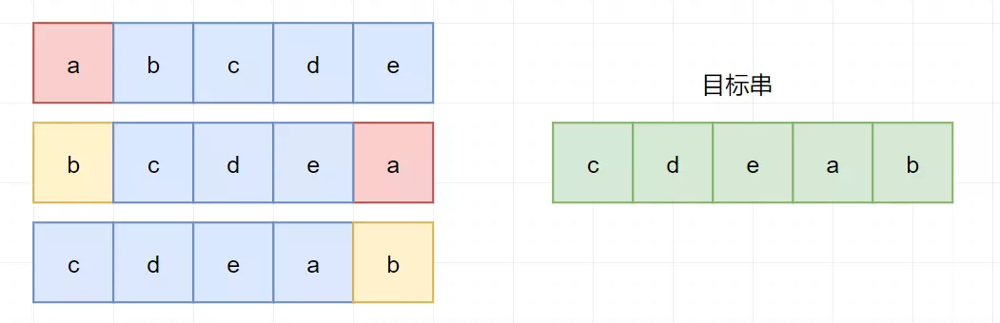
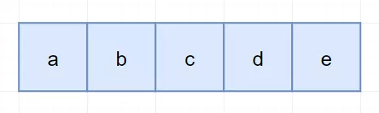

 
##	旋转字符串（796）
date:	2020-07-12
 

> 今天是小浩算法 “365刷题计划” 第103天。分享的这道题虽然很简单，但是在笔试或者面试当中，出现的频率却非常高。

## 01、题目示例

> 经典常考类算法题目。

<br/>

| 第796题：旋转字符串                                          |
| ------------------------------------------------------------ |
| 给定两个字符串, A 和 B。A 的旋转操作就是将 A 最左边的字符移动到最右边。例如, 若 A = 'abcde'，在移动一次之后结果就是'bcdea' 。如果在若干次旋转操作之后，A 能变成B，那么返回True。 |

**示例 1:**

```
输入: A = 'abcde', B = 'cdeab'
输出: true
```

**示例 2:**

```
输入: A = 'abcde', B = 'abced'
输出: false
```

<br/>

**注意：** A 和 B 长度不超过 100。

<br/>

题意还是很容易理解的，说白了就是每次把前面的元素放到最后面：


## 02、题解分析

> 这道题目看起来简单，但其实很容易出错。

<br/>

这道题目最容易想到的解法，其实就是跟着题意来。每次将旋转后的A和目标串对比：



```java
//java
class Solution {
    public boolean rotateString(String A, String B) {
        if (A.equals("") && B.equals("")) {
            return true;
        }
        int len = A.length();
        for (int i = 0; i < len; i++) {
            String first = A.substring(0, 1);
            String last = A.substring(1, len);
            A = last + first;
            if (A.equals(B)) {
                return true;
            }
        }
        return false;
    }
}
```

但是代码其实并不优雅，我们继续观察一下这个字符串：



无论它怎样旋转，最终的 A + A包含了所有可以通过旋转操作从 A 得到的字符串：


那我们是不是只需要判断  B  是否为  A + A  的子串就可以了：

```java
//java
class Solution {    
    public boolean rotateString(String A, String B) {        
        return A.length() == B.length() && (A + A).contains(B);    
    }
}
```

执行结果：


一般面试写的话，基本就是到这个程度。但是大概率面试官这时还会问你一个问题：如何继续进行优化？


注意我们上面问题，其实已经转化为了：**判断 B 是否为 A + A 的子串**。那我们就可以引申答出 KMP，SUNDAY，BF 等字符串匹配策略。（当然，这里其实 SUNDAY 并不是特别适合）

<br/>

然后就是用相应的匹配策略，来实现转化后的问题。

<br/>

这里附上一份 KMP 解题代码：

```java
class Solution {
    public boolean rotateString(String A, String B) {
        int N = A.length();
        if (N != B.length()) return false;
        if (N == 0) return true;

        //Compute shift table
        int[] shifts = new int[N+1];
        Arrays.fill(shifts, 1);
        int left = -1;
        for (int right = 0; right < N; ++right) {
            while (left >= 0 && (B.charAt(left) != B.charAt(right)))
                left -= shifts[left];
            shifts[right + 1] = right - left++;
        }

        //Find match of B in A+A
        int matchLen = 0;
        for (char c: (A+A).toCharArray()) {
            while (matchLen >= 0 && B.charAt(matchLen) != c)
                matchLen -= shifts[matchLen];
            if (++matchLen == N) return true;
        }

        return false;
    }
}
```

这个有兴趣可以看看，代码是 leetcode 官方的。

<br/>

## 03、算法小知识

> KMP算法是一种改进的字符串匹配算法，由D.E.Knuth，J.H.Morris和V.R.Pratt提出的，因此人们称它为克努特—莫里斯—普拉特操作（简称KMP算法）。KMP算法的核心是利用匹配失败后的信息，尽量减少模式串与主串的匹配次数以达到快速匹配的目的。具体实现就是通过一个next()函数实现，函数本身包含了模式串的局部匹配信息。KMP算法的时间复杂度O(m+n)。


大家有兴趣可以看我之前写的一篇KMP教程：

 [KMP（上篇）](1.3.字符串系列/306.md) 