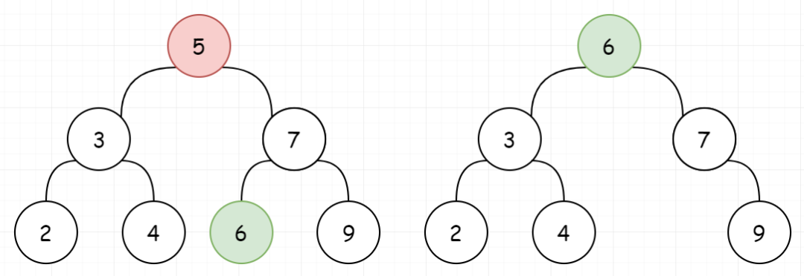

 
## BST 的删除(450)
 

> 在两节中，我们了解了BST（二叉搜索树）的概念，并且知道了如何在BST中查找一个元素。那我们又如何在BST中去删除一个元素呢？我们将通过本节的例题进行学习！
>
> 下面我们仍然通过例题进行讲解。
## 01、题目分析

| 第450题：删除二叉搜索树中的节点                              |
| ------------------------------------------------------------ |
| 给定一个二叉搜索树的根节点 root 和一个值 key，删除二叉搜索树中的 key 对应的节点，并保证二叉搜索树的性质不变。返回二叉搜索树（有可能被更新）的根节点的引用。 |

一般来说，删除节点可分为两个步骤：

<br/>

- 首先找到需要删除的节点；
- 如果找到了，删除它。

<br/>

说明： 要求算法时间复杂度为 O(h)，h 为树的高度。

<br/>

**示例：**

```
root = [5,3,6,2,4,null,7]
key = 3

    5
   / \
  3   6
 / \   \
2   4   7

给定需要删除的节点值是 3，所以我们首先找到 3 这个节点，然后删除它。

一个正确的答案是 [5,4,6,2,null,null,7], 如下图所示。
    5
   / \
  4   6
 /     \
2       7

另一个正确答案是 [5,2,6,null,4,null,7]。
    5
   / \
  2   6
   \   \
    4   7
```

> **强烈建议先学习之前两节内容！**
>
> **以达到最好的学习效果！**

## 02、复习巩固

先复习一下，**二叉搜索树**（BST）的特性：

<br/>

- 若它的左子树不为空，则所有左子树上的值均小于其根节点的值
- 若它的右子树不为空，则所有右子树上的值均大于其根节点得值
- 它的左右子树也分别为二叉搜索树

<br/>

如下图就是一棵典型的BST：


## 03、图解分析

明确了概念，我们进行分析。我们要删除BST的一个节点，首先需要**找到该节点**。而找到之后，会出现三种情况。

<br/>

1、待删除的节点左子树为空，让待删除节点的右子树替代自己。


2、待删除的节点右子树为空，让待删除节点的左子树替代自己。


3、如果待删除的节点的左右子树都不为空。我们需要找到**比当前节点小的最大节点（前驱）**，来替换自己


或者**比当前节点大的最小节点（后继）**，来替换自己。



分析完毕，我们一起看代码怎么实现吧。

## 04、GO语言示例

这里我们给出通过**后继节点**来替代自己的方案（请后面自行动手实现另一种方案）：

```go
func deleteNode(root *TreeNode, key int) *TreeNode {
    if root == nil {
        return nil
    }
    if key < root.Val {
        root.Left = deleteNode( root.Left, key )
        return root
    }
    if key > root.Val {
        root.Right = deleteNode( root.Right, key )
        return root
    }
    //到这里意味已经查找到目标
    if root.Right == nil {
        //右子树为空
        return root.Left
    }
    if root.Left == nil {
        //左子树为空
        return root.Right
    }
    minNode := root.Right
    for minNode.Left != nil {
        //查找后继
        minNode = minNode.Left
    }
    root.Val = minNode.Val
    root.Right = deleteMinNode( root.Right )
    return root
}


func deleteMinNode( root *TreeNode ) *TreeNode {
    if root.Left == nil {
        pRight := root.Right
        root.Right = nil
        return pRight
    }
    root.Left = deleteMinNode( root.Left )
    return root
}
```

执行结果：


