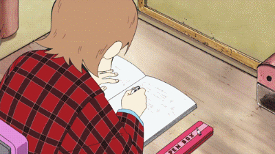

 
##	画圈圈的问题
date:	2020-07-06
 

> 这次小浩又出去面试了，面试官说想和我画圈圈（原题为狼厂校招面试题），想起来还有点羞羞的。

## 01、题目示例

| 面试题：小浩出去面试时，面试官拿出一张纸，在纸上从左到右画了一百个小圆圈（手速快，没办法）接下来，面试官要求两人轮流涂掉其中一个或者两个相邻的小圆圈。 |
| ------------------------------------------------------------ |
| 规定：谁涂掉最后一个小圆圈谁就赢了（换句话说，谁没有涂的了谁就输了）。问题是：小浩应该选取先涂还是后涂？如何才能有必胜策略？ |

## 02、题目分析

> 策梅洛定理（英语：Zermelo's theorem）是博弈论的一条定理，以恩斯特·策梅洛命名。策梅洛的论文于1913年以德文发表。表示在二人的有限游戏中，如果双方皆拥有完全的资讯，并且运气因素并不牵涉在游戏中，那先行或后行者当一必有一方有必胜/必不败的策略。

  

作为聪明机智的小浩（没见过这么夸自己的），最后当然是小浩获胜。获胜的方法：**小浩强烈要求先手进行游戏，并且在游戏开始时，先把正中间的两个小圆圈涂黑，于是左右两边各剩下了49个圆圈**。像是下面这样：

然后小浩开始模仿（逼死）面试官，面试官在左边涂掉哪些圆圈，小浩就对称地在右边涂掉哪些圆圈；面试官在右边涂掉哪些圆圈， 小浩就对称地在左边涂掉哪些圆圈。因此，只要面试官有走的，小浩就一定有走的，最终保证能获胜。

## 03、改编版

> 大概的思想还是一致，想办法找到可以使用 “对称大法”的时机，就可以必胜。

  

假若刚开始的时候，100小圆圈成环排列，游戏规则完全相同，此时如何可以让小浩有必胜策略？评论区留下你的想法吧！（为了让大家不对纯粹的算法题产生疲惫，以后采取 算法题 - 逻辑题 穿插的形式来进行讲解）

## 04、补充说明

> 在组合博弈论里，无偏博弈是一类任意局势对于游戏双方都是平等的回合制双人游戏。这里平等的意思是所有可行的走法仅仅依赖于当前的局势，而与现在正要行动的是哪一方无关。换句话说，两个游戏者除了先后手之外毫无区别。

  

有兴趣的可以看一下 掰巧克力 的题目：

 [巧克力问题](1.9.二分法系列/907.md) 

本题，以及之前的掰巧克力题目，其实都属于博弈论中的一类问题，它们有三个共同特征：

- 游戏信完全透明的，每个人都知道对方可以怎么走，结果会怎么样；
- 下一步可以怎么走与下一步是谁走没有关系，换句话说我能以哪些方式操作哪些棋子，你就能以哪些方式操作哪些棋子（排除了象棋之类的游戏）；
- 整个游戏必然会在有限步之内结束，谁先没走的了谁就输了。

  

在博弈论中，这类游戏就叫做“**无偏博弈**”（impartial game）。**在无偏博弈中，如果对于某个棋局状态，谁遇到了它谁就有办法必胜，我们就把它叫做“必胜态”；如果对于某个棋局状态，谁遇到了它对手就会有办法必胜，我们就把它叫做“必败态”**。

  

一般而言，根据题意我们可以立即判断出，那些不能走的状态就是必败态了。从这些必败态出发，我们可以按照下面两条规则，自底向上地推出其他所有状态的性质：有办法走到必败态的状态就是必胜态，只能走到必胜态的状态就是必败态。最终，我们总会得出初始状态的性质：它要么是必胜的，要么是必败的。因而，我们可以证明，在一切无偏博弈中，总有一个玩家有必胜策略。

  

如果后面再给大家分享博弈论的问题，我将会讲解一些“非无偏”类型的题目，供大家学习和参考。