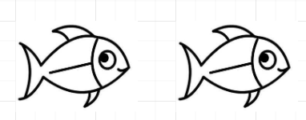
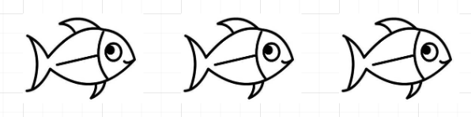

 
##	大鱼和小鱼的问题
date:	2020-07-08
 

> 十年前有一款很出名的游戏叫做“孢子”，不知道大家玩没玩过。玩家最初扮演一个单细胞生物，通过“大鱼吃小鱼，小鱼吃虾米，虾米吃水藻”的规则，逐步进化为宇宙文明生物。换句话说，大鱼之上总是有更大的鱼存在。当然我们这里不是讨论这个游戏，而是思考一个有趣的问题：倘若所有的鱼都是理性的，那会出现怎样的情况呢？

  

## 01、题目分析

> 总有一条更大的鱼（Always a Bigger Fish）不但是电影情节中的经典桥段，也是各种恶搞的灵感来源——小鱼总是被大鱼吃掉，而大鱼上面始终还有更大的鱼。久而久之，聪明的大鱼或许就不会去吃小鱼了，否则按照传统剧情，它身后会出现一条更大的鱼吃掉自己。让我们完整叙述一下问题：

 

| 大鱼小鱼的问题：假设有10条鱼，它们从小到大依次编号为1, 2, …, 10。我们规定，吃鱼必须要严格按顺序执行。也就是说，大鱼只能吃比自己小一级 的鱼，不能越级吃更小的鱼；并且只有等到第k条鱼吃了第 k-1 条鱼后，第 k+1条鱼 才能吃第 k 条鱼。 |
| ------------------------------------------------------------ |
| 同时：第1条鱼则啥都不能吃，只有被吃的份儿。我们假设，如果有小鱼 吃的话，大鱼肯定不会放过；但是，保全性命的优先级显然更高，在吃小鱼之前， 大鱼得先保证自己不会被吃掉才行。假设每条鱼都是无限聪明的（并且它们也都知 道这一点，并且它们也都知道它们知道这一点……），那么第1条鱼能存活下来吗？ |

## 02、题目分析

> 这个题目是相当有意思的....

 

首先，我想聪明的大家已经猜到这是一道什么类型的题。对，**博弈论**！因为题中出现了博弈论中的经典条件“**无限聪明**”。现在让我们思考该题：

 

我们是有十条鱼，分析起来是比较麻烦的。所以我们从最简单的两条鱼开始分析：

两条鱼的情况下，第二条鱼就是无敌的存在，他不用担心自己被吃掉！如果是三条鱼：

3条鱼的情况下，第2条鱼不能吃第1条鱼，否则将化为只有2条鱼的情形，它将会被第3条鱼吃掉。如果是四条鱼，就有意思了：

此时第2条鱼可以大胆地吃掉第1条鱼，因为根据前面的结论，它知道第3条鱼是不敢吃它的。问题来了，五条鱼会如何：

5条鱼的情况下，第2条鱼是不敢吃第1条鱼的，因为如果它吃了第一条鱼。问题转化为4条鱼的场景，原3号鱼就可以大胆吃掉原2号鱼，因为它知道4号鱼是不敢吃它的，否则5号鱼就会吃掉4号鱼（绕不绕）

 

我们发现一个有趣的结论，只要鱼有奇数个，那么第一条鱼将总是可以活下来。如果鱼是偶数个，那么第二条鱼将总是可以吃掉第一条鱼，将状态转化到奇数条鱼的场景。

 

所以该题的答案是：不能，在十条鱼的场景下，第一条鱼必死无疑。

## 03、改编版本

> 下面这个和上面的题目如出一辙，建议大家自己思考一下。

 

假如你在旅途中遇到一个老头，老头向你推销一个魔壶，魔壶里有一个魔鬼，可以满足你的任何愿望。但是，使用了这个魔壶会让你死后永受炼狱之苦。唯一的解法，就是你把这个魔壶再以一个更低的价格卖给别人。问题是：你会不会买下这个魔壶？以什么价格买下？（假设你足够聪明）

 

简单分析一下这个问题：因为我们并不知道用什么价格来买这个魔壶，所以自然是从最小的价格还是尝试，假设我们用最小的货币单位 1 来购买这个魔壶，那么这个魔壶将永远都不能卖给下一个人，所以 1 货币单位 肯定是不行的。那么现在我们使用 2 货币单位来购买这个魔壶，你同样找不到下一个买家。事情开始变得有趣，你开始尝试 3 货币单位 到 N 货币单位，然后你发现：根据类推，你不应该以任何价钱去购买这个瓶子，因为每个都都知道他没办法卖掉这个瓶子。

 

问题来了，为什么会推出这样一个和现实完全背道而驰的“谬论”，这是因为在推理中，我们假设每个人都做出了最优的决策，并且就这一点达成了共识。注意，这里有两个条件：

 

- 最优决策
- 共识

 

最优决策好理解，那这个共识该如何理解呢？最优决策指的是，大家都足够聪明。而共识，指的是大家都知道大家足够聪明。那如果大家并不知道大家都是足够聪明的，这种情况就称之为“不完全信息”

 

这里值得强调的一点是，信息不对称 和 不完全信息，这两个的概念是有所不同的。划重点：不完全信息同时是经济学和博弈论中的概念，但是信息不对称大多指经济学中概念。这个大家了解一下即可（其实我个人觉得这种东东理解其本质就ok了，并不需要过于较真）下面的问题，摘自《经济学基础》题库

理论的东西就是这么枯燥，总之大家拿到这种题目知道怎么分析就ok了。

  

所以，今天的问题你学会了吗，评论区留下你的想法！

